# Nerove Tutor — Entity Relationship Document (ERD.md)

**Document type:** Logical database design (pre-implementation)
**Platform:** Supabase (PostgreSQL, Auth, Storage, Realtime)
**Companion document:** PRD.md (product/architecture requirements)
**Status:** Draft v1.0 — logical design only, no SQL/migrations

This document specifies the logical database architecture for Nerove Tutor. It is deliberately implementation-agnostic in one sense (no SQL/DDL) and implementation-specific in another (it assumes Supabase's Postgres + Auth + Storage + Realtime model, since that's the committed platform per PRD.md §9). Anyone implementing migrations should treat this document as the contract they're translating into SQL, not a rough guide to deviate from without updating this document first.

---

## Table of Contents

1. Database Overview
2. Design Principles
3. Entity List
4. Relationship Diagram (Mermaid ER Diagram)
5. Detailed Entity Descriptions
6. Relationship Explanations
7. Normalization Strategy
8. Referential Integrity Rules
9. Naming Conventions
10. Future Expansion Strategy
11. Performance Considerations
12. Security Considerations
13. Supabase-Specific Considerations
14. Row Level Security Planning
15. Storage Architecture
16. Realtime Considerations
17. Audit Strategy
18. Soft Delete Strategy
19. Archiving Strategy
20. Versioning Strategy

---

## 1. Database Overview

Nerove Tutor's database serves three distinct workloads that pull the design in different directions, and the schema is organized around keeping them from interfering with each other:

1. **Structured, low-write, high-read content data** — courses, chapters, lessons, quizzes. Authored infrequently, read constantly. Optimized for read performance and versioning, not write throughput.
2. **Per-user learning state** — progress, quiz attempts, streaks, statistics. Moderate write frequency, always scoped to a single user, always read on the "get everything for this student" access pattern that the AI Tutor and UI both depend on.
3. **High-volume conversational/session data** — conversation messages, voice sessions, camera sessions, activity logs. The fastest-growing data by an order of magnitude, append-mostly, time-ordered, and the primary candidate for future partitioning/archival.

Every entity in this document is classified into one of these three categories, because that classification is what drives its indexing, retention, and scaling treatment later in this document (§11, §19).

The schema is designed for **one course today, unlimited courses tomorrow** — every content entity is scoped under `course_id` (directly or transitively) rather than assuming Python is special-cased anywhere in the schema itself.

## 2. Design Principles

- **UUID primary keys everywhere.** Required for Supabase Auth interop (`auth.users.id` is a UUID) and avoids sequential-ID enumeration/leakage across a multi-tenant-by-user system.
- **`auth.users` is the root of user identity; `profiles` extends it.** Never duplicate identity concerns into a second table — extend, don't replace.
- **Every user-owned row carries `user_id` directly**, even where it's technically derivable through a join (e.g., a `quiz_attempt` could derive user from its session), because Row-Level Security policies (§14) need a direct, indexed column to filter on efficiently — RLS performance and design simplicity both favor denormalizing ownership onto every row.
- **Content is versioned, not mutated in place**, where mutation would silently change a student's already-in-progress experience (§20).
- **Soft delete for anything a user or the AI Tutor might reference historically** (lessons, courses, quizzes); **hard delete for genuinely disposable data** (§18).
- **Timestamps (`created_at`, `updated_at`) on every table** without exception — non-negotiable baseline for debugging, auditing, and sync logic.
- **No business logic in the database beyond what referential integrity requires.** Gating, grading, and mastery calculations live in the backend (per PRD.md §7.13, §21.2); the database enforces *data* integrity (foreign keys, uniqueness), not *product* rules.
- **Design for the query pattern, not just the entity.** The single most common query in this system is "give me everything relevant about student X" (used every AI Tutor turn) — this shapes indexing decisions throughout (§11).
- **Every foreign key has an explicit, deliberate cascade rule** — never left at the database default without consideration (§8).

## 3. Entity List

Grouped by workload category (§1):

**Identity & Profile**
- `users` *(Supabase-managed `auth.users`, referenced not owned)*
- `profiles`
- `settings`

**Course Content (low-write, high-read, versioned)**
- `courses`
- `chapters`
- `lessons`
- `lesson_contents`
- `quizzes`
- `quiz_questions`
- `quiz_answers`

**Per-User Learning State**
- `progress`
- `learning_sessions`
- `quiz_attempts`
- `bookmarks`
- `notes`
- `study_statistics`
- `daily_goals`
- `learning_streaks`
- `achievements`
- `badges` *(catalog, low-write like content)*

**Conversational & AI State**
- `conversations`
- `conversation_messages`
- `ai_memory`

**Session Telemetry (high-volume, append-mostly)**
- `voice_sessions`
- `camera_sessions`
- `sleep_events`
- `activity_logs`

**System**
- `notifications`
- `storage_references`

**Administration**
- `admin_users`
- `content_audit_log`

**Future / Reserved (schema-ready, not activated in V1)**
- `subscription_plans`
- `subscriptions`

---

## 4. Relationship Diagram (Mermaid ER Diagram)

```mermaid
erDiagram
    USERS ||--|| PROFILES : "extends"
    USERS ||--|| SETTINGS : "has"
    USERS ||--o{ PROGRESS : "tracks"
    USERS ||--o{ LEARNING_SESSIONS : "starts"
    USERS ||--o{ QUIZ_ATTEMPTS : "attempts"
    USERS ||--o{ BOOKMARKS : "creates"
    USERS ||--o{ NOTES : "writes"
    USERS ||--o{ STUDY_STATISTICS : "accrues"
    USERS ||--o{ DAILY_GOALS : "sets"
    USERS ||--|| LEARNING_STREAKS : "maintains"
    USERS ||--o{ ACHIEVEMENTS : "earns"
    USERS ||--o{ CONVERSATIONS : "has"
    USERS ||--o{ AI_MEMORY : "owns"
    USERS ||--o{ VOICE_SESSIONS : "runs"
    USERS ||--o{ CAMERA_SESSIONS : "runs"
    USERS ||--o{ ACTIVITY_LOGS : "generates"
    USERS ||--o{ NOTIFICATIONS : "receives"
    USERS ||--o{ SUBSCRIPTIONS : "may hold (future)"

    COURSES ||--o{ CHAPTERS : "contains"
    CHAPTERS ||--o{ LESSONS : "contains"
    LESSONS ||--o{ LESSON_CONTENTS : "composed of"
    LESSONS ||--o| QUIZZES : "gated by"
    QUIZZES ||--o{ QUIZ_QUESTIONS : "contains"
    QUIZ_QUESTIONS ||--o{ QUIZ_ANSWERS : "has options"

    LESSONS ||--o{ PROGRESS : "tracked via"
    LESSONS ||--o{ LEARNING_SESSIONS : "studied in"
    LESSONS ||--o{ BOOKMARKS : "bookmarked"
    LESSONS ||--o{ NOTES : "annotated"
    LESSONS ||--o{ CONVERSATIONS : "discussed in"
    LESSONS ||--o{ AI_MEMORY : "referenced by"

    QUIZZES ||--o{ QUIZ_ATTEMPTS : "attempted via"
    QUIZ_ATTEMPTS ||--o{ QUIZ_ANSWERS : "selected (response)"

    CONVERSATIONS ||--o{ CONVERSATION_MESSAGES : "contains"
    CONVERSATIONS ||--o| VOICE_SESSIONS : "may include"
    LEARNING_SESSIONS ||--o| VOICE_SESSIONS : "may include"
    LEARNING_SESSIONS ||--o| CAMERA_SESSIONS : "may include"
    CAMERA_SESSIONS ||--o{ SLEEP_EVENTS : "emits"

    BADGES ||--o{ ACHIEVEMENTS : "template for"

    PROFILES ||--o{ STORAGE_REFERENCES : "avatar / assets"
    LESSON_CONTENTS ||--o{ STORAGE_REFERENCES : "media assets"

    ADMIN_USERS ||--o{ CONTENT_AUDIT_LOG : "performs"
    COURSES ||--o{ CONTENT_AUDIT_LOG : "audited"

    SUBSCRIPTION_PLANS ||--o{ SUBSCRIPTIONS : "defines (future)"
```



*(Cardinalities are described precisely per entity in §6; the diagram favors readability over encoding every optional/nullable nuance — treat §5–§8 as authoritative where they differ in detail.)*

---

## 5. Detailed Entity Descriptions

Each entity is described with: Purpose, Primary Key, Foreign Keys, Cardinality (1:1/1:N/N:N), Cascade/Delete/Update rules, Indexes, Unique Constraints, Optional Relationships, Future Scalability. Fields listed are the material ones for design purposes, not an exhaustive column list (no SQL/DDL per scope).

### 5.1 `users` (Supabase-managed `auth.users`)
- **Purpose:** Root identity record, owned entirely by Supabase Auth. Never extended with custom columns directly.
- **Primary Key:** `id` (UUID)
- **Foreign Keys:** none (root entity)
- **Cardinality:** 1:1 with `profiles`, `settings`, `learning_streaks`; 1:N with nearly every other user-owned entity.
- **Cascade/Delete:** Account deletion is initiated through Supabase Auth; all dependent tables cascade-delete or anonymize per §18/§8, keyed off `auth.users.id`.
- **Indexes:** Managed by Supabase internally.
- **Unique Constraints:** Email uniqueness enforced by Supabase Auth.
- **Optional Relationships:** N/A.
- **Future Scalability:** Supports future SSO/enterprise identity providers without schema change — identity federation is a Supabase Auth concern, not a schema concern.

### 5.2 `profiles`
- **Purpose:** Application-specific user data — display name, learning goal, experience level, avatar reference.
- **Primary Key:** `id` (UUID, same value as `auth.users.id` — extension pattern, not a separate identity)
- **Foreign Keys:** `id` → `auth.users.id`
- **Cardinality:** 1:1 with `users`.
- **Cascade/Delete:** `ON DELETE CASCADE` from `users` — a profile cannot outlive its identity.
- **Update Rules:** `updated_at` maintained on every write; no cascading updates needed (PK never changes).
- **Indexes:** Primary key only (already unique/1:1, no additional lookup pattern needed).
- **Unique Constraints:** PK itself; no additional unique fields.
- **Optional Relationships:** `avatar_storage_ref` optional (nullable) — not every user sets an avatar.
- **Future Scalability:** `preferences` modeled as a flexible JSON field (§7) to absorb new personalization fields without migration.

### 5.3 `settings`
- **Purpose:** Privacy and interaction toggles — camera enabled, voice enabled, TTS voice choice, notification preferences.
- **Primary Key:** `user_id` (UUID, 1:1 extension of `users`, same pattern as `profiles`)
- **Foreign Keys:** `user_id` → `auth.users.id`
- **Cardinality:** 1:1 with `users`.
- **Cascade/Delete:** `ON DELETE CASCADE`.
- **Indexes:** PK only.
- **Unique Constraints:** PK itself.
- **Optional Relationships:** None — every user has exactly one settings row, created at signup with privacy-safe defaults (camera off, per PRD.md §21.1).
- **Future Scalability:** JSON `notification_prefs` and future `per_course_settings` field reserved for V2+ per-course customization (PRD.md §7.20).

### 5.4 `courses`
- **Purpose:** Top-level content entity; one row per course (Python today, more later).
- **Primary Key:** `id` (UUID)
- **Foreign Keys:** none.
- **Cardinality:** 1:N with `chapters`.
- **Cascade/Delete:** Soft delete only (§18) — a published course is never hard-deleted while students have progress against it; unpublishing sets `is_published = false` and hides it from new enrollment without breaking existing students' history.
- **Indexes:** Unique index on `slug` (e.g., `python`) for lookup by URL-safe identifier.
- **Unique Constraints:** `slug` unique.
- **Optional Relationships:** None required.
- **Future Scalability:** `subject` field (distinct from `slug`/`title`) is what makes multi-course support additive — a second course is a new row, not a schema change (this is the single most important future-proofing decision in the schema, per PRD.md §14.3).

### 5.5 `chapters`
- **Purpose:** Groups lessons within a course; provides ordering and structure.
- **Primary Key:** `id` (UUID)
- **Foreign Keys:** `course_id` → `courses.id`
- **Cardinality:** N:1 to `courses`; 1:N to `lessons`.
- **Cascade/Delete:** `ON DELETE RESTRICT` from `courses` when soft-deleting is the norm (§18) — a hard delete of a course should not be permitted while chapters exist; deletion always flows through the soft-delete/unpublish path instead.
- **Indexes:** Composite index on (`course_id`, `order_index`) — the standard "get ordered chapters for this course" query.
- **Unique Constraints:** Unique on (`course_id`, `order_index`) to prevent ordering collisions.
- **Optional Relationships:** None.
- **Future Scalability:** Ordering by integer `order_index` (not a linked-list) chosen deliberately for simplicity; reordering is an admin-tool operation, not a high-frequency runtime one, so simple integer reindexing is acceptable.

### 5.6 `lessons`
- **Purpose:** The core unit of teaching; carries the learning objective the AI Tutor teaches toward.
- **Primary Key:** `id` (UUID)
- **Foreign Keys:** `chapter_id` → `chapters.id`; `prerequisite_lesson_id` → `lessons.id` (nullable, self-referencing)
- **Cardinality:** N:1 to `chapters`; 1:N to `lesson_contents`, `progress`, `bookmarks`, `notes`; 0:1 to `quizzes` (a lesson has at most one gating quiz in V1).
- **Cascade/Delete:** Soft delete only (§18); hard delete restricted while any `progress` rows reference the lesson.
- **Indexes:** Composite (`chapter_id`, `order_index`); index on `prerequisite_lesson_id` for gating-chain lookups.
- **Unique Constraints:** Unique on (`chapter_id`, `order_index`).
- **Optional Relationships:** `prerequisite_lesson_id` nullable — the first lesson in a chapter has no prerequisite.
- **Future Scalability:** `language` field (e.g., `python`) and `lesson_type` (concept/code-along/discussion, per PRD.md §14.1) make non-Python, non-code lesson types representable without new tables.

### 5.7 `lesson_contents`
- **Purpose:** The actual teaching material for a lesson — broken into ordered content blocks (explanation, code example, analogy) rather than one large blob, matching the AI Tutor's step-by-step delivery (PRD.md §13.3).
- **Primary Key:** `id` (UUID)
- **Foreign Keys:** `lesson_id` → `lessons.id`
- **Cardinality:** N:1 to `lessons`; optionally references `storage_references` for embedded media.
- **Cascade/Delete:** `ON DELETE CASCADE` from `lessons` (content blocks have no independent existence).
- **Indexes:** Composite (`lesson_id`, `order_index`).
- **Unique Constraints:** Unique on (`lesson_id`, `order_index`).
- **Optional Relationships:** `storage_reference_id` nullable — most content blocks are pure text/code, not media.
- **Future Scalability:** `content_type` enum (text/code/image/diagram) extensible for richer lesson media in later versions without restructuring the table.

### 5.8 `quizzes`
- **Purpose:** The gating assessment definition for a lesson.
- **Primary Key:** `id` (UUID)
- **Foreign Keys:** `lesson_id` → `lessons.id`
- **Cardinality:** 1:1 with `lessons` in V1 (modeled loosely as 1:N at the schema level — see below — to avoid a future migration); 1:N to `quiz_questions`.
- **Cascade/Delete:** Soft delete only, consistent with other content entities; restricted while `quiz_attempts` reference it.
- **Indexes:** Index on `lesson_id`.
- **Unique Constraints:** None enforced at 1:1 today by design — deliberately *not* adding a unique constraint on `lesson_id`, since PRD.md §15.1 anticipates chapter-level quizzes later; enforcing strict 1:1 now would require a migration to relax it later, whereas leaving it unconstrained now costs nothing at V1's single-quiz-per-lesson scale and is enforced instead at the application layer.
- **Optional Relationships:** None.
- **Future Scalability:** See above — schema already accommodates chapter-level or multi-quiz-per-lesson models.

### 5.9 `quiz_questions`
- **Purpose:** Individual questions within a quiz, including the seed data AI-generated variants are derived from (PRD.md §13.3).
- **Primary Key:** `id` (UUID)
- **Foreign Keys:** `quiz_id` → `quizzes.id`
- **Cardinality:** N:1 to `quizzes`; 1:N to `quiz_answers`.
- **Cascade/Delete:** `ON DELETE CASCADE` from `quizzes`.
- **Indexes:** Index on `quiz_id`.
- **Unique Constraints:** None beyond PK.
- **Optional Relationships:** None.
- **Future Scalability:** `question_type` (multiple-choice/code-output/free-response) extensible; `objective_tag` field links questions back to the lesson's learning objective for mistake-log correlation (PRD.md §15.1).

### 5.10 `quiz_answers`
- **Purpose:** Answer options for a question (for multiple-choice-style items) — serves both as the canonical option set and, via `quiz_attempt_answers`-style linkage (see `quiz_attempts` below), the record of what a student selected.
- **Primary Key:** `id` (UUID)
- **Foreign Keys:** `quiz_question_id` → `quiz_questions.id`
- **Cardinality:** N:1 to `quiz_questions`.
- **Cascade/Delete:** `ON DELETE CASCADE` from `quiz_questions`.
- **Indexes:** Index on `quiz_question_id`.
- **Unique Constraints:** None beyond PK.
- **Optional Relationships:** None.
- **Future Scalability:** `is_correct` flag supports simple multiple-choice grading now; free-response/code-output grading (evaluated by the AI Tutor rather than by matching a stored answer row) is handled in `quiz_attempts.raw_answer` instead, so this table doesn't need to represent every possible question type.

### 5.11 `progress`
- **Purpose:** The gating source of truth — one row per (user, lesson), tracking completion status and resume position. The single most frequently read table in the system (PRD.md §7.13).
- **Primary Key:** `id` (UUID)
- **Foreign Keys:** `user_id` → `auth.users.id`; `lesson_id` → `lessons.id`
- **Cardinality:** N:1 to `users`; N:1 to `lessons`.
- **Cascade/Delete:** `ON DELETE CASCADE` from `users` (account deletion removes progress); `ON DELETE RESTRICT` from `lessons` in the soft-delete model (lessons aren't hard-deleted while progress references them).
- **Indexes:** Unique composite (`user_id`, `lesson_id`); secondary index on `user_id` alone (the "get everything for this student" pattern, PRD.md §15.3).
- **Unique Constraints:** Unique on (`user_id`, `lesson_id`).
- **Optional Relationships:** None — created lazily on first access to a lesson, not pre-populated for the whole course.
- **Future Scalability:** `mastery_score` stored as a numeric field now (not just boolean pass/fail) so V5's richer mastery modeling (PRD.md §26) is a computation change, not a schema change.

### 5.12 `learning_sessions`
- **Purpose:** One row per study session (app open to app close/idle), the parent record for correlating voice/camera activity within a session.
- **Primary Key:** `id` (UUID)
- **Foreign Keys:** `user_id` → `auth.users.id`; `lesson_id` → `lessons.id` (nullable — a session might span course browsing without a specific lesson)
- **Cardinality:** N:1 to `users`; N:1 to `lessons` (optional); 1:N to `voice_sessions`, `camera_sessions`.
- **Cascade/Delete:** `ON DELETE CASCADE` from `users`.
- **Indexes:** Composite (`user_id`, `started_at`) for chronological per-user queries feeding `study_statistics` rollups.
- **Unique Constraints:** None beyond PK.
- **Optional Relationships:** `lesson_id` nullable.
- **Future Scalability:** `device_type` field supports future cross-device analytics without new tables.

### 5.13 `quiz_attempts`
- **Purpose:** One row per quiz submission — the graded result, feeding both gating (`progress`) and the mistake log input to the AI Tutor.
- **Primary Key:** `id` (UUID)
- **Foreign Keys:** `user_id` → `auth.users.id`; `quiz_id` → `quizzes.id`
- **Cardinality:** N:1 to `users`; N:1 to `quizzes`; 1:N conceptually to individual question responses (stored as a structured `answers` field rather than a separate join table — see §7 normalization rationale).
- **Cascade/Delete:** `ON DELETE CASCADE` from `users`; `ON DELETE RESTRICT` from `quizzes` (grading history isn't deleted when a quiz is edited — quizzes are versioned instead, §20).
- **Indexes:** Composite (`user_id`, `quiz_id`, `attempted_at`) for "latest attempt" and history queries.
- **Unique Constraints:** None — multiple attempts per user per quiz are expected (retakes, PRD.md §14.4).
- **Optional Relationships:** None.
- **Future Scalability:** `objective_scores` (per-objective breakdown, not just an aggregate score) reserved for richer mastery modeling (V5).

### 5.14 `bookmarks`
- **Purpose:** User-saved references to specific lessons for quick return access.
- **Primary Key:** `id` (UUID)
- **Foreign Keys:** `user_id` → `auth.users.id`; `lesson_id` → `lessons.id`
- **Cardinality:** N:1 to `users`; N:1 to `lessons`.
- **Cascade/Delete:** `ON DELETE CASCADE` from both parents.
- **Indexes:** Composite (`user_id`, `created_at`).
- **Unique Constraints:** Unique on (`user_id`, `lesson_id`) — bookmarking twice is idempotent, not a duplicate row.
- **Optional Relationships:** `note` field nullable (a bookmark doesn't require an accompanying note; see `notes` entity for richer annotation).
- **Future Scalability:** None required — this is a deliberately simple entity.

### 5.15 `notes`
- **Purpose:** Free-form student notes attached to a lesson, distinct from the lightweight `bookmarks.note` field — supports longer-form annotation.
- **Primary Key:** `id` (UUID)
- **Foreign Keys:** `user_id` → `auth.users.id`; `lesson_id` → `lessons.id`
- **Cardinality:** N:1 to `users`; N:1 to `lessons`.
- **Cascade/Delete:** `ON DELETE CASCADE` from both.
- **Indexes:** Composite (`user_id`, `lesson_id`).
- **Unique Constraints:** None — a user may have multiple notes per lesson.
- **Optional Relationships:** None.
- **Future Scalability:** Content stored as Markdown text; no structural change anticipated.

### 5.16 `study_statistics`
- **Purpose:** Daily rollup of study activity per user — avoids expensive aggregation over raw session data at read time (PRD.md §15.1).
- **Primary Key:** `id` (UUID)
- **Foreign Keys:** `user_id` → `auth.users.id`
- **Cardinality:** N:1 to `users`.
- **Cascade/Delete:** `ON DELETE CASCADE`.
- **Indexes:** Unique composite (`user_id`, `date`).
- **Unique Constraints:** Unique on (`user_id`, `date`) — one rollup row per user per day, upserted as sessions complete.
- **Optional Relationships:** None.
- **Future Scalability:** Additional rollup granularities (weekly/monthly) can be materialized views over this table rather than new base tables.

### 5.17 `daily_goals`
- **Purpose:** User-configured or system-suggested daily study target (e.g., minutes or lessons), used for streak and motivation logic.
- **Primary Key:** `id` (UUID)
- **Foreign Keys:** `user_id` → `auth.users.id`
- **Cardinality:** N:1 to `users` — historized (one row per goal-setting event with an effective date range), not overwritten in place, so historical streak calculations remain accurate against the goal that was active at the time.
- **Cascade/Delete:** `ON DELETE CASCADE`.
- **Indexes:** Composite (`user_id`, `effective_from`).
- **Unique Constraints:** None (historized by design, see above).
- **Optional Relationships:** None.
- **Future Scalability:** Supports future goal types (e.g., per-course goals) via a nullable `course_id` scoping column.

### 5.18 `learning_streaks`
- **Purpose:** Current and best streak counters per user.
- **Primary Key:** `user_id` (UUID, 1:1 extension pattern like `profiles`/`settings`)
- **Foreign Keys:** `user_id` → `auth.users.id`
- **Cardinality:** 1:1 with `users`.
- **Cascade/Delete:** `ON DELETE CASCADE`.
- **Indexes:** PK only.
- **Unique Constraints:** PK itself.
- **Optional Relationships:** None.
- **Future Scalability:** Timezone field stored explicitly to keep streak-day boundaries correct regardless of user travel/timezone changes (a known edge case, PRD.md §7.14).

### 5.19 `achievements`
- **Purpose:** Instances of a badge/milestone earned by a specific user.
- **Primary Key:** `id` (UUID)
- **Foreign Keys:** `user_id` → `auth.users.id`; `badge_id` → `badges.id`
- **Cardinality:** N:1 to `users`; N:1 to `badges`.
- **Cascade/Delete:** `ON DELETE CASCADE` from `users`; `ON DELETE RESTRICT` from `badges` (earned achievements shouldn't vanish if a badge definition is retired — retire via `badges.is_active = false` instead).
- **Indexes:** Composite (`user_id`, `earned_at`).
- **Unique Constraints:** Unique on (`user_id`, `badge_id`) for non-repeatable badges; repeatable badges (e.g., "10-day streak," "30-day streak" as separate badge rows) are modeled as distinct `badges` rows rather than allowing duplicate earn rows — keeps this constraint simple and uniform.
- **Optional Relationships:** None.
- **Future Scalability:** Decoupled, event-driven population (PRD.md §7.14, §9.6) means new badge types don't require achievements-table changes.

### 5.20 `badges`
- **Purpose:** Catalog of achievement definitions (name, description, icon, criteria).
- **Primary Key:** `id` (UUID)
- **Foreign Keys:** none.
- **Cardinality:** 1:N to `achievements`.
- **Cascade/Delete:** Soft delete (`is_active` flag) only — never hard-deleted while `achievements` reference it.
- **Indexes:** None beyond PK needed at catalog scale.
- **Unique Constraints:** Unique on `slug`.
- **Optional Relationships:** None.
- **Future Scalability:** `criteria` stored as structured JSON so new badge logic doesn't require new columns.

### 5.21 `conversations`
- **Purpose:** One row per tutoring conversation/session grouping — the parent of `conversation_messages`, and the entity that carries the long-term-memory summary (PRD.md §13.5, §15.1 `conversation_sessions`).
- **Primary Key:** `id` (UUID)
- **Foreign Keys:** `user_id` → `auth.users.id`; `lesson_id` → `lessons.id` (nullable)
- **Cardinality:** N:1 to `users`; N:1 to `lessons` (optional); 1:N to `conversation_messages`; 0:1 to `voice_sessions`.
- **Cascade/Delete:** `ON DELETE CASCADE` from `users`.
- **Indexes:** Composite (`user_id`, `started_at`); composite (`user_id`, `lesson_id`) for per-lesson history retrieval.
- **Unique Constraints:** None.
- **Optional Relationships:** `lesson_id` nullable (a conversation could occur outside a specific lesson context, e.g., general Q&A).
- **Future Scalability:** `summary` field is the compressed long-term memory artifact — deliberately separate from the raw message table so future memory-pipeline changes don't require touching `conversation_messages` (PRD.md §15.2).

### 5.22 `conversation_messages`
- **Purpose:** Individual turns within a conversation — the raw transcript.
- **Primary Key:** `id` (UUID)
- **Foreign Keys:** `conversation_id` → `conversations.id`
- **Cardinality:** N:1 to `conversations`.
- **Cascade/Delete:** `ON DELETE CASCADE` from `conversations`.
- **Indexes:** Composite (`conversation_id`, `created_at`) — the standard "chronological transcript" query.
- **Unique Constraints:** None.
- **Optional Relationships:** None.
- **Future Scalability:** The single highest-volume table in the system — designed for time-based partitioning (§19) from day one, even though not operationally activated at V1 scale.

### 5.23 `ai_memory`
- **Purpose:** Structured, queryable memory artifacts distinct from conversation summaries — specifically the mistake log and per-objective mastery signals the AI Tutor reads every turn (PRD.md §13.2, §15.1 `mistake_log`).
- **Primary Key:** `id` (UUID)
- **Foreign Keys:** `user_id` → `auth.users.id`; `lesson_id` → `lessons.id` (nullable)
- **Cardinality:** N:1 to `users`; N:1 to `lessons` (optional).
- **Cascade/Delete:** `ON DELETE CASCADE` from `users`.
- **Indexes:** Composite (`user_id`, `objective_tag`) — the exact access pattern the AI Tutor orchestrator uses ("what is this student weak on").
- **Unique Constraints:** None (a student can accumulate multiple mistake entries over time for the same objective).
- **Optional Relationships:** `lesson_id` nullable if the memory item is objective-scoped rather than lesson-scoped.
- **Future Scalability:** `objective_tag`-based indexing (rather than free-text lesson reference) is what makes future spaced-review scheduling (PRD.md §14.4, V2 roadmap) a query over this table rather than a redesign.

### 5.24 `voice_sessions`
- **Purpose:** Telemetry for a single voice pipeline session — duration, latency metrics, provider used — explicitly *not* audio content (PRD.md §21.1/§21.4: no audio is stored).
- **Primary Key:** `id` (UUID)
- **Foreign Keys:** `user_id` → `auth.users.id`; `learning_session_id` → `learning_sessions.id` (nullable); `conversation_id` → `conversations.id` (nullable)
- **Cardinality:** N:1 to `users`; N:1 to `learning_sessions` (optional); N:1 to `conversations` (optional).
- **Cascade/Delete:** `ON DELETE CASCADE` from `users`.
- **Indexes:** Composite (`user_id`, `started_at`).
- **Unique Constraints:** None.
- **Optional Relationships:** Both FKs beyond `user_id` are nullable — a voice session is always tied to a user but may not always cleanly map to a single learning session or conversation record depending on client flow.
- **Future Scalability:** `provider` field (per the `ProviderGateway` abstraction, PRD.md §9.4) allows cost/performance analysis across STT/TTS provider changes over time.

### 5.25 `camera_sessions`
- **Purpose:** Telemetry for an opt-in camera monitoring session — start/end time, not frame data (PRD.md §12.1: no frames stored).
- **Primary Key:** `id` (UUID)
- **Foreign Keys:** `user_id` → `auth.users.id`; `learning_session_id` → `learning_sessions.id` (nullable)
- **Cardinality:** N:1 to `users`; N:1 to `learning_sessions` (optional); 1:N to `sleep_events`.
- **Cascade/Delete:** `ON DELETE CASCADE` from `users`.
- **Indexes:** Composite (`user_id`, `started_at`).
- **Unique Constraints:** None.
- **Optional Relationships:** `learning_session_id` nullable.
- **Future Scalability:** Structure supports future engagement-score aggregation (PRD.md §7.12) without new tables.

### 5.26 `sleep_events`
- **Purpose:** Discrete drowsiness/attention events emitted by the Camera Engine (PRD.md §12.7) — the event record, not raw signal data.
- **Primary Key:** `id` (UUID)
- **Foreign Keys:** `camera_session_id` → `camera_sessions.id`
- **Cardinality:** N:1 to `camera_sessions`.
- **Cascade/Delete:** `ON DELETE CASCADE` from `camera_sessions`.
- **Indexes:** Index on `camera_session_id`.
- **Unique Constraints:** None.
- **Optional Relationships:** None.
- **Future Scalability:** `event_type` extensible (drowsy/looking_away/etc.) without new tables.

### 5.27 `activity_logs`
- **Purpose:** General-purpose structured event log (app opens, lesson starts, feature usage) backing product analytics (PRD.md §7.21), distinct from the domain-specific tables above.
- **Primary Key:** `id` (UUID)
- **Foreign Keys:** `user_id` → `auth.users.id` (nullable — some events may be anonymous/pre-auth)
- **Cardinality:** N:1 to `users` (optional).
- **Cascade/Delete:** `ON DELETE SET NULL` from `users` — analytics value is retained in aggregate even if a specific user's PII linkage is removed on account deletion (see §18 for the privacy rationale).
- **Indexes:** Composite (`event_type`, `created_at`); composite (`user_id`, `created_at`) where present.
- **Unique Constraints:** None.
- **Optional Relationships:** `user_id` nullable.
- **Future Scalability:** Designed as an append-only event stream from day one; a future analytics warehouse can consume this table via CDC/export without schema change.

### 5.28 `notifications`
- **Purpose:** Record of notifications sent/pending for a user.
- **Primary Key:** `id` (UUID)
- **Foreign Keys:** `user_id` → `auth.users.id`
- **Cardinality:** N:1 to `users`.
- **Cascade/Delete:** `ON DELETE CASCADE`.
- **Indexes:** Composite (`user_id`, `sent_at`); partial index on `read_at IS NULL` for unread-count queries.
- **Unique Constraints:** None.
- **Optional Relationships:** `read_at` nullable until read.
- **Future Scalability:** `type`/`payload` (JSON) pattern extensible to new notification kinds without schema change.

### 5.29 `storage_references`
- **Purpose:** Metadata pointer to a Supabase Storage object (avatar images, lesson media) — the database never stores binary content, only references (§15).
- **Primary Key:** `id` (UUID)
- **Foreign Keys:** `uploaded_by` → `auth.users.id` (nullable — system/admin-uploaded content has no student uploader)
- **Cardinality:** Referenced optionally by `profiles` (avatar) and `lesson_contents` (media); N:1 to `users` for uploader attribution.
- **Cascade/Delete:** `ON DELETE SET NULL` on `uploaded_by` (the storage object and its metadata outlive the uploader's account in the case of course content; personal uploads like avatars are cascade-deleted from the referencing side, i.e., `profiles.avatar_storage_ref` is cleared, not the storage_references row itself, which can be garbage-collected by a separate process).
- **Indexes:** Index on `bucket` + `path` for lookup.
- **Unique Constraints:** Unique on (`bucket`, `path`).
- **Optional Relationships:** N/A — this table itself is the optional side of every relationship pointing to it.
- **Future Scalability:** Bucket-scoped design allows new content-media buckets (course art, badge icons) without new tables.

### 5.30 `admin_users`
- **Purpose:** Role-based access record for internal staff (content authors, support) distinct from `auth.users`' regular student identity, per PRD.md §7.22, §21.2.
- **Primary Key:** `user_id` (UUID, references `auth.users.id` — admins are still Supabase Auth identities, just with an elevated role record)
- **Foreign Keys:** `user_id` → `auth.users.id`
- **Cardinality:** 1:1 with `users` (a subset of users are also admins).
- **Cascade/Delete:** `ON DELETE CASCADE`.
- **Indexes:** PK only.
- **Unique Constraints:** PK itself.
- **Optional Relationships:** N/A.
- **Future Scalability:** `role` field (content_editor/support/superadmin) extensible for finer-grained permissions as the admin surface grows (PRD.md §26 V3).

### 5.31 `content_audit_log`
- **Purpose:** Records who changed what course content and when (PRD.md §21.6, §17).
- **Primary Key:** `id` (UUID)
- **Foreign Keys:** `admin_user_id` → `admin_users.user_id`; `course_id` → `courses.id` (nullable, may reference chapter/lesson instead via a polymorphic `entity_type`/`entity_id` pair)
- **Cardinality:** N:1 to `admin_users`; N:1 to `courses` (optional/polymorphic).
- **Cascade/Delete:** `ON DELETE RESTRICT` from `admin_users` (audit history must not silently disappear if an admin account is removed — deactivate the admin instead, per §18).
- **Indexes:** Composite (`entity_type`, `entity_id`, `created_at`).
- **Unique Constraints:** None.
- **Optional Relationships:** Polymorphic target fields, by nature optional/contextual.
- **Future Scalability:** Generic `entity_type`/`entity_id` pattern extends to any future auditable entity without new audit tables per entity type.

### 5.32 `subscription_plans` (future/reserved)
- **Purpose:** Catalog of Premium/Pro/Team/Enterprise tiers (PRD.md §26 V4) — schema-reserved, not activated in V1.
- **Primary Key:** `id` (UUID)
- **Foreign Keys:** none.
- **Cardinality:** 1:N to `subscriptions`.
- **Cascade/Delete:** Soft delete (`is_active`) only.
- **Indexes:** Unique on `slug`.
- **Unique Constraints:** Unique `slug`.
- **Optional Relationships:** N/A.
- **Future Scalability:** This is itself the future-scalability entry — table exists so V4 monetization is additive, not a redesign, per PRD.md §4.2/§26.

### 5.33 `subscriptions` (future/reserved)
- **Purpose:** Per-user active subscription record.
- **Primary Key:** `id` (UUID)
- **Foreign Keys:** `user_id` → `auth.users.id`; `plan_id` → `subscription_plans.id`
- **Cardinality:** N:1 to `users`; N:1 to `subscription_plans`; effectively 0:1 active-at-a-time per user (enforced at application layer, historized like `daily_goals` for billing history integrity).
- **Cascade/Delete:** `ON DELETE CASCADE` from `users`; `ON DELETE RESTRICT` from `subscription_plans`.
- **Indexes:** Composite (`user_id`, `status`).
- **Unique Constraints:** None (historized).
- **Optional Relationships:** N/A.
- **Future Scalability:** Not populated or read by any V1 code path — exists purely so the schema doesn't need a breaking migration when monetization ships.

---

## 6. Relationship Explanations

### 6.1 Identity Chain
`auth.users` is the single root of identity. `profiles`, `settings`, and `learning_streaks` are all 1:1 extensions using the same PK-as-FK pattern (their primary key *is* the foreign key to `auth.users.id`). This is deliberate: it guarantees exactly one row per user per concern without needing a separate unique constraint, and it makes "does this user have a profile/settings/streak row" a trivial existence check rather than a query needing a `WHERE user_id =` filter.

### 6.2 Content Hierarchy
`courses → chapters → lessons → lesson_contents` is a strict, ordered 1:N chain. Each level carries `order_index` scoped to its parent, and each level's uniqueness constraint is scoped to the parent (e.g., `order_index` unique within a `chapter_id`, not globally) — this is what allows courses to be authored independently and in parallel without index collisions.

`lessons → quizzes → quiz_questions → quiz_answers` is a parallel assessment hierarchy, deliberately kept structurally separate from the teaching-content hierarchy (rather than, say, treating quizzes as just another `lesson_contents` row) because quizzes have fundamentally different lifecycle needs — they're attempted, graded, and retried by students, which teaching content is not.

### 6.3 Per-User State Fan-Out
Almost every per-user entity (`progress`, `bookmarks`, `notes`, `quiz_attempts`, `ai_memory`, etc.) is a many-to-one relationship back to `users`, and most are also many-to-one to a content entity (`lessons` or `quizzes`). None of these are many-to-many in the traditional join-table sense — each is a direct N:1:N shape (user N:1 ← entity → N:1 content), which keeps queries simple (no join table indirection) at the cost of not supporting, e.g., a single `progress` row spanning multiple lessons — which is correct, since progress is inherently per-lesson.

### 6.4 The One Genuine Many-to-Many: Achievements
`achievements` is the join entity between `users` and `badges` — a user can earn many badges, a badge can be earned by many users. This is the one place in the schema with a textbook many-to-many join table, because unlike progress/bookmarks/notes (which are inherently 1:1-scoped to a single user+content pair by nature), badge-earning is genuinely a crosscutting relationship between two independent catalogs (users and badge definitions).

### 6.5 Conversational Nesting
`conversations → conversation_messages` is 1:N, standard parent/child. `ai_memory` is deliberately **not** nested under `conversations` — it's a sibling entity keyed on `(user_id, objective_tag)` rather than `conversation_id`, because AI memory needs to be queryable independent of which conversation produced it (a mistake noted in one session must be retrievable in a completely different future session without traversing conversation history). This separation is the single most important relationship design decision for AI Tutor performance (PRD.md §13.2, §13.5).

### 6.6 Session Telemetry Nesting
`learning_sessions` is the loose parent of `voice_sessions` and `camera_sessions` (both optionally reference it), representing the real-world fact that a study session may include zero, one, or multiple voice/camera sub-sessions, and that voice/camera sessions could in principle occur slightly outside a cleanly-bounded learning session (e.g., a dropped connection creates a new `learning_sessions` row while the underlying `voice_sessions` row's timestamps span the gap). Nullable FKs here are a deliberate acknowledgment that real client behavior won't always map cleanly to server-side session boundaries.

### 6.7 Polymorphic Audit Pattern
`content_audit_log` uses a generic `entity_type` + `entity_id` pair (rather than separate nullable FK columns per possible target table) specifically because the set of auditable content entities (`courses`, `chapters`, `lessons`, `quizzes`, ...) will grow, and a new nullable-FK column per new entity type would make the audit table's schema grow indefinitely. This is the one deliberate departure from "always use a real foreign key" in this document, justified because audit logging is inherently cross-cutting and referential integrity here is enforced at the application layer rather than the database layer — an acceptable tradeoff for a log table that is never used to drive product logic, only investigation.

---

## 7. Normalization Strategy

The schema targets **Third Normal Form (3NF) as the default**, with deliberate, documented departures where 3NF purity would hurt the system's actual access patterns:

**Where strict normalization is followed:**
- Content hierarchy (`courses`/`chapters`/`lessons`/`lesson_contents`) — fully normalized; no duplication of course/chapter metadata onto lesson rows.
- Identity extension tables (`profiles`/`settings`/`learning_streaks`) — normalized out of `auth.users` rather than adding custom columns to the Auth-managed table, which Supabase doesn't support directly anyway.

**Where denormalization is deliberate:**
- **`user_id` duplicated onto every user-owned row**, even where derivable via a join (e.g., through `lesson_id` → no, that doesn't reach `user_id`; but consider `sleep_events` which could theoretically only carry `camera_session_id`, requiring a join to `camera_sessions` to find `user_id`). Where the join to find `user_id` is cheap and the table is low-volume (`sleep_events`), the join is accepted. Where the table is high-volume and directly queried per-user constantly (`progress`, `quiz_attempts`, `conversations`, `ai_memory`), `user_id` is stored directly to keep RLS policy evaluation (§14) a single-column filter, not a join.
- **`study_statistics` is a denormalized daily rollup** of `learning_sessions` — a deliberate summary table, not derived at query time, specifically to avoid expensive aggregation on every dashboard/streak read (§15.1 rationale carried over from PRD.md).
- **`conversations.summary`** is a denormalized, derived-but-stored compression of `conversation_messages` — normalized storage would require recomputing the summary from full history on every AI Tutor turn, which defeats the purpose of bounding context size (PRD.md §13.5).

**Where a join table is avoided in favor of a structured JSON field:**
- `quiz_attempts` stores per-question responses as a structured JSON field rather than a separate `quiz_attempt_answers` join table. A fully normalized design would create a join table with one row per question per attempt; this was evaluated and rejected because (a) attempt answers are never queried independently of their parent attempt — they're always read as "the full attempt," and (b) the write pattern (submit entire quiz atomically) maps naturally to a single JSON write rather than a multi-row insert. This is a considered tradeoff, not an oversight — if per-question analytics become a real product need later, this can be normalized out into a proper join table without touching any other part of the schema.

**Guiding rule:** normalize by default; denormalize only where a specific, named access pattern (not hypothetical future convenience) justifies it, and document the reason at the point of departure rather than leaving it implicit.

## 8. Referential Integrity Rules

| Relationship | On Delete | On Update | Rationale |
|---|---|---|---|
| `profiles`/`settings`/`learning_streaks`/`admin_users` → `users` | CASCADE | CASCADE (PK never changes in practice) | These have no meaning without the parent identity |
| `progress`/`bookmarks`/`notes`/`quiz_attempts`/`conversations`/`ai_memory`/`voice_sessions`/`camera_sessions`/`notifications`/`daily_goals`/`study_statistics` → `users` | CASCADE | CASCADE | Account deletion should fully remove personal learning data (§18 privacy rationale) |
| `activity_logs` → `users` | SET NULL | CASCADE | Aggregate analytics value retained without PII linkage post-deletion |
| `chapters` → `courses` | RESTRICT (soft-delete courses instead) | CASCADE | Prevents orphaning structural content; deletion flows through unpublish, not hard delete |
| `lessons` → `chapters` | RESTRICT (soft-delete instead) | CASCADE | Same rationale |
| `lesson_contents` → `lessons` | CASCADE | CASCADE | Content blocks have no independent existence |
| `quizzes` → `lessons` | RESTRICT (soft-delete instead) | CASCADE | Grading history depends on quiz existing |
| `quiz_questions` → `quizzes` | CASCADE | CASCADE | No independent existence |
| `quiz_answers` → `quiz_questions` | CASCADE | CASCADE | No independent existence |
| `quiz_attempts` → `quizzes` | RESTRICT | CASCADE | Historical grading records must survive quiz edits (quizzes versioned instead, §20) |
| `achievements` → `badges` | RESTRICT (deactivate badge instead) | CASCADE | Earned achievements are permanent regardless of catalog changes |
| `conversation_messages` → `conversations` | CASCADE | CASCADE | No independent existence |
| `sleep_events` → `camera_sessions` | CASCADE | CASCADE | No independent existence |
| `content_audit_log` → `admin_users` | RESTRICT (deactivate admin instead) | CASCADE | Audit trail must be immutable and permanent |
| `storage_references.uploaded_by` → `users` | SET NULL | CASCADE | Storage object metadata may outlive the uploader (course assets uploaded by since-departed staff) |

**General rule:** `CASCADE` is used only where the child genuinely has no meaning without the parent (compositional relationships). `RESTRICT` (paired with a soft-delete path at the parent level) is used everywhere a hard delete would destroy historically meaningful records. `SET NULL` is reserved for the narrow case where the relationship is attributional, not compositional (audit/analytics attribution surviving account deletion).

## 9. Naming Conventions

- **Tables:** `snake_case`, plural nouns (`lessons`, `quiz_attempts`), matching the FastAPI/Python and Postgres ecosystem convention.
- **Primary keys:** always `id`, except 1:1 extension tables where the PK is explicitly the FK (`profiles.id`, `settings.user_id`, `learning_streaks.user_id`) — named to match what it references (`id` when mirroring `users.id` exactly as identity, `user_id` where the column's semantic role as "whose settings/streak this is" is clearer than a bare `id`). This mild inconsistency is intentional and documented here rather than silently arbitrary: `profiles.id` because a profile *is* the user's profile (identity-like), `settings.user_id`/`learning_streaks.user_id` because those tables are more naturally read as "settings belonging to a user."
- **Foreign keys:** `<referenced_singular>_id` (`lesson_id`, `course_id`, `quiz_id`), consistently, with the sole self-referencing exception `prerequisite_lesson_id` named for clarity over brevity.
- **Timestamps:** `created_at`, `updated_at` on every table; domain-specific timestamps use a clear verb-based name (`started_at`, `ended_at`, `earned_at`, `attempted_at`, `sent_at`, `read_at`) rather than a generic second `_at` column.
- **Booleans:** `is_<adjective>` (`is_published`, `is_active`, `is_correct`).
- **JSON columns:** plain descriptive name, no type suffix (`preferences`, `payload`, `criteria`) — the type is a storage detail, not part of the semantic name.
- **Enums:** implemented as constrained text or Postgres enum types (an implementation decision deferred to migration time, out of scope here) but referred to in this document by lowercase_snake_case value names (`not_started`, `in_progress`, `completed`).
- **Indexes:** `idx_<table>_<columns>` (e.g., `idx_progress_user_id`), constraint names `uq_<table>_<columns>` for uniques.

## 10. Future Expansion Strategy

- **New courses:** purely additive — new `courses` row plus its `chapters`/`lessons`/`quizzes` tree. No schema change (PRD.md §14.3, §4.1 architectural goal realized at the data layer).
- **New lesson/content types:** absorbed via the `content_type`/`lesson_type` enum fields (§5.6, §5.7) rather than new tables, as long as the new type is representable within the existing block-based content model; a fundamentally new pedagogy (e.g., collaborative multi-student lessons) would warrant new tables, and this document does not pretend otherwise.
- **New platforms (macOS/Linux/Web, PRD.md V3):** zero database impact — the schema has no client-platform-specific structure; `learning_sessions.device_type` already accommodates new values.
- **Monetization (PRD.md V4):** `subscription_plans`/`subscriptions` exist and are ready; activation is a matter of populating and reading them, not migrating.
- **Multi-language courses:** `lessons.language` field already exists; a genuinely new spoken/programming language course is a content-authoring exercise, not a schema change.
- **Richer mastery modeling (PRD.md V5):** `progress.mastery_score` and `quiz_attempts` are numeric/structured already, not boolean — algorithm changes are computation changes over existing columns.
- **Growth path for anything not anticipated:** every content and per-user table carries a flexible JSON field (`preferences`, `payload`, `criteria`, `content` blocks) specifically to absorb unanticipated fields without a migration for minor additions; structural expansion (new tables) remains the answer for genuinely new entities, and is expected to be low-friction given the consistent FK/naming/cascade conventions established here.

---

## 11. Performance Considerations

### 11.1 The Dominant Query Pattern
"Give me everything relevant about student X" (used on every AI Tutor turn, and on every app open) is the single most performance-critical access pattern in the system. Every per-user table (`progress`, `ai_memory`, `quiz_attempts`, `conversations`) carries a direct, indexed `user_id` column specifically so this pattern never requires a multi-hop join (§7 denormalization rationale).

### 11.2 Indexing Strategy
- **Composite indexes ordered (`parent_id`, `ordering_or_time_column`)** throughout — matches how data is actually read (ordered lists scoped to a parent), not just existence-checked.
- **Partial indexes** where a common query filters on a boolean/null condition at scale — e.g., unread notifications (`WHERE read_at IS NULL`), active courses (`WHERE is_published = true`).
- **No indexes on low-cardinality boolean columns alone** (e.g., a bare index on `is_correct`) — not selective enough to help; always paired with a scoping column.

### 11.3 High-Volume Table Handling
`conversation_messages` and `activity_logs` are the fastest-growing tables (PRD.md §15.3). Both are designed as append-mostly, time-ordered, and structured for eventual partitioning (§19) — indexes on these tables are deliberately minimal (parent/user + timestamp only) to keep write throughput high, since over-indexing an append-heavy table trades read convenience for write latency at exactly the tables where write volume matters most.

### 11.4 Read/Write Separation of Concerns
`study_statistics` exists so that dashboards, streaks, and analytics never scan `learning_sessions` or `activity_logs` directly (§7 denormalization rationale) — this rollup pattern is the primary lever for keeping read latency flat as historical data grows, rather than relying solely on indexing to keep aggregate queries fast indefinitely.

### 11.5 Connection & Query Efficiency
The backend's stateless design (PRD.md §8) means connection pooling (via Supabase's built-in pooler or an application-level pool) is essential at scale; this document doesn't specify pool sizing (an operational, not schema, concern) but notes it as a dependency of the "backend is stateless and horizontally scalable" NFR.

## 12. Security Considerations

- **Every user-owned table is protected by Row-Level Security** (§14) as the primary access-control mechanism — the database enforces isolation independently of application-layer bugs, per PRD.md §21.2's "second line of defense" principle.
- **No sensitive raw media ever lands in the database.** Voice audio and camera frames are never written to any table (§5.24, §5.25 telemetry-only design) — this is a schema-level guarantee, not just a policy, since there is no column anywhere designed to hold that data.
- **Admin/audit tables are the exception to student-facing RLS** — `admin_users` and `content_audit_log` are readable only by admin roles, enforced via a separate RLS policy set keyed on `admin_users` membership rather than `user_id = auth.uid()` (§14.4).
- **Storage references are metadata-only**; actual access control to the underlying Supabase Storage objects is enforced by Storage bucket policies (§15), which must be kept consistent with `storage_references` visibility rules — a documented cross-system consistency requirement, not automatic.

## 13. Supabase-Specific Considerations

- **`auth.users` is Supabase-managed** and is treated as read-only/reference-only from the application schema's perspective — no application table is ever the "true" source of identity, only extensions of it (§5.1–5.3, §6.1).
- **Supabase Auth triggers** should be used to auto-create `profiles`, `settings`, and `learning_streaks` rows on user signup (a `handle_new_user` trigger pattern) — this keeps the 1:1 extension tables always populated rather than requiring defensive nullable-row-existence checks throughout the application.
- **Supabase Realtime** operates on Postgres logical replication over specific tables — only tables that genuinely need live cross-device push (`progress`, `notifications`, `achievements`) should have Realtime enabled (§16); enabling it broadly on high-volume tables like `conversation_messages` would create unnecessary replication load for a use case (live transcript sync) better served by the WebSocket voice session channel itself (PRD.md §11.4), not table-level Realtime.
- **Supabase Storage** buckets are separate from the Postgres schema but referenced via `storage_references` (§15) — bucket structure (public vs. private, per-user vs. shared) is a Storage-policy concern layered on top of this schema, detailed in §15.
- **Supabase connection pooling (PgBouncer-based)** should be assumed for the FastAPI backend's connection strategy, given the stateless/horizontally-scalable backend requirement (PRD.md §8).

## 14. Row Level Security Planning

### 14.1 Default Policy Pattern
For every user-owned table, the baseline RLS policy is:
```
USING (user_id = auth.uid())
WITH CHECK (user_id = auth.uid())
```
applied to `SELECT`, `INSERT`, `UPDATE`, `DELETE` as appropriate per table (e.g., students can `INSERT`/`SELECT` their own `notes`, but should not be able to `DELETE` `progress` rows directly — gating integrity requires progress mutation to go through the backend service role, not raw client writes, per PRD.md §7.13/§21.2).

### 14.2 Content Tables (Read-Only for Students)
`courses`, `chapters`, `lessons`, `lesson_contents`, `quizzes`, `quiz_questions`, `badges` are readable by all authenticated users (`SELECT` policy with `USING (is_published = true)` or equivalent) but writable only by the `service_role` (backend) or an `admin_users`-scoped policy — students never have direct write access to content tables.

**Exception:** `quiz_answers.is_correct` should **not** be readable by students directly via a naive `SELECT *` policy — grading must happen server-side (backend using the service role, which bypasses RLS) so the correct-answer flag is never exposed to the client before/during an attempt. This is called out explicitly because it's the one place a default "students can read all published content" policy would leak information that breaks the product (quiz integrity).

### 14.3 Backend Service Role
Gating writes (`progress`), grading writes (`quiz_attempts`, and the `is_correct` computation), and AI memory writes (`ai_memory`) are performed by the FastAPI backend using Supabase's `service_role` key (which bypasses RLS), never by the client directly — consistent with PRD.md §21.2's "server-side enforcement of anything gating or graded." RLS on these tables still restricts client-side `SELECT` to the owning user, but `INSERT`/`UPDATE` from the client is either disabled entirely or restricted to non-gating fields (e.g., a student can update their own `notes`, but not their own `progress.status`).

### 14.4 Admin Access
`admin_users`, `content_audit_log`, and content-table write access are gated by a policy checking `EXISTS (SELECT 1 FROM admin_users WHERE user_id = auth.uid())`, distinct from the general per-user pattern.

### 14.5 Aggregate/Anonymized Tables
`activity_logs` (post-`user_id`-nulling) and any future analytics warehouse export are not subject to per-row RLS in the same way once anonymized — access control there shifts to a role-based policy (analytics/admin role) rather than per-user ownership, since the data is no longer meaningfully "owned" by an individual user after `SET NULL` on deletion.

## 15. Storage Architecture

Supabase Storage holds all binary content; Postgres holds only metadata references (`storage_references`, §5.29) — no BLOBs in the database.

### 15.1 Buckets
| Bucket | Contents | Access |
|---|---|---|
| `avatars` | User profile pictures | Private; per-user read/write via Storage RLS policy matching `auth.uid()` in the object path |
| `course-media` | Lesson diagrams, images, embedded media referenced by `lesson_contents` | Public-read (published content), admin-write only |
| `badge-icons` | Badge catalog icons | Public-read, admin-write only |

### 15.2 Path Convention
Object paths encode ownership/scope for Storage-policy matching, e.g. `avatars/{user_id}/{filename}`, `course-media/{course_id}/{lesson_id}/{filename}` — this mirrors the naming/FK conventions used in Postgres (§9) so Storage policies and RLS policies reason about ownership consistently.

### 15.3 Explicit Non-Use of Storage
Per PRD.md §12.1/§21.4, camera frames and voice audio are **never written to Storage** — this is a hard product/privacy constraint, not merely an unaddressed use case, and is called out here so a future engineer doesn't assume Storage is the "obvious place" to persist that data.

## 16. Realtime Considerations

Realtime (Postgres logical replication via Supabase) is enabled selectively, not globally:

- **Enabled:** `progress` (cross-device gate/progress sync, PRD.md §7.19), `notifications` (live badge/unread updates), `achievements` (live "you earned a badge" moments).
- **Not enabled:** `conversation_messages` (live transcript delivery is handled by the dedicated voice WebSocket session, PRD.md §11.4, not table-level Realtime — using both would be redundant and could introduce ordering/duplication bugs), `activity_logs`/`voice_sessions`/`camera_sessions` (telemetry, no live-UI consumer), all content tables (low write frequency; a simple refetch-on-navigation is sufficient, no need for push).

**Rationale for selectivity:** each Realtime-enabled table adds replication overhead and client subscription complexity; the rule applied is "only enable Realtime where a specific UI moment genuinely needs push delivery," matching PRD.md §9.6's general preference against over-applying event-driven patterns where request/response suffices.

## 17. Audit Strategy

- **Content changes** (courses/chapters/lessons/quizzes edits) are recorded in `content_audit_log` (§5.31) — who, what entity, when, via the polymorphic pattern (§6.7). This is the primary audit surface, since content integrity (students must not silently experience a changed lesson mid-progress) is the highest-value thing to audit.
- **Grading and gating events are not separately audited beyond their natural record** — `quiz_attempts` and `progress` rows are themselves the durable record of what happened and when (`attempted_at`, `updated_at`); a separate audit log duplicating this would be redundant, since these rows are never mutated destructively (attempts are additive, progress updates are expected in the normal product flow, not "changes to audit" in the content-integrity sense).
- **Admin actions beyond content edits** (e.g., an admin looking up a user's data for support) are out of scope for database-level audit in V1 — if required, this becomes a natural extension of the `content_audit_log` polymorphic pattern (generalizing it to an `admin_action_log`) rather than a new design.
- **`updated_at` on every table** (§2) provides a minimal baseline audit signal (when a row last changed) even where no dedicated audit table exists, sufficient for debugging though not for full change-history reconstruction.

## 18. Soft Delete Strategy

**Soft delete (`is_published`/`is_active`/`deleted_at` pattern) is used for:**
- All content entities (`courses`, `chapters`, `lessons`, `quizzes`, `badges`) — because students may have historical `progress`/`achievements`/`ai_memory` referencing them; hard-deleting would either cascade-destroy that history or orphan it. Unpublishing/deactivating removes visibility for new access while preserving referential integrity for existing records.

**Hard delete is used for:**
- Genuinely disposable, user-initiated, no-downstream-reference data: a student deleting their own `notes` or `bookmarks` — nothing else references these rows, so hard delete is simple and correct.
- Full account deletion (§8 cascade table) — when a user deletes their account, their personal data is genuinely removed (`CASCADE`), consistent with the privacy-first, data-minimization principle (PRD.md §21.5), **except** where `SET NULL` is used specifically to preserve anonymized aggregate value (`activity_logs.user_id`, `storage_references.uploaded_by`).

**Rule of thumb applied throughout:** soft-delete anything another table's foreign key might point to historically; hard-delete anything that's a true leaf node with no downstream dependents, and account-deletion cascades are the one deliberate exception where "hard delete personal data" is itself the privacy-correct behavior, not a default to avoid.

## 19. Archiving Strategy

- **`conversation_messages`** is the primary archival candidate (§11.3, §15.3 of PRD.md): the schema is designed to support future time-based partitioning (e.g., by `created_at` month/quarter) so that older partitions can be moved to cheaper storage or excluded from routine query plans, without this being operationally necessary at V1 scale — the design cost of anticipating this now is near-zero (choosing a partition-friendly PK/indexing shape), while retrofitting it onto a live multi-hundred-GB table later is expensive.
- **`activity_logs`** follows the same pattern — high-volume, time-ordered, append-only, and a natural candidate for rolling off to a data warehouse/cold storage after a retention window once one is defined (no specific retention period is fixed in this document; that's a product/legal decision, not an architectural one, per PRD.md §21.5's "no region-specific compliance target in V1").
- **`quiz_attempts`** and **`progress`** are explicitly **not** archival candidates in the same sense — they remain live, queryable, per-user data for the life of the account, since they directly inform current gating/mastery state, not just historical record.
- **Course content versions** (§20) that are superseded are archival candidates for the same reason as conversation messages: low ongoing query value, high volume over years of content iteration, safe to move to cold storage once no active `progress` references the superseded version.

## 20. Versioning Strategy

- **Course content is versioned at the course level** via `courses.content_version` (PRD.md §15.1) — when a course's structure changes meaningfully (not a typo fix, but e.g., reordering chapters or changing a quiz's pass threshold), the version increments. This is a coarse-grained versioning strategy deliberately, not per-lesson field-level versioning, because the product-level question that matters is "is a student's in-progress experience still coherent," which is a course-structural question, not a field-level one.
- **In-progress students are not silently migrated to a new content version mid-course** — `progress` rows can optionally carry the `content_version` a student's progress was made against (a reserved field, not required for V1's single-course launch where no version migration scenario yet exists, but structurally trivial to add) so a future version can decide whether to migrate a student forward or let them finish on the version they started, rather than this being an undefined behavior discovered in production.
- **Quiz versioning follows the same coarse pattern**: a quiz's question bank changing is treated as a content edit tracked in `content_audit_log`, not a new `quizzes` row — `quiz_attempts` remain valid historical records regardless of later quiz edits (§8 RESTRICT rationale), since an attempt records the actual questions/answers presented at the time within its own structured `answers` field, not just a foreign key to a `quizzes` row that might later change.
- **Schema/migration versioning** (the database schema itself, as distinct from content) is a standard Supabase/Postgres migration-tooling concern (sequential migration files) and is intentionally out of scope for this logical design document, which describes the target structure migrations should converge on, not the migration process itself.

---

*End of document.*
