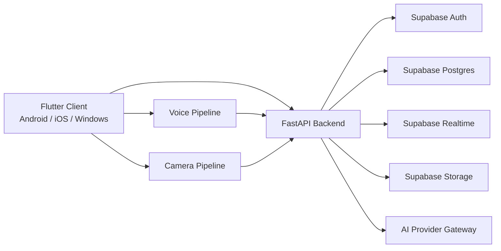
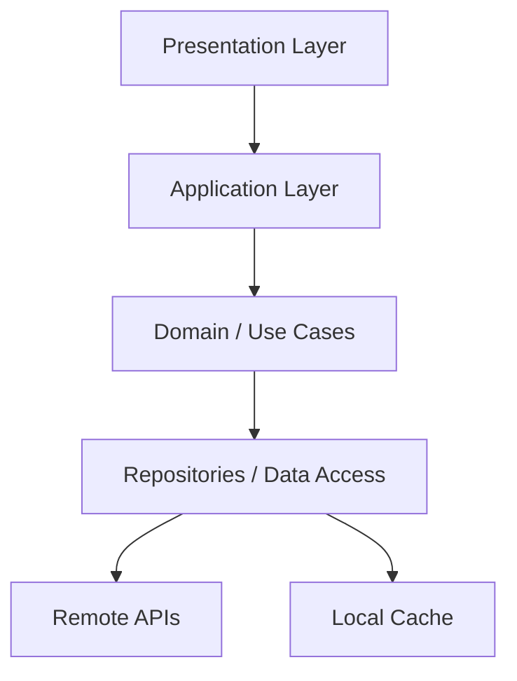
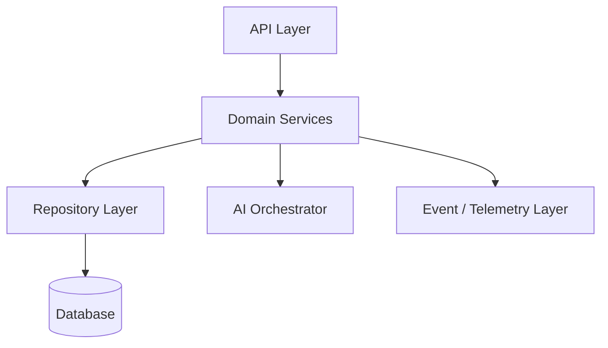
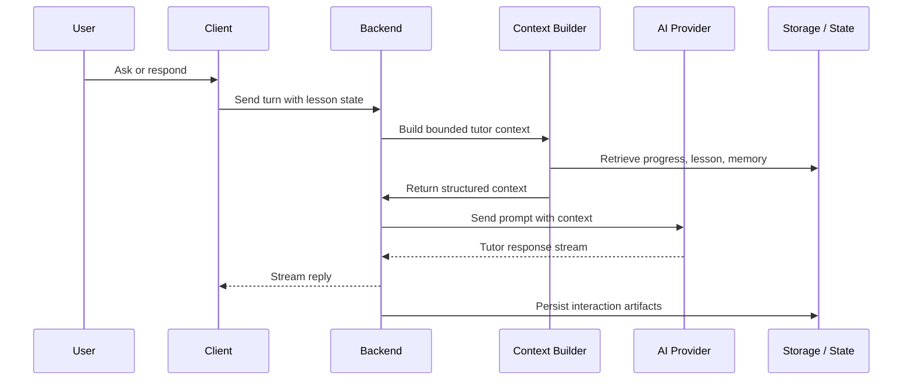
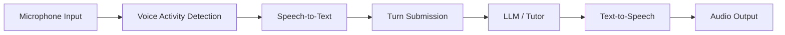
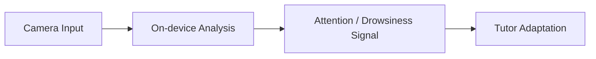

# Nerove Tutor Architecture

**Status:** Draft v1.0  
**Maintained by:** Engineering leads and contributors  
**Audience:** Backend engineers, mobile engineers, AI engineers, DevOps, and reviewers

---

## Overview

Nerove Tutor is a cross-platform, voice-first tutoring system built around three core responsibilities:

1. deliver structured learning experiences
2. orchestrate AI tutoring behavior with bounded context
3. persist learning progress and interaction state securely

The architecture is designed to support Android, iOS, and Windows from a single Flutter client codebase, while the backend is implemented as a set of stateless services backed by Supabase infrastructure.

This document describes the architecture at the system level and the module level, including boundaries, responsibilities, integration patterns, and operating constraints.

---

## Purpose

This document exists to provide a durable architectural reference for implementing and evolving Nerove Tutor. It is intended to answer the practical questions of how the system is structured, where responsibilities lie, how components interact, and how the product can evolve without introducing unnecessary coupling.

---

## Scope

This document covers:

- system architecture and runtime topology
- client and backend responsibilities
- AI and voice integration boundaries
- persistence and realtime boundaries
- security and privacy architecture
- scalability and evolution considerations

This document does not replace the product requirements, logical database design, or implementation schema. Those documents remain the authoritative source for product intent and data contract details.

---

## Design Decisions

The architecture is shaped by the following design decisions:

- The product is built around a single Flutter client for Android, iOS, and Windows.
- The backend is service-oriented and stateless where possible, with state persisted in Supabase-managed services.
- AI tutoring is treated as an orchestrated capability, not as a general-purpose chatbot.
- Voice interaction is a first-class runtime path with a defined fallback to text.
- Camera-based attention detection is optional, privacy-preserving, and never used for surveillance.
- The learning engine is structured around course, chapter, lesson, practice, quiz, and progress state.

These decisions are intended to keep the system maintainable, extensible, and suitable for future multi-course expansion.

---

## System Architecture

### High-level architecture

### Runtime responsibilities

| Layer               | Responsibility                                                                                                                                                |
| ------------------- | ------------------------------------------------------------------------------------------------------------------------------------------------------------- |
| Client              | Present the lesson experience, manage local UI state, capture voice and camera input where enabled, render course content, and interact with backend services |
| Backend             | Coordinate lesson flow, evaluate progress, manage AI tutor orchestration, enforce server-side rules, and persist structured state                             |
| Supabase Auth       | Manage identity and session lifecycle                                                                                                                         |
| Supabase Postgres   | Store profile, content, progress, and telemetry data                                                                                                          |
| Supabase Realtime   | Synchronize state across devices and sessions                                                                                                                 |
| Supabase Storage    | Store non-database assets such as avatars and media references                                                                                                |
| AI Provider Gateway | Provide a provider abstraction for LLM, voice, and related AI services                                                                                        |

---

## Client Architecture

The Flutter client is designed as a feature-oriented application with clear separation between UI, domain logic, and data access.

### Client responsibilities

- render lesson content, practice prompts, quizzes, and conversational UI
- manage local session state and offline cache for static lesson content
- coordinate voice capture and playback
- manage optional camera-based attention signals
- present progress and lesson navigation to the user
- integrate with backend services for session state and progress synchronization

### Client architecture layers

### Client module boundaries

- Authentication module
- Course and lesson module
- Learning session module
- Voice interaction module
- Camera interaction module
- Progress and quiz module
- Conversation and memory module
- Settings and profile module

### Client design principles

- UI modules should remain focused on rendering and user interaction.
- Domain logic should not be embedded directly in widgets.
- Repositories should abstract the difference between local data and remote services.
- Platform-specific behavior should be isolated behind well-defined abstractions.

---

## Backend Architecture

The backend is organized around a service-oriented model that separates orchestration from persistence and external integrations.

### Backend responsibilities

- serve lesson and course content state to the client
- enforce progression rules server-side
- orchestrate AI tutor calls and context assembly
- evaluate quiz and practice inputs where required
- persist learning state, conversation history, and telemetry
- expose integration points for realtime and provider services

### Backend component model

### Backend boundaries

- Authentication and profile service
- Course content service
- Progress and lesson pacing service
- Quiz and practice evaluation service
- Conversation and memory service
- Voice session and telemetry service
- Notification and offline-support service

### Service design principles

- Backend services should be stateless and request-driven.
- Business rules that determine progression should be enforced server-side.
- AI orchestration should be isolated behind a dedicated service boundary.
- External provider integration should not leak into feature services.

---

## AI Tutor Architecture

The AI tutor is the centerpiece of the product experience. It is not implemented as a generic chat system, but as a structured tutoring orchestrator that operates within the product’s course and progress model.

### AI tutor responsibilities

- interpret the learner’s current lesson context
- decide whether to teach, explain, review, quiz, or encourage
- assemble relevant context from progress, lesson, and mistake history
- adapt pacing and explanation depth to the student’s needs
- degrade gracefully when provider or network availability is reduced

### AI orchestration flow

### AI architecture principles

- Prompting and context assembly must be deterministic enough to be reviewed.
- The tutor should depend on structured state rather than raw history replay alone.
- Guardrails should constrain the system to tutoring behavior rather than general assistant behavior.
- Fallback behavior must be explicit and user-visible.

---

## Voice Architecture

Voice is the primary interaction mode for the product and therefore deserves a dedicated runtime architecture.

### Voice runtime flow

### Voice architecture responsibilities

- capture audio input from the client
- detect when a user begins speaking and when the user stops
- stream partial transcription for low-latency interaction
- send the turn to the backend for tutor orchestration
- stream AI output back to the client and synthesize audio
- support interruption and fallback to text mode when needed

### Voice design constraints

- latency is a primary product requirement
- barge-in must be supported from the first release
- audio should never be persisted as a product requirement
- fallback behavior must be graceful and visible

---

## Camera Architecture

The camera-based attention system is optional, privacy-preserving, and intentionally limited.

### Camera architecture principles

- camera input is opt-in and off by default
- no video or frame data is stored or uploaded
- only short-lived analytics or attention signals may be processed on-device
- the feature must never become a surveillance system

### Camera flow

### Camera design considerations

- the feature should be rate-limited and debounced
- the system must degrade gracefully when a device cannot provide a usable signal
- the AI should respond supportively rather than punitively

---

## Data Architecture

Data is organized around three workload types that influence how it is stored, indexed, and accessed:

1. structured learning content
2. per-user learning state
3. high-volume telemetry and conversation data

### Data boundaries

| Category  | Examples                                             | Characteristics                 |
| --------- | ---------------------------------------------------- | ------------------------------- |
| Content   | courses, chapters, lessons, quizzes                  | low-write, high-read, versioned |
| State     | progress, quiz attempts, bookmarks, notes, settings  | user-scoped and update-heavy    |
| Telemetry | voice sessions, conversation messages, activity logs | append-heavy and time-oriented  |

### Data access model

- content is read frequently and should be designed for predictable access
- user state is accessed as a dense “everything for student X” view
- telemetry should be append-oriented and designed for future archival and partitioning

---

## Persistence and Realtime Architecture

The system uses Supabase Postgres as the source of truth for durable application state, with Supabase Realtime used for event propagation where appropriate.

### Persistence model

- user identity and authentication live in Supabase Auth
- application data lives in Postgres tables aligned to the schema contract
- storage assets are referenced rather than embedded directly in the database
- realtime synchronization is treated as an enhancement layer, not a hard dependency for core learning flows

### Realtime behavior

- progress updates should propagate across devices when connectivity allows
- local state should remain usable even if realtime is unavailable
- reconciliation should be deterministic and based on explicit state transitions

---

## Security and Privacy Architecture

Security and privacy are architectural concerns, not only policy concerns.

### Security boundaries

- authentication is handled by Supabase Auth
- access to user-owned data is constrained by Row-Level Security and server-side enforcement
- sensitive operations must not rely on client-side trust alone
- API access should be least-privilege by design

### Privacy principles

- voice and camera features are privacy-sensitive by design
- camera input is never stored or uploaded
- voice sessions are telemetry-oriented and should not store raw audio
- the product should default to the most private and least invasive configuration

---

## Scalability and Evolution Strategy

The architecture is deliberately prepared for growth beyond the initial scope.

### Scalability expectations

- backend services should remain stateless and horizontally scalable
- content structures should support additional courses without schema rewrites
- AI provider integration should be abstracted to allow changes over time
- telemetry storage should be designed for growth and future archival

### Evolution strategy

- new courses should be modeled as new content sets rather than special-casing the implementation
- new lesson types should be represented through metadata and extension points
- new AI providers should be added behind the provider gateway
- future analytics and spaced-repetition features should build on existing state models rather than new parallel systems

---

## Operational Considerations

The architecture assumes that production operations will require explicit attention to reliability and observability.

### Operational expectations

- services should degrade gracefully when dependencies fail
- AI-dependent features should have non-AI fallback states
- client and backend should surface state clearly rather than failing silently
- telemetry should support debugging, monitoring, and incident analysis

### Failure handling principles

- auth failures should not lead to silent state loss
- AI provider outages should not crash the learning experience
- persistence failures should preserve user intent where possible
- realtime failures should not block local usage

---

## Conventions

The architecture follows consistent conventions:

- feature boundaries are explicit and aligned with product behavior
- domain logic is separated from infrastructure concerns
- user state and telemetry are treated distinctly from static content
- AI orchestration is isolated behind its own service boundary
- client-side and server-side responsibilities are deliberately separated

---

## References

This document is intended to be read alongside the following authoritative sources:

- [PRD.md](../PRD.md)
- [ERD.md](../ERD.md)
- [SCHEMA.md](../SCHEMA.md)

These documents define the product intent, logical data model, and implementation schema that this architecture document is built to support.
