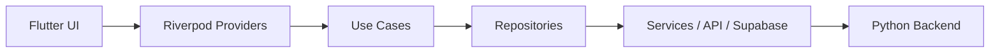
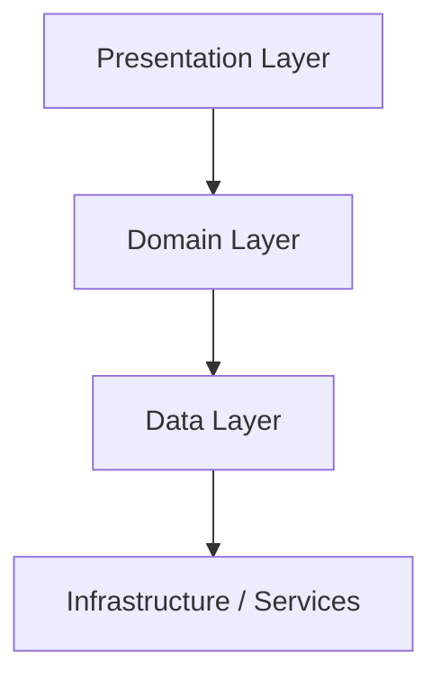
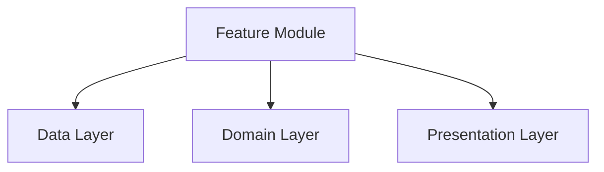

# MentorinAja Flutter Project Structure

**Status:** Draft v1.0  
**Audience:** Engineering leads, Flutter engineers, backend engineers, platform engineers, and future contributors  
**Scope:** Repository structure, Flutter application architecture, dependency rules, naming conventions, and engineering standards for a multi-developer codebase

---

## 1. Executive Summary

This document defines the authoritative repository and Flutter application structure for MentorinAja. It is written for a team with strong Node.js and backend experience but limited Flutter experience, so each Flutter concept is introduced alongside a familiar backend analogy.

The architecture recommendation is:

- Feature-first organization at the repository level
- Clean Architecture boundaries inside each feature
- Riverpod as the single solution for state management and dependency injection
- GoRouter for navigation
- A shared core layer for cross-cutting infrastructure

This structure is designed to support:

- Android, iOS, and Windows from a single Flutter codebase
- sustained development by multiple engineers
- more than 100,000 lines of code without becoming brittle
- long-term growth into additional courses, lessons, and features

---

## 2. Architectural Recommendation

### 2.1 Recommended architecture

The best fit for this project is a hybrid architecture:

- Feature-first architecture for team organization and maintainability
- Clean Architecture boundaries for dependency control and testability
- Layered separation inside each feature for presentation, domain, and data concerns

This is not a purely theoretical choice. It is the architecture that best balances:

- team velocity
- code ownership clarity
- clear boundaries between UI, business rules, and external services
- ease of onboarding for backend engineers who are new to Flutter

### 2.2 Why this architecture is the best fit

A large Flutter application becomes unmaintainable quickly when UI code, domain logic, network logic, and platform integrations are all mixed together. The proposed structure avoids that by making the app understandable in the same way a mature backend service is structured.

For a Node.js-oriented team, the mental model is:

- Feature-first organization ≈ service-oriented module organization
- Presentation layer ≈ route handlers + view layer
- Domain layer ≈ business logic services
- Data layer ≈ repository/service adapters over persistence and remote APIs

### 2.3 Why this is better than alternatives

| Architecture              | Why it is weaker for this project                                                   | Why the recommended approach is better                                                             |
| ------------------------- | ----------------------------------------------------------------------------------- | -------------------------------------------------------------------------------------------------- |
| MVC                       | Too UI-centric and ambiguous for large-scale app growth                             | The recommended approach makes business logic explicit and keeps UI thin                           |
| MVVM                      | Good for simple screens, but often becomes fragmented across a large app            | Feature-first organization provides stronger module boundaries and ownership                       |
| Feature First only        | Good for organization, but can become a folder soup without internal discipline     | Clean Architecture boundaries prevent feature-level coupling from becoming chaotic                 |
| Clean Architecture only   | Powerful but can become overly abstract and slow to implement for a growing team    | The hybrid approach uses Clean Architecture where it matters without over-engineering every screen |
| Layered Architecture only | Easy to understand, but often causes cross-layer coupling and poor module isolation | Feature-first structure keeps related code close while preserving layer boundaries                 |

### 2.4 Architectural decision summary

The project should use:

- Feature-first folders for product organization
- Clear layers inside each feature
- Shared infrastructure in core
- Explicit dependency rules enforced by convention and review

This gives the team the benefits of module-oriented development without sacrificing architectural rigor.

---

## 3. Repository Structure

The repository should be organized around clear top-level responsibilities.

```text
mentorinaja/
├── frontend/
├── backend/
├── docs/
├── scripts/
├── .github/
├── assets/
├── tools/
├── README.md
└── .gitignore
```

### 3.1 Root folders

#### frontend/

**Purpose**

Contains the Flutter mobile and desktop client application.

**Responsibilities**

- application UI
- navigation
- local state
- integrations with backend APIs and Supabase
- platform-specific entry points

**Allowed dependencies**

- may depend on shared domain contracts and infrastructure in core
- may depend on assets and localization resources

**Forbidden dependencies**

- should not contain backend business logic
- should not directly access database implementations
- should not import feature-specific code from unrelated features unless explicitly shared

**Examples of files**

- frontend/pubspec.yaml
- frontend/lib/main.dart
- frontend/lib/app.dart

**Best practices**

- keep the Flutter app as a single, coherent product boundary
- keep all feature code under frontend/lib/features
- keep platform integrations isolated in services and adapters

#### backend/

**Purpose**

Contains the Python backend services and integration logic.

**Responsibilities**

- AI tutor orchestration
- lesson and course progression rules
- storage and Supabase integration
- authentication and session orchestration

**Allowed dependencies**

- may depend on domain models and business rules defined in backend services
- may depend on Supabase and provider infrastructure

**Forbidden dependencies**

- should not contain Flutter-specific UI code
- should not contain client-side routing logic

**Examples of files**

- backend/app/main.py
- backend/app/api/routes/auth.py
- backend/app/services/tutor_service.py

**Best practices**

- keep backend services stateless where possible
- expose stable interfaces for the Flutter client
- preserve the backend as the authoritative source of business rules

#### docs/

**Purpose**

Repository-level engineering, product, architecture, and design documentation.

**Responsibilities**

- PRD, ERD, schema, design, architecture, and onboarding docs
- source-of-truth documents for contributors

**Allowed dependencies**

- none; documentation is informational only

**Forbidden dependencies**

- should not be used as runtime code

**Examples of files**

- docs/PRD.md
- docs/ERD.md
- docs/SCHEMA.md
- docs/architecture/FolderStructure.md

#### scripts/

**Purpose**

Repository automation scripts for setup, build, lint, generation, and release operations.

**Responsibilities**

- code generation commands
- environment bootstrap
- lint/test helpers
- migration or build automation

**Allowed dependencies**

- may invoke frontend and backend tooling

**Forbidden dependencies**

- should not contain production application logic

**Examples of files**

- scripts/bootstrap.sh
- scripts/gen_icons.sh

#### .github/

**Purpose**

CI/CD workflows, issue templates, pull request templates, and repository automation.

**Responsibilities**

- test pipelines
- build validation
- linting and static analysis
- release automation

**Allowed dependencies**

- none beyond repository conventions

**Forbidden dependencies**

- should not contain app code

#### assets/

**Purpose**

Shared static assets used by the Flutter client.

**Responsibilities**

- images, icons, fonts, audio, video, translations, and documents

**Allowed dependencies**

- may be referenced by frontend code only

**Forbidden dependencies**

- should not contain business logic

#### tools/

**Purpose**

Developer tooling, internal scripts, and local utilities that support the engineering workflow.

**Responsibilities**

- code generation helpers
- custom analyzers
- local development helpers

**Allowed dependencies**

- may depend on repository conventions and generated code

**Forbidden dependencies**

- should not be part of production runtime

---

## 4. Flutter Application Structure

The Flutter application lives under frontend/. The structure below should be used for the client codebase.

```text
frontend/
├── pubspec.yaml
├── analysis_options.yaml
├── lib/
│   ├── main.dart
│   ├── app.dart
│   ├── core/
│   ├── features/
│   ├── shared/
│   ├── config/
│   ├── services/
│   ├── widgets/
│   ├── models/
│   ├── extensions/
│   ├── utils/
│   ├── theme/
│   ├── routing/
│   ├── localization/
│   └── generated/
├── test/
├── integration_test/
└── assets/
```

### 4.1 lib/

**Purpose**

The root of the Flutter application source code.

**Responsibilities**

- entry point for the app
- composition of app-level modules
- top-level app initialization

**Allowed dependencies**

- may import from core, features, shared, config, services, and routing

**Forbidden dependencies**

- should not contain feature implementation directly

**Examples of files**

- lib/main.dart
- lib/app.dart

**Best practices**

- keep this folder minimal
- use it as composition root, not business logic storage

> For a Node.js team, lib/main.dart is roughly analogous to src/index.js: it boots the application and wires together the runtime composition.

### 4.2 core/

**Purpose**

Cross-cutting application infrastructure that is shared by all features.

**Responsibilities**

- error handling
- logging
- network abstractions
- storage abstractions
- environment configuration
- app-wide constants
- base classes and interfaces

**Allowed dependencies**

- may import from shared and utilities
- may not import from features

**Forbidden dependencies**

- must not depend on feature-specific business logic
- must not import UI widgets that are specific to one feature

**Examples of files**

- core/errors/app_exception.dart
- core/network/api_client.dart
- core/storage/storage_service.dart
- core/usecases/use_case.dart

**Best practices**

- keep this layer generic and reusable
- avoid feature-specific code here
- treat it as the shared infrastructure layer of the application

### 4.3 features/

**Purpose**

Product features such as authentication, course, lesson, quiz, AI tutor, settings, voice, and camera.

**Responsibilities**

- UI for a feature
- feature state and controllers
- feature-specific domain logic
- feature-specific repository adapters

**Allowed dependencies**

- may import from core, shared, and other features only through explicit shared contracts
- may import services and models

**Forbidden dependencies**

- must not import from unrelated features directly unless the abstraction is intentionally shared
- must not contain application-wide infrastructure that belongs in core

**Examples of files**

- features/authentication/presentation/pages/sign_in_page.dart
- features/course/domain/use_cases/load_course_use_case.dart

**Best practices**

- each feature should be self-contained
- keep the feature API small and explicit
- use the same structure for every feature

### 4.4 shared/

**Purpose**

Reusable cross-feature domain and UI abstractions that are not application-wide infrastructure.

**Responsibilities**

- shared entities and value objects
- shared UI primitives that are used across multiple features
- reusable feature contracts

**Allowed dependencies**

- may depend on core and common models
- may not depend on a specific feature implementation

**Forbidden dependencies**

- should not host feature-specific logic

**Examples of files**

- shared/domain/entities/app_user.dart
- shared/presentation/widgets/empty_state.dart

**Best practices**

- use this folder for abstractions that are truly shared, not for leftovers
- keep it lean to prevent accidental coupling

### 4.5 config/

**Purpose**

Application configuration, environment settings, and runtime wiring.

**Responsibilities**

- environment variables and app config
- feature flags
- provider bootstrap
- app initialization settings

**Allowed dependencies**

- may import from core and services

**Forbidden dependencies**

- should not contain feature UI
- should not contain feature domain logic

**Examples of files**

- config/app_config.dart
- config/environment.dart

**Best practices**

- keep configuration explicit and typed
- avoid hard-coded runtime behavior in this folder

### 4.6 services/

**Purpose**

Cross-cutting application services that integrate with external systems.

**Responsibilities**

- backend API clients
- Supabase adapters
- auth service wrappers
- storage service wrappers
- analytics and telemetry integrations

**Allowed dependencies**

- may depend on core and models
- may depend on repositories or domain interfaces

**Forbidden dependencies**

- should not contain presentation widgets
- should not contain feature-specific UI logic

**Examples of files**

- services/auth_service.dart
- services/supabase_service.dart

**Best practices**

- services should map external systems into stable app-facing interfaces
- keep them composable and testable

> For backend developers, this is similar to a service layer in Node.js: a well-defined adapter around infrastructure concerns.

### 4.7 widgets/

**Purpose**

Small reusable UI building blocks that are not full screens.

**Responsibilities**

- buttons
- cards
- form controls
- lesson panels
- progress indicators
- empty states

**Allowed dependencies**

- may import shared UI primitives and theme tokens

**Forbidden dependencies**

- should not contain feature-specific business logic
- should not know about data repositories directly

**Examples of files**

- widgets/primary_button.dart
- widgets/lesson_card.dart

**Best practices**

- keep widgets simple and composable
- prefer stateless widgets when possible
- pass data in rather than reaching into repositories or providers

### 4.8 models/

**Purpose**

Domain and transport models used by the app.

**Responsibilities**

- UI-facing models
- API response models
- serialization helpers
- local persistence models

**Allowed dependencies**

- may depend on extensions and utilities

**Forbidden dependencies**

- should not contain business use cases
- should not contain presentation logic

**Examples of files**

- models/course_model.dart
- models/lesson_model.dart

**Best practices**

- keep models purpose-driven
- separate DTOs from domain entities when needed
- avoid putting logic into model classes

### 4.9 extensions/

**Purpose**

Dart extension methods that make the codebase more expressive.

**Responsibilities**

- formatting helpers
- string/date conversions
- collection utilities
- UI convenience extensions

**Allowed dependencies**

- may depend on core utilities and models

**Forbidden dependencies**

- should not contain stateful or side-effecting logic

**Examples of files**

- extensions/string_extensions.dart
- extensions/date_time_extensions.dart

**Best practices**

- keep extensions small and predictable
- do not use them as a dumping ground for unrelated logic

### 4.10 utils/

**Purpose**

Pure utility code that does not belong to a domain or UI layer.

**Responsibilities**

- formatting helpers
- validators
- math helpers
- file utilities
- safe parsers

**Allowed dependencies**

- may depend on core and models

**Forbidden dependencies**

- should not depend on providers or runtime app state

**Examples of files**

- utils/validators.dart
- utils/formatters.dart

**Best practices**

- keep utilities stateless and deterministic

### 4.11 theme/

**Purpose**

Visual design tokens and theme configuration.

**Responsibilities**

- color palettes
- typography scales
- spacing
- shadows
- dark/light themes

**Allowed dependencies**

- may be imported by widgets and screens

**Forbidden dependencies**

- should not contain feature-specific business logic

**Examples of files**

- theme/app_theme.dart
- theme/app_colors.dart

**Best practices**

- centralize all visual design decisions here
- keep components consuming theme values rather than hard-coding colors

### 4.12 routing/

**Purpose**

Navigation configuration and route definitions.

**Responsibilities**

- route declarations
- route guards
- deep links
- route parameter parsing

**Allowed dependencies**

- may import feature pages and shared navigation models

**Forbidden dependencies**

- should not contain business logic unrelated to navigation

**Examples of files**

- routing/app_router.dart
- routing/route_paths.dart

**Best practices**

- keep routing centralized
- avoid spreading route definitions across features

> For backend engineers, GoRouter is the closest Flutter equivalent to an Express Router: a central registry for route matching and handler resolution.

### 4.13 localization/

**Purpose**

Translated strings and locale support.

**Responsibilities**

- strings for UI copy
- locale-specific resources
- pluralization and formatting rules

**Allowed dependencies**

- may be used by pages and widgets

**Forbidden dependencies**

- should not contain runtime state or feature logic

**Examples of files**

- localization/app_localizations.dart
- localization/arb/en.arb

**Best practices**

- all user-visible strings should come from localization resources
- do not embed hard-coded UI copy in widgets

---

## 5. Feature Structure

Every feature should follow the same internal structure. This keeps the codebase consistent even as the number of features grows.

### 5.1 Feature template

```text
features/authentication/
├── data/
│   ├── datasources/
│   │   └── auth_remote_data_source.dart
│   ├── models/
│   │   └── auth_user_dto.dart
│   └── repositories/
│       └── auth_repository_impl.dart
├── domain/
│   ├── entities/
│   │   └── auth_user.dart
│   ├── repositories/
│   │   └── auth_repository.dart
│   └── use_cases/
│       └── sign_in_use_case.dart
├── presentation/
│   ├── controllers/
│   │   └── sign_in_controller.dart
│   ├── pages/
│   │   └── sign_in_page.dart
│   └── widgets/
│       └── auth_form.dart
└── auth_feature.dart
```

### 5.2 Feature responsibilities

#### data/

**Purpose**

Implementation of remote and local data access for the feature.

**Responsibilities**

- API calls
- local cache access
- DTO mapping
- repository implementation

#### domain/

**Purpose**

Core business behavior of the feature.

**Responsibilities**

- entities
- repository interfaces
- use cases
- validation rules

#### presentation/

**Purpose**

User interface and stateful display logic.

**Responsibilities**

- pages
- widgets
- controllers/providers
- screen-level state

### 5.3 Feature examples

The following features should use this structure:

- Authentication
- Course
- Lesson
- Quiz
- AI Tutor
- Settings
- Notifications
- Camera
- Voice
- Profile

### 5.4 Feature-level rules

- each feature should own its own state and UI
- feature data should be isolated behind repository interfaces
- features may share infrastructure but should not share implementation details freely
- avoid “god features” that contain too many unrelated capabilities

### 5.5 Example: Authentication feature

```text
features/authentication/
├── data/
│   ├── datasources/
│   │   └── auth_remote_data_source.dart
│   ├── models/
│   │   └── auth_session_dto.dart
│   └── repositories/
│       └── auth_repository_impl.dart
├── domain/
│   ├── entities/
│   │   └── auth_session.dart
│   ├── repositories/
│   │   └── auth_repository.dart
│   └── use_cases/
│       └── sign_in_use_case.dart
├── presentation/
│   ├── controllers/
│   │   └── auth_controller.dart
│   ├── pages/
│   │   └── sign_in_page.dart
│   └── widgets/
│       └── auth_form.dart
└── auth_feature.dart
```

---

## 6. Dependency Rules

Dependency rules must be explicit. They are the most important guardrail for long-term maintainability.

### 6.1 Core rule

The dependency direction should be:

```text
Presentation
↓
Domain
↓
Data
```

Never the opposite.

### 6.2 Allowed imports

#### Presentation layer may import

- domain abstractions
- shared models
- theme and widgets
- routing and localization helpers

#### Domain layer may import

- core abstractions
- entities and value objects
- repository interfaces
- use cases and domain rules

#### Data layer may import

- domain interfaces
- models
- core infrastructure
- external APIs and storage services

#### Core may import

- shared utilities
- infrastructure abstractions
- platform adapters

### 6.3 Forbidden imports

#### Presentation must never import

- concrete data implementations from another feature
- repositories that are not part of its own feature contract
- infrastructure that belongs in core

#### Domain must never import

- Flutter widgets
- presentation controllers
- feature-specific UI code
- concrete data implementations

#### Data must never import

- presentation widgets
- route definitions
- screen controllers

### 6.4 Practical enforcement

The following practices should be enforced in code review:

- no feature package importing another feature’s data implementation directly
- no UI layer importing repositories directly unless it is through a provider/controller abstraction
- no domain layer depending on Riverpod, widgets, or navigation abstractions

---

## 7. Naming Conventions

The codebase should be consistent and predictable.

### 7.1 Folders

- use lowercase snake_case
- use plural nouns for collections of similar items
- use singular nouns for conceptual modules

Examples:

- features/authentication/
- features/course/
- shared/widgets/
- core/errors/

### 7.2 Files

- use lowercase snake_case
- use descriptive names
- use suffixes where appropriate

Examples:

- auth_repository_impl.dart
- sign_in_controller.dart
- lesson_detail_page.dart

### 7.3 Widgets

- use PascalCase
- prefer descriptive names
- keep names aligned with the UI role

Examples:

- LessonCard
- QuizResultBanner
- PrimaryButton

### 7.4 Pages and Screens

- use PascalCase with Page or Screen suffix
- use the feature name as a prefix where needed

Examples:

- SignInPage
- CourseOverviewScreen
- LessonDetailPage

### 7.5 Models

- use PascalCase
- domain models are nouns
- DTOs should end with DTO or use a clear transport suffix

Examples:

- CourseModel
- LessonContentDto
- AuthSession

### 7.6 DTOs

- use PascalCase
- suffix with DTO where the object is transport-specific

Examples:

- LessonDto
- QuizAttemptDto

### 7.7 Repositories

- use PascalCase
- end with Repository or RepositoryImpl

Examples:

- AuthRepository
- AuthRepositoryImpl

### 7.8 Services

- use PascalCase
- use domain-oriented names

Examples:

- AuthService
- StorageService
- VoiceSessionService

### 7.9 Providers

- use lower_snake_case for provider names
- prefer descriptive names over generic ones

Examples:

- authControllerProvider
- lessonStateProvider
- courseListProvider

### 7.10 Controllers

- use PascalCase
- suffix with Controller where the class manages screen or feature state

Examples:

- AuthController
- LessonController

### 7.11 Enums

- use PascalCase
- use singular, descriptive names

Examples:

- LessonType
- ProgressStatus
- AuthMode

### 7.12 Extensions

- use descriptive PascalCase names for the extended type

Examples:

- StringExtensions
- DateTimeExtensions

### 7.13 Constants

- use PascalCase for classes and uppercase snake_case for values

Examples:

- AppConstants
- kDefaultTimeout

### 7.14 Assets

- use lowercase snake_case
- keep names grouped by type and purpose

Examples:

- images/lesson_intro.png
- icons/voice_enabled.svg
- audio/lesson_intro.mp3

---

## 8. State Management

### 8.1 Recommendation: Riverpod

Riverpod should be the single state management solution for the Flutter app.

### 8.2 Why Riverpod

Riverpod is the best fit because it provides:

- compile-time safety
- testability
- scoped providers
- dependency injection support
- reactive state composition
- clean separation between UI and state

It is also a good match for an engineering team with a backend background because it behaves like a typed, reactive dependency container rather than an ad hoc view-model pattern.

### 8.3 Node.js analogy

Riverpod is roughly analogous to:

- Dependency Injection + Reactive State Container
- a lightweight, typed service registry with reactive subscriptions

That makes it much easier for backend engineers to reason about than a purely widget-centric state pattern.

### 8.4 Usage model

Use Riverpod for:

- feature state
- screen-level state
- asynchronous loading state
- app-wide configuration state
- service access

Avoid placing business rules directly in widgets. Keep state providers thin and orchestrate logic through use cases and repositories.

### 8.5 Provider layering

A typical pattern is:

```text
UI → Provider/Controller → Use Case → Repository → Service/API
```

This makes state handling explicit and testable.

---

## 9. Routing

### 9.1 Recommendation: GoRouter

GoRouter should be the navigation framework.

### 9.2 Why GoRouter

GoRouter is the best fit because it provides:

- typed route definitions
- deep linking support
- route guards
- clean nested navigation support
- strong fit for modern Flutter apps

### 9.3 Node.js analogy

GoRouter is similar to an Express Router:

- it maps routes to handlers
- it can support nested routes and middleware-like guards

### 9.4 Routing structure

Route definitions should live in:

- routing/app_router.dart
- routing/route_paths.dart

Routes should be grouped by feature where appropriate, but central routing registration should remain in a single place.

---

## 10. Dependency Injection

### 10.1 Recommendation: Riverpod

Riverpod should be used for both state management and dependency injection.

### 10.2 Why Riverpod is the best choice

Using Riverpod for DI removes the need to introduce a second dependency injection framework. This reduces mental overhead and keeps the architecture simpler for a team that is still learning Flutter.

### 10.3 Benefits

- no separate service locator burden
- provider-based test overrides
- easy caching and lifecycle control
- consistent mental model across state and dependencies

### 10.4 Pattern

Use providers for:

- repositories
- services
- API clients
- feature controllers
- environment configuration

---

## 11. Asset Structure

Assets should be organized by type and purpose.

```text
assets/
├── images/
├── icons/
├── animations/
├── fonts/
├── audio/
├── videos/
├── translations/
├── documents/
```

### 11.1 Asset guidelines

#### images/

- product illustrations
- lesson visuals
- onboarding art

#### icons/

- app icons
- feature icons
- navigation icons

#### animations/

- Lottie or animation assets
- transitions and effect assets

#### fonts/

- local font files
- brand typography resources

#### audio/

- voice prompts
- sound effects
- lesson audio clips

#### videos/

- optional lesson videos or explanatory media

#### translations/

- localization files
- ARB or JSON translation resources

#### documents/

- onboarding documents
- policy or help content

### 11.2 Best practices

- keep asset names lowercase and descriptive
- use a consistent naming convention per asset type
- avoid storing large binary assets in the repository unless necessary
- keep assets versioned and referenced via a single manifest or pubspec entry

---

## 12. Testing Structure

Testing should be explicit and layered.

```text
test/
├── unit/
├── widget/
├── integration/
├── golden/
├── fixtures/
└── mocks/
```

### 12.1 unit/

**Purpose**

Fast tests for domain logic, use cases, and pure utilities.

### 12.2 widget/

**Purpose**

Tests for individual widgets and feature UI interactions.

### 12.3 integration/

**Purpose**

Tests for full feature flows and navigation between screens.

### 12.4 golden/

**Purpose**

Visual regression tests for important screens and states.

### 12.5 fixtures/

**Purpose**

Static sample objects used in tests.

### 12.6 mocks/

**Purpose**

Mock implementations of services and repositories.

### 12.7 Testing rules

- test domain logic first
- test state providers and use cases directly
- keep widget tests focused on visible behavior
- use integration tests for critical user journeys

---

## 13. Directory Trees and Examples

### 13.1 Full frontend tree example

```text
frontend/
├── lib/
│   ├── main.dart
│   ├── app.dart
│   ├── core/
│   │   ├── errors/
│   │   ├── network/
│   │   └── storage/
│   ├── features/
│   │   ├── authentication/
│   │   ├── course/
│   │   ├── lesson/
│   │   ├── quiz/
│   │   ├── ai_tutor/
│   │   ├── settings/
│   │   ├── notifications/
│   │   ├── voice/
│   │   ├── camera/
│   │   └── profile/
│   ├── shared/
│   ├── config/
│   ├── services/
│   ├── widgets/
│   ├── models/
│   ├── extensions/
│   ├── utils/
│   ├── theme/
│   ├── routing/
│   └── localization/
└── test/
```

### 13.2 Example: where new features go

When adding a new feature, create a new folder under features/ with the following shape:

```text
features/new_feature/
├── data/
├── domain/
├── presentation/
└── new_feature.dart
```

If the feature is shared across multiple modules or is cross-cutting, place supporting abstractions in shared/ rather than inside the feature itself.

---

## 14. Mermaid Diagrams

### 14.1 High-level architecture



### 14.2 Dependency direction



### 14.3 Feature structure



---

## 15. Engineering Standards

### 15.1 Best practices

- keep UI thin and focused on interaction
- move business rules into domain use cases
- use repositories to abstract infrastructure details
- keep feature modules cohesive and self-contained
- prefer explicit, typed interfaces over hidden magic
- use Riverpod providers as the primary state and dependency boundary
- keep routing centralized under routing/
- keep shared infrastructure in core/

### 15.2 Anti-patterns

- putting API calls directly inside widgets
- storing business rules in screens
- importing repositories from unrelated features
- allowing one feature to know the internal structure of another feature
- scattering state across multiple unrelated providers
- using the same folder for unrelated concerns

### 15.3 Common mistakes

- treating Flutter as if it were a generic script-based UI layer rather than a structured app ecosystem
- overusing global state without clear ownership
- mixing data access and UI concerns in the same file
- adding abstractions before the need becomes clear
- creating feature folders that contain unrelated responsibilities

### 15.4 Code ownership

Each feature should have a clear owner or primary maintainer. The owner is responsible for:

- the feature's architecture quality
- dependency boundaries
- test coverage
- consistency with naming and structure conventions

### 15.5 Scalability strategy

This structure scales because it supports:

- independent feature development by different engineers
- clear boundaries for code review
- future addition of more courses and lesson types
- straightforward extraction of shared abstractions when they become necessary

### 15.6 Refactoring strategy

When code grows beyond a healthy size:

- extract use cases from controllers
- move repeated infrastructure logic into core
- split features that have become too broad
- introduce shared abstractions only when the duplication is real and repeated

### 15.7 Future expansion

This structure is designed to support:

- additional courses beyond Python
- richer lesson types
- optional multi-modal tutoring experiences
- further platform-specific integration points
- future performance tuning without architectural rewrites

---

## 16. Final Recommendation

The recommended structure for MentorinAja is a hybrid architecture composed of:

- Feature-first organization for team cohesion
- Clean Architecture boundaries for dependency discipline
- Riverpod for state and dependency injection
- GoRouter for navigation
- A shared core layer for infrastructure and cross-cutting concerns

This is the structure most likely to remain maintainable as the product grows beyond 100,000 lines of code, while remaining understandable to a team that is strong in backend engineering but still building Flutter fluency.
