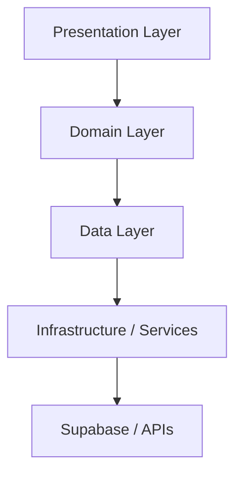

# MentorinAja Repository and Application Structure

**Status:** Draft v1.0  
**Maintained by:** Engineering leads, platform engineers, Flutter contributors, and backend contributors  
**Audience:** Engineers, reviewers, maintainers, and future contributors  
**Scope:** Repository-wide structure, Flutter application structure, feature architecture, dependency rules, testing strategy, and engineering standards

---

## 1. Purpose

This document defines the production-grade repository structure for MentorinAja. It is the engineering standard for how the repository should be organized, how the Flutter frontend should be layered, how features should be isolated, and how contributors should maintain consistency as the codebase grows.

This document is aligned with the existing product, architecture, frontend, design, and setup documentation. It does not redesign product behavior or contradict the source-of-truth documents. Instead, it implements them in a concrete, scalable structure suitable for a multi-developer team and for a codebase that will eventually exceed 100,000 lines of code.

---

## 2. Architectural Principles

The repository structure is based on the following principles:

1. Feature-first organization for product clarity
2. Layered separation for maintainability and testability
3. Explicit dependency direction to prevent architectural drift
4. Strong ownership boundaries so each feature can evolve independently
5. Backend and frontend separation without hidden coupling
6. Shared infrastructure concentrated in a small number of well-defined places

These principles are intended to support long-term development across Android, iOS, Windows, and the Python backend.

---

## 3. Repository Structure Overview

The repository should be organized as a modular, multi-service workspace with a clear separation between product documentation, frontend, backend, tooling, and shared assets.

```text
mentorinaja/
├── .github/
├── assets/
├── backend/
├── docs/
├── examples/
├── frontend/
├── scripts/
├── tools/
├── README.md
├── .gitignore
└── pyproject.toml
```

### 3.1 Top-level folders

| Folder    | Purpose                                                                      | Why it exists                                                              |
| --------- | ---------------------------------------------------------------------------- | -------------------------------------------------------------------------- |
| .github/  | CI/CD, workflow automation, issue templates, PR templates                    | Centralizes automation and repository governance                           |
| assets/   | Shared static assets for the product                                         | Keeps images, icons, fonts, translations, and media organized and reusable |
| backend/  | Python backend services and application code                                 | Separates server-side logic from client-side code                          |
| docs/     | Product, architecture, design, and contributor documentation                 | Preserves the source-of-truth documentation for the team                   |
| examples/ | Reference implementations, sample flows, and integration examples            | Helps onboarding and demonstrates approved patterns                        |
| frontend/ | Flutter application for Android, iOS, and Windows                            | Keeps the client codebase isolated from backend and tooling                |
| scripts/  | Build, setup, generation, and automation scripts                             | Encapsulates repeatable developer workflows                                |
| tools/    | Developer utilities, generators, local helpers, and internal support tooling | Keeps auxiliary engineering tooling separate from core application code    |

---

## 4. Backend Repository Structure

The backend should be organized as a modular Python service layer that supports the Flutter client while preserving business rules on the server.

```text
backend/
├── app/
│   ├── api/
│   │   ├── deps/
│   │   ├── routes/
│   │   └── schemas/
│   ├── core/
│   │   ├── config/
│   │   ├── errors/
│   │   ├── logging/
│   │   └── security/
│   ├── domain/
│   │   ├── models/
│   │   ├── services/
│   │   └── use_cases/
│   ├── infrastructure/
│   │   ├── auth/
│   │   ├── db/
│   │   ├── storage/
│   │   ├── ai/
│   │   └── telemetry/
│   ├── services/
│   └── tests/
├── scripts/
├── requirements.txt
└── pyproject.toml
```

### 4.1 Backend responsibilities

- Implement tutor orchestration, lesson progression, quiz evaluation, and user progression logic
- Enforce server-side business rules and guardrails
- Provide stable API contracts for the Flutter client
- Integrate with Supabase Auth, Postgres, Storage, Realtime, and AI providers

### 4.2 Backend ownership

- The backend owns product rules that must be enforced consistently across clients
- The Flutter client should not be the authority for progression or grading rules

### 4.3 Node.js comparison

For a Node.js-oriented team, the backend structure is similar to a service-oriented Express/Fastify application with:

- routes ≈ API endpoints
- services ≈ domain services
- infrastructure ≈ database and provider adapters

---

## 5. Frontend Repository Structure

The Flutter frontend should be isolated under frontend/ and structured as a single client application that can evolve safely over time.

```text
frontend/
├── android/
├── ios/
├── windows/
├── linux/
├── macos/
├── web/
├── lib/
│   ├── core/
│   ├── features/
│   ├── shared/
│   ├── config/
│   ├── routing/
│   ├── theme/
│   ├── localization/
│   ├── services/
│   ├── utils/
│   ├── extensions/
│   ├── models/
│   ├── widgets/
│   ├── app.dart
│   └── main.dart
├── test/
├── integration_test/
├── pubspec.yaml
├── analysis_options.yaml
├── melos.yaml
└── README.md
```

### 5.1 Why each frontend folder exists

| Folder                | Why it exists                                                                  |
| --------------------- | ------------------------------------------------------------------------------ |
| android/              | Android-specific project files and build configuration                         |
| ios/                  | iOS-specific project files and build configuration                             |
| windows/              | Windows desktop support                                                        |
| linux/                | Linux desktop support                                                          |
| macos/                | macOS desktop support                                                          |
| web/                  | Web support if needed for future expansion                                     |
| lib/                  | All application source code                                                    |
| test/                 | Unit and widget tests                                                          |
| integration_test/     | End-to-end user-flow tests                                                     |
| pubspec.yaml          | Package manifest; equivalent to package.json in Node.js                        |
| analysis_options.yaml | Linting and static analysis rules                                              |
| melos.yaml            | Optional workspace tooling if the frontend later splits into multiple packages |

### 5.2 Node.js comparison

- pubspec.yaml ≈ package.json
- lib/main.dart ≈ src/index.js
- Flutter widgets ≈ UI components rendered by the app runtime
- Flutter routes ≈ route handlers in a web/server framework

---

## 6. lib/ Structure

The lib/ folder should be organized around clear ownership and dependency direction.

```text
frontend/lib/
├── app.dart
├── main.dart
├── core/
├── features/
├── shared/
├── config/
├── routing/
├── theme/
├── localization/
├── services/
├── utils/
├── extensions/
├── models/
├── widgets/
└── generated/
```

### 6.1 Folder responsibilities

| Folder        | Responsibility                                                                                     | Allowed imports                    | Forbidden imports                        |
| ------------- | -------------------------------------------------------------------------------------------------- | ---------------------------------- | ---------------------------------------- |
| core/         | Cross-cutting infrastructure: errors, storage abstractions, network primitives, app-wide utilities | shared/, utils/, services/         | features/ business logic                 |
| features/     | Product features such as auth, course, lesson, quiz, ai, voice, camera, profile, settings          | core/, shared/, services/, models/ | unrelated feature internals              |
| shared/       | Reusable abstractions used by more than one feature                                                | core/, models/, utils/             | feature-specific business logic          |
| config/       | App configuration, runtime environment, feature flags, bootstrap                                   | core/, services/                   | UI widgets, feature screens              |
| routing/      | Route definitions and route guards                                                                 | features/, shared/                 | business logic not related to navigation |
| theme/        | Design tokens, colors, typography, spacing, themes                                                 | widgets/, shared/                  | feature-specific use cases               |
| localization/ | Translations and locale resources                                                                  | widgets/, screens, shared/         | data repositories                        |
| services/     | API clients, Supabase adapters, storage wrappers, audio/video helpers                              | core/, models/, shared/            | presentation widgets                     |
| utils/        | Pure, stateless helpers                                                                            | core/, models/                     | providers and runtime app state          |
| extensions/   | Dart extension methods for common types                                                            | utils/, models/                    | side-effecting logic                     |
| models/       | Domain models and DTOs                                                                             | extensions/, utils/                | use cases and UI-only code               |
| widgets/      | Reusable UI building blocks                                                                        | theme/, localization/, shared/     | repositories, feature-specific logic     |

### 6.2 Ownership

- core/ owns shared infrastructure
- features/ owns feature-specific behavior
- shared/ owns genuinely cross-cutting abstractions
- routing/ owns navigation composition
- theme/ and localization/ own universal presentation concerns

### 6.3 Dependency direction

The dependency direction should be:

```text
presentation -> domain -> data -> infrastructure
```

In practice, the dependency direction for this repository is:

```text
features/presentation -> features/domain -> features/data -> core/services
```

No layer should depend on the layer above it.

---

## 7. Standard Feature Structure

Each feature should follow the same internal structure so contributors can navigate the codebase consistently.

```text
frontend/lib/features/auth/
├── application/
│   └── auth_controller.dart
├── data/
│   ├── datasources/
│   │   └── auth_remote_data_source.dart
│   ├── models/
│   │   └── auth_session_dto.dart
│   └── repositories/
│       └── auth_repository_impl.dart
├── domain/
│   ├── entities/
│   │   └── auth_session.dart
│   ├── repositories/
│   │   └── auth_repository.dart
│   └── use_cases/
│       └── sign_in_use_case.dart
├── presentation/
│   ├── pages/
│   │   └── sign_in_page.dart
│   └── widgets/
│       └── auth_form.dart
└── auth_feature.dart
```

### 7.1 Feature folders

| Folder        | Responsibility                                                          |
| ------------- | ----------------------------------------------------------------------- |
| presentation/ | Pages, widgets, screens, and screen-level UI state                      |
| domain/       | Entities, value objects, repositories interfaces, and use cases         |
| data/         | Repositories, data sources, DTOs, and persistence adapters              |
| application/  | Feature controllers, providers, and orchestrators                       |
| widgets/      | Feature-specific reusable UI components                                 |
| models/       | Feature-local data models when needed                                   |
| repositories/ | Feature repository abstractions and implementations                     |
| datasources/  | Remote/local data source implementations                                |
| providers/    | Feature-level providers or state holders                                |
| services/     | Feature-local service adapters if they are not generic enough for core/ |

### 7.2 Feature examples

The following features should all use this structure:

- auth/
- course/
- lesson/
- quiz/
- ai/
- voice/
- camera/
- profile/
- settings/
- notifications/

### 7.3 Node.js comparison

A feature module in Flutter is closest to a Node.js domain module that has:

- controllers ≈ route handlers or request handlers
- use cases ≈ service layer methods
- repositories ≈ data access layer
- data sources ≈ database or external API adapters

---

## 8. Dependency Rules

The most important engineering rule in the repository is that dependencies must move in one direction.

### 8.1 Canonical dependency direction

```text
Presentation
  ↓
Domain
  ↓
Data
  ↓
Infrastructure
```

### 8.2 Allowed imports

| Layer          | May import                                                  |
| -------------- | ----------------------------------------------------------- |
| Presentation   | domain/, shared/, theme/, localization/, widgets/           |
| Domain         | core/, shared/, models/, repositories interfaces/           |
| Data           | domain/, core/, services/, external APIs, local persistence |
| Infrastructure | core/, services/, providers/                                |

### 8.3 Forbidden imports

| Layer          | Must never import                            |
| -------------- | -------------------------------------------- |
| Presentation   | data implementations from unrelated features |
| Domain         | widgets, screens, Flutter UI code            |
| Data           | presentation widgets or page code            |
| Infrastructure | feature-specific UI logic                    |

### 8.4 Practical enforcement

- Feature presentation should not import another feature’s repository implementation
- Domain should not know about Riverpod widgets or Flutter navigation details
- Data should not depend on page widgets or route definitions

### 8.5 Dependency diagram



---

## 9. State Management

### 9.1 Recommendation: Riverpod

Riverpod should be the single state management solution for the Flutter app.

### 9.2 Why Riverpod is the best fit

Riverpod is the best choice because it provides:

- typed state and dependency management
- excellent testability
- predictable provider scoping
- strong support for async state and loading/error states
- a clean path to dependency injection without a second framework

This is a strong fit for MentorinAja because the app has many asynchronous flows, including:

- authentication
- course and lesson loading
- voice interactions
- quiz evaluation
- progress synchronization

### 9.3 Comparison

| Option   | Strengths                                         | Weaknesses                        | Recommendation                  |
| -------- | ------------------------------------------------- | --------------------------------- | ------------------------------- |
| Riverpod | Strong typing, testability, DI support, scalable  | Slight learning curve             | Recommended                     |
| Bloc     | Very explicit state transitions, mature ecosystem | More boilerplate and ceremony     | Not preferred for this codebase |
| Cubit    | Simpler than Bloc                                 | Less expressive for complex flows | Acceptable but not preferred    |
| Provider | Familiar but less robust and less future-proof    | Weaker typing and harder to scale | Not recommended                 |

### 9.4 Node.js comparison

Riverpod is closest to:

- dependency injection + reactive state container
- a typed service registry with observable state

This is easier for backend engineers to understand than widget-centric state patterns.

---

## 10. Routing

### 10.1 Recommendation: GoRouter

GoRouter should be the routing solution for the Flutter app.

### 10.2 Why GoRouter is the best fit

GoRouter provides:

- centralized route definitions
- deep-linking support
- route guards and nested navigation
- clear management for multi-screen flows such as onboarding, lessons, quizzes, and settings

### 10.3 Comparison

| Option      | Strengths                                      | Weaknesses                               | Recommendation               |
| ----------- | ---------------------------------------------- | ---------------------------------------- | ---------------------------- |
| GoRouter    | Modern, well-supported, simple to reason about | Requires disciplined route definition    | Recommended                  |
| AutoRoute   | Code generation and type-safe routes           | More ceremony and setup                  | Acceptable but not preferred |
| Navigator 2 | Powerful but low-level and complex             | Too much complexity for the initial team | Not recommended              |

### 10.4 Node.js comparison

GoRouter is closest to an Express Router or a central route registry in a web server.

---

## 11. Dependency Injection

### 11.1 Recommendation: Riverpod

Riverpod should be used for dependency injection as well as state management.

### 11.2 Why this is the best conclusion

Using Riverpod for both state management and DI avoids introducing a second framework and keeps the architecture easier to learn. It also makes testing easier because providers can be overridden in tests.

### 11.3 Comparison

| Option     | Strengths                                        | Weaknesses                           | Recommendation |
| ---------- | ------------------------------------------------ | ------------------------------------ | -------------- |
| Riverpod   | Unified model for state and dependency injection | Requires team familiarity            | Recommended    |
| GetIt      | Simple service locator                           | Less explicit and less test-friendly | Not preferred  |
| Injectable | Good code generation support                     | Adds additional setup and complexity | Not preferred  |

### 11.4 Node.js comparison

Riverpod is closest to a dependency injection container plus reactive subscriptions, which is familiar to teams that use DI containers or service registries in backend systems.

---

## 12. Asset Structure

Assets should be organized by content type and kept separate from code.

```text
assets/
├── images/
├── icons/
├── illustrations/
├── animations/
├── fonts/
├── audio/
├── videos/
├── translations/
└── documents/
```

### 12.1 Asset rules

| Asset folder   | Use for                                            |
| -------------- | -------------------------------------------------- |
| images/        | product images, onboarding visuals, lesson imagery |
| icons/         | UI icons and feature icons                         |
| illustrations/ | editorial or explanatory art                       |
| animations/    | Lottie or other animated assets                    |
| fonts/         | local font files                                   |
| audio/         | voice prompts, effects, and other sound assets     |
| videos/        | optional video-based lesson content                |
| translations/  | localization resources                             |
| documents/     | help articles, policy docs, or issue references    |

### 12.2 Naming conventions

- folder names should be lowercase and descriptive
- files should use lowercase snake_case
- names should reflect the purpose of the asset, not the implementation detail

Examples:

- assets/images/onboarding_welcome.png
- assets/icons/voice_active.svg
- assets/animations/lesson_complete.json

---

## 13. Testing Structure

The testing strategy should be layered so that fast unit tests cover logic, widget tests cover local behavior, and integration tests cover whole flows.

```text
frontend/
├── test/
│   ├── unit/
│   ├── widget/
│   ├── integration/
│   ├── golden/
│   ├── fixtures/
│   └── mocks/
```

### 13.1 Test responsibilities

| Test folder  | Responsibility                                         |
| ------------ | ------------------------------------------------------ |
| unit/        | Domain logic, use cases, validators, pure utilities    |
| widget/      | Widgets, UI composition, widget-level interactions     |
| integration/ | Full feature flows, navigation, state transitions      |
| golden/      | Visual regression tests for key screens and states     |
| fixtures/    | Sample data and reusable test payloads                 |
| mocks/       | Mock repositories, services, and external integrations |

### 13.2 Testing standards

- Do not test implementation details when visible behavior can be tested instead
- Keep unit tests focused on logic and contracts
- Use integration tests for critical workflows such as onboarding, lesson progression, and quiz completion
- Use golden tests for important screens that must remain visually stable

---

## 14. Naming Conventions

Consistency is critical for maintainability. The following naming rules should be used across the repository.

### 14.1 Folders

- use lowercase snake_case
- use plural nouns for groups of similar items
- use singular nouns for modules and concepts

Examples:

- features/auth
- features/course
- core/errors

### 14.2 Files

- use lowercase snake_case
- use descriptive names
- use suffixes where appropriate

Examples:

- auth_repository_impl.dart
- lesson_detail_page.dart
- app_router.dart

### 14.3 Widgets

- use PascalCase
- use descriptive names tied to their role

Examples:

- LessonCard
- QuizResultBanner
- PrimaryButton

### 14.4 Pages and Screens

- use PascalCase with Page or Screen suffix

Examples:

- SignInPage
- LessonDetailScreen

### 14.5 Repositories

- use PascalCase
- suffix with Repository or RepositoryImpl

Examples:

- AuthRepository
- AuthRepositoryImpl

### 14.6 Services

- use PascalCase and domain-oriented names

Examples:

- AuthService
- VoiceSessionService
- StorageService

### 14.7 Providers

- use lower_snake_case names
- keep names tied to the state they expose

Examples:

- auth_controller_provider
- lesson_state_provider

### 14.8 Models

- use PascalCase
- domain models should be nouns
- DTOs should be clearly transport-oriented

Examples:

- CourseModel
- LessonContentDto

### 14.9 Enums

- use PascalCase
- use singular descriptive names

Examples:

- LessonType
- ProgressStatus

### 14.10 Extensions

- use descriptive names that reflect the type being extended

Examples:

- StringExtensions
- DateTimeExtensions

### 14.11 Assets

- use lowercase snake_case
- include the asset category in the name when helpful

Examples:

- onboarding_welcome.png
- lesson_code_example.svg

---

## 15. Engineering Standards

### 15.1 Best practices

- Keep presentation code thin and focused on rendering and interaction
- Move business logic into domain use cases and feature controllers
- Use repositories to hide data access details from the UI layer
- Keep features self-contained and cohesive
- Keep infrastructure shared and generic
- Treat the backend as the authority for progression, evaluation, and security rules
- Keep routing and theme centralized
- Favor explicit, typed contracts over ad-hoc maps and dynamic values

### 15.2 Anti-patterns

- Putting API calls directly inside widgets
- Embedding business rules inside screen classes
- Importing repository implementations from unrelated features
- Mixing UI, state, data-access, and business logic in the same file
- Scattering feature state across unrelated providers
- Allowing one feature to depend on another feature’s internal structure

### 15.3 Scalability strategy

The structure scales because it supports:

- independent development by multiple engineers
- clear review boundaries around feature code
- future addition of more lesson types and courses
- clear separation between shared infrastructure and feature implementation

### 15.4 Refactoring strategy

When code grows, refactor in this order:

1. extract business logic from screens into use cases
2. move repeated infrastructure logic into core/
3. split overly broad features into smaller modules
4. introduce shared abstractions only when duplication is real and recurring

### 15.5 Feature ownership

Each feature should have a primary owner or maintainers responsible for:

- architectural consistency
- test coverage
- dependency rules
- naming and file organization

### 15.6 Code ownership

The repository should preserve ownership clarity so that contributors understand:

- which team owns which feature
- which modules are shared infrastructure
- which files are stable contracts and which are implementation details

### 15.7 Plugin strategy

Plugins should be used carefully and only when they provide clear value. The repository should prefer stable, widely supported packages over experimental solutions. Plugin decisions should be reviewed as architecture decisions, not treated as local implementation details.

### 15.8 Future expansion

This structure is designed to support:

- additional courses beyond the initial Python offering
- richer lesson and quiz types
- more advanced AI tutor orchestration
- future platform support beyond the current set
- long-term maintainability without a structural rewrite

---

## 16. Recommended Initial Directory Tree

The initial repository should be created with the following structure:

```text
.github/
  workflows/
  ISSUE_TEMPLATE/
assets/
  images/
  icons/
  illustrations/
  animations/
  fonts/
  audio/
  videos/
  translations/
  documents/
backend/
  app/
    api/
    core/
    domain/
    infrastructure/
    services/
    tests/
  scripts/
  pyproject.toml
  requirements.txt
docs/
  architecture/
  design/
  frontend/
  development/
examples/
frontend/
  android/
  ios/
  windows/
  linux/
  macos/
  web/
  lib/
    core/
    features/
    shared/
    config/
    routing/
    theme/
    localization/
    services/
    utils/
    extensions/
    models/
    widgets/
  test/
  integration_test/
  pubspec.yaml
  analysis_options.yaml
  melos.yaml
scripts/
  dev/
  ci/
  release/
tools/
  generators/
  lint/
  local/
README.md
.gitignore
```

---

## 17. Final Recommendation

The repository should be implemented as a modular, feature-oriented system with:

- a clear backend/client split
- a layered Flutter frontend under frontend/lib
- explicit feature boundaries and dependency direction
- Riverpod as the single state and dependency management model
- GoRouter as the navigation framework
- a shared infrastructure layer in core/
- layered testing for unit, widget, integration, and visual regression coverage

This structure is the best fit for MentorinAja because it aligns with the existing architectural documents, supports multiple contributors, preserves long-term maintainability, and provides a strong foundation for growth beyond the initial release.
