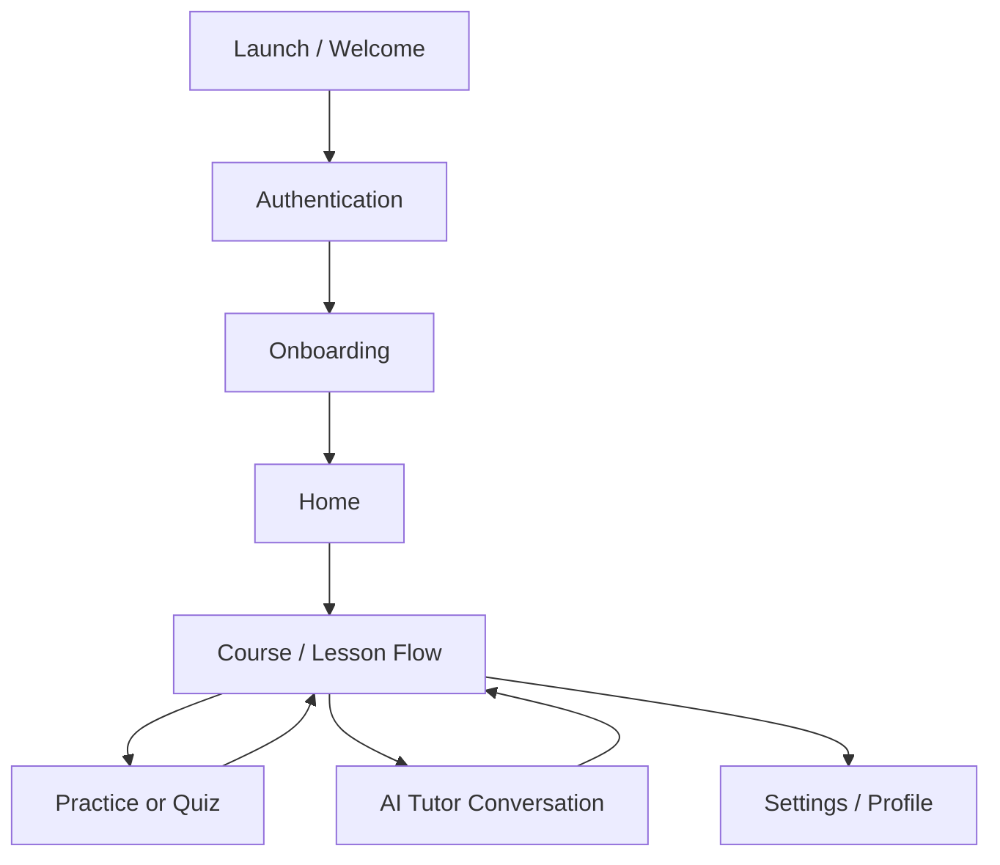
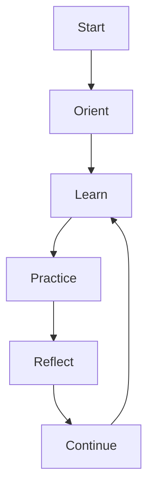
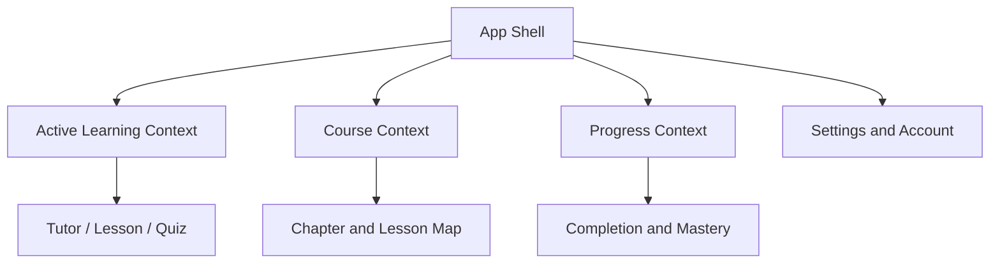
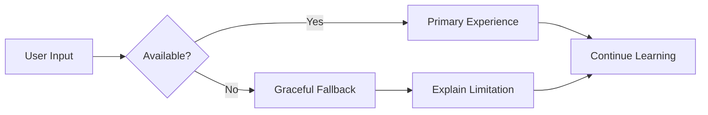

# MentorinAja Design

**Status:** Draft v1.0  
**Maintained by:** Product, design, and engineering contributors  
**Audience:** Designers, frontend engineers, product managers, and reviewers

---

## Overview

MentorinAja is a voice-first, AI-assisted learning product designed to feel like a private tutor rather than a generic chatbot. The experience is built around calm guidance, visible progress, and low-friction interaction. The design philosophy centers on helping learners stay focused, feel supported, and make steady progress without becoming overwhelmed.

This document explains the product design philosophy and user experience strategy behind MentorinAja. It is not a component library or visual specification; it is the product-level explanation of why the experience is shaped the way it is.

---

## Purpose

This document exists to ensure that product design remains coherent as the application grows. It captures the reasoning behind the experience architecture, navigation model, interaction patterns, and quality expectations across Android, iOS, and Windows.

It serves as a reference for:

- product and design decisions
- implementation alignment across platforms
- user experience consistency for contributors
- future product evolution without design drift

---

## Design Goals

MentorinAja should feel:

- modern
- clean
- premium
- educational
- friendly
- minimal
- calm
- fast
- accessible

The design language is inspired by the quality standards of leading education and productivity products, but the experience is not a direct imitation. The goal is to create a product that feels thoughtful, trustworthy, and focused on learning.

### Primary design objectives

1. Make learning feel personal and guided.
2. Reduce cognitive load during every interaction.
3. Preserve momentum through clear feedback and visible progress.
4. Make voice interaction feel natural and low-friction.
5. Create a product that feels calm even during difficult learning moments.
6. Ensure the experience remains usable on low-end devices and in fragmented real-world contexts.

---

## Design Principles

### 1. Learning first, interface second

The user interface should never compete with the learning objective. The experience should draw attention to the lesson, the explanation, or the next action—not to decorative complexity.

### 2. Feel like a tutor, not a search box

The product should behave like a patient teacher that knows where the learner is, what they are trying to learn, and when to slow down. The interface should support that relationship through pacing, clarity, and continuity.

### 3. Reduce friction without reducing depth

Simple interactions should not come at the cost of pedagogical depth. The product should make it easy to respond, continue, ask questions, and review concepts while still supporting meaningful learning.

### 4. Be calm under pressure

When a learner is stuck, confused, or tired, the product should remain reassuring. It should not feel performative, aggressive, or judgmental.

### 5. Make progress visible

Learners should always understand what they are working on, how far they have come, and what comes next. Progress should be visible at multiple levels: lesson, chapter, course, and long-term growth.

### 6. Respect attention and context

The experience should be designed for fragmented and multitasking usage. It should remain understandable even when the user is interrupted, switching devices, or returning after a long break.

---

## Product Experience Philosophy

MentorinAja is designed around the idea that learning is a guided process, not a series of disconnected prompts. The experience should feel continuous, coherent, and emotionally supportive.

The product should guide users through three layers of interaction:

1. Orientation — understand the learner’s place in the course and what comes next.
2. Interaction — teach, respond, practice, and evaluate.
3. Reflection — show progress, reinforce mastery, and maintain continuity.

This creates an experience that feels more like a learning journey than a utility app.

---

## First Launch Experience

The first launch experience should establish trust immediately. It should feel fast, clear, and focused on progress rather than onboarding clutter.

### Goals of the first launch

- create confidence quickly
- help the user start learning without delay
- establish the identity of the product as a tutor, not just a content viewer
- collect only the minimum information needed to personalize the first experience

### First launch sequence

1. App opens with a polished loading and welcome state.
2. The user is invited to sign in or continue as a guest where appropriate.
3. Lightweight onboarding collects essential context such as goals and experience level.
4. The user is guided directly into lesson one rather than an empty dashboard.
5. The tutor greets the student and begins the first lesson immediately.

### Design intent

The first launch is intentionally brief and momentum-oriented. The app should avoid asking for too much information before showing value.

---

## Authentication Flow

Authentication should feel secure, unobtrusive, and seamless.

### Design goals

- protect progress and personalization
- avoid unnecessary friction for returning users
- support email and social sign-in where appropriate
- make sign-in feel trustworthy and simple

### Experience behavior

- the authentication experience should be visually calm and focused
- the user should understand what is happening and why
- errors should be presented clearly and without blame
- returning users should be routed back into their learning context quickly

### Design principles

- security should be invisible in the best cases
- authentication should never interrupt the learning flow more than necessary
- state should be preserved across app restarts and device changes

---

## Onboarding Flow

The onboarding experience should help the product understand the learner without making them feel tested.

### Goals of onboarding

- establish initial learning context
- set expectations for the tutoring experience
- collect minimal personalization data
- create momentum toward first success

### What onboarding should feel like

- short and opinionated
- supportive and non-judgmental
- clear about what the app does and how it will assist
- focused on learning goals rather than generic profile completion

### Onboarding content

The onboarding flow should gather:

- preferred name or display name
- level of experience
- learning goal
- privacy and notification preferences

It should not behave like a formal placement exam. The system should use the collected context to shape pacing, not to gate entry.

---

## Home Screen

The home screen should act as a landing point for momentum, not a cluttered dashboard.

### Design intent

The home experience should answer three questions immediately:

- What should I do next?
- Where did I leave off?
- What progress have I made?

### Content hierarchy

The home screen should prioritize:

1. continue where you left off
2. next recommended lesson or activity
3. progress summary
4. quick access to course map and settings

### Design treatment

The screen should feel light, focused, and forward-looking. It should not feel like a control panel or administrative overview.

---

## Dashboard

The dashboard is a secondary surface. It should provide structure and context without overwhelming the learner.

### Dashboard purpose

- show overview of progress
- provide course-level context
- support navigation to chapters and lessons
- reveal pacing and mastery signals

### Dashboard design behavior

The dashboard should remain visually calm and explanatory. It should never feel like a dense analytics screen. Progress should be presented with clarity and encouragement rather than pressure.

---

## Course Flow

The course flow is central to the product. It should feel structured, accessible, and guided.

### Course structure

The experience should reflect the progression:

- course
- chapter
- lesson
- practice
- quiz
- next lesson

This sequence should be visible in the interface and reflected in the pacing of the experience.

### Design intent

Course navigation should make the path clear without making the learner feel constrained. The learner should always understand what they are doing now and what comes next.

### Interaction behavior

- progress should be visible in context
- unlocked content should feel attainable
- locked content should be clearly indicated without being discouraging
- transitions between lessons should feel smooth and calm

---

## Lesson Flow

The lesson flow should feel like a guided teaching experience rather than static content consumption.

### Design goals

- keep attention on the current concept
- maintain continuity between explanation, example, and practice
- allow the learner to move at a natural pace
- support both voice and text interaction during the same session

### Lesson experience structure

A lesson should contain:

- a clear learning objective
- a short explanation or teaching step
- one or more examples or code demonstrations
- an opportunity for practice or reflection
- a clear next step

### Design treatment

The layout should be spacious, readable, and low-noise. The learner should feel that the lesson is guiding them rather than asking them to parse a wall of content.

---

## AI Tutor Flow

The AI tutor is the product’s core differentiator. The experience should make the tutor feel attentive, helpful, and consistent without becoming emotionally overbearing.

### Design goals

- make the tutor feel like a personal guide
- avoid making the experience feel like a generic chat interface
- preserve a structured teaching rhythm
- make tutoring behavior understandable and trustworthy

### Tutor interaction principles

- the tutor should be explicit about context and next steps
- explanations should be paced and layered
- the tutor should adapt to difficulty and confusion without being repetitive
- the tutor should help learners recover from mistakes rather than simply correct them

### Experience qualities

The AI tutor should feel:

- patient
- encouraging
- precise
- calm
- informative
- nonjudgmental

---

## Voice Interaction Flow

Voice is the primary interaction modality and should feel as natural as possible. The experience must support real-time conversation while preserving clarity and accessibility.

### Voice design goals

- make speaking feel effortless
- support interruptions and back-and-forth exchange
- maintain visible context during voice interaction
- provide a text fallback that is always available

### Voice experience principles

- voice should feel like a natural extension of the lesson, not a separate mode
- the interface should show the current state of listening, processing, and speaking
- the user should never feel uncertain whether the app heard them
- the system should gracefully support interruptions, retries, and fallback to typing

### Interaction behavior

A voice session should provide:

- clear listening state
- visible transcription or partial transcript where appropriate
- a way to stop, retry, or switch to typing
- a calm and legible transcript history

---

## Code Viewer Flow

The code viewer is a key part of the learning experience because many lessons require reading and understanding code examples.

### Design goals

- make code readable without making it feel intimidating
- support line-by-line explanation and highlighting
- allow the learner to focus on the relevant portion of the example
- remain usable on small screens and larger layouts

### Experience design

The code viewer should:

- present code in a structured, readable format
- allow the learner to follow the explanation with minimal effort
- support focus on specific line references or conceptual sections
- use enough spacing and contrast to remain comfortable for long reading sessions

---

## Quiz Flow

The quiz experience should feel intentional, focused, and supportive.

### Goals of the quiz experience

- provide objective checkpoints
- reinforce learning without feeling punitive
- clearly communicate outcomes and next steps
- preserve a sense of progress and momentum

### Design behavior

- quizzes should feel concise and approachable
- feedback should explain the outcome rather than simply mark it incorrect
- the learner should always understand whether they are ready to continue
- failed attempts should create a path toward review rather than discouragement

---

## Progress Tracking

Progress is a core emotional and functional element of the experience. It should be visible, meaningful, and motivating without becoming superficial.

### Design goals

- make progress feel real and cumulative
- help learners recover from setbacks without losing momentum
- show the next step clearly

### Progress representation

The interface should communicate:

- lesson completion state
- chapter progress
- cumulative mastery or confidence signals
- next recommended action

Progress should be presented as a learning journey, not as a game-like achievement system alone.

---

## Settings

Settings should be simple, understandable, and privacy-conscious.

### Design goals

- make privacy decisions visible and understandable
- expose important preferences without overwhelming the user
- keep default values safe and privacy-preserving

### Settings categories

Settings should organize controls such as:

- voice preferences
- camera preferences
- notification preferences
- appearance preferences
- accessibility preferences
- account and session controls

The design should avoid burying critical privacy controls in obscure menus.

---

## Notifications

Notifications should feel useful and respectful. They should support continuity without becoming intrusive.

### Design principles

- notifications should help the learner continue when they are ready
- they should be opt-in and configurable
- they should not feel manipulative or constant
- they should respect the student’s rhythm and context

---

## Error States

Error states should be human-centered and actionable. They should reduce anxiety and provide clear next steps.

### Error experience principles

- errors should be understandable in plain language
- the user should always know what happened
- the next action should be obvious
- the experience should avoid blame or confusion

### Common error examples

- network loss
- authentication failure
- inability to process voice input
- AI service unavailability
- quiz grading failure

The UI should present these states as recoverable moments rather than dead ends.

---

## Empty States

Empty states should feel intentional and hopeful. They should orient the user rather than simply saying “nothing here.”

### Empty state principles

- describe what the user can do next
- keep the message short and encouraging
- make the next action visually obvious
- avoid empty-looking layouts that feel abandoned

---

## Offline States

Offline states should preserve trust and clarity. The experience should communicate clearly when some content is unavailable offline and when the user must reconnect.

### Offline design principles

- make the limitation clear
- preserve as much continuity as possible
- avoid making the app appear broken when functionality is unavailable
- support a graceful fallback to cached static content where applicable

---

## Navigation Philosophy

Navigation should feel calm, predictable, and unobtrusive. The product should rarely force the user to think about navigation mechanics. The focus should remain on the learning task.

### Navigation principles

- navigation should support momentum
- the next step should be obvious
- the user should frequently know where they are and where they are going
- navigation should adapt to context rather than always following the same structure

### Navigation hierarchy

The primary navigation hierarchy is:

1. app shell
2. lesson or course context
3. focused interaction surface
4. supporting utilities such as settings or progress

This hierarchy ensures that the learner sees the content and path forward before secondary navigation options.

### Screen hierarchy

### Deep linking

Deep links should support direct entry to a lesson, course section, or active tutoring context. This is valuable for returning users and for future cross-device continuity.

### Future scalability

Navigation should support future growth into additional courses, lesson types, and richer tutoring experiences without becoming structurally fragile. The navigation model should remain modular and route-driven rather than hard-coded to a single flow.

---

## Layout Principles

The product should adapt gracefully across mobile, tablet, and desktop form factors while preserving a consistent experience.

### Responsive layout

The interface should fluidly adapt to the available space without sacrificing clarity or hierarchy.

### Adaptive layout

Each layout should present the most important content first. On narrow screens, the experience should prioritize focused lesson content. On larger screens, the interface can expose additional context such as course map, notes, or supporting views.

### Mobile-first strategy

The mobile experience is the primary reference point because it is the most constrained and most likely to be used in fragmented and on-the-go contexts.

### Tablet behavior

On tablets, the layout should make better use of breadth by showing more contextual information while preserving focus on the active lesson.

### Desktop behavior

On Windows, the interface should feel more spacious and structured. The product should support keyboard interaction, larger content areas, and multi-panel possibilities where appropriate.

### Safe areas

Layouts should respect safe areas and device-specific insets so content is never obscured by system UI.

### Window resizing

The interface should support resizing gracefully in desktop contexts without awkward layout jumps or clipped content.

---

## Accessibility

Accessibility is a core product requirement and should shape the design at every level.

### Font scaling

The experience should support dynamic text scaling without breaking layout. Text should reflow and remain readable, especially in lesson content and tutor messages.

### Color contrast

Text and interactive controls must maintain strong contrast. Color should not be the only signal for state, meaning, or completion.

### Voice accessibility

Voice interaction should be paired with visible text so learners can follow along without relying on audio alone. Transcript output should remain available and legible.

### Screen reader support

The app should provide semantic structure, clear labels, and logical reading order for assistive technology. Screen readers should be able to understand where the user is and what action is available.

### Keyboard navigation

The desktop experience should support keyboard navigation, logical focus order, and visible focus states.

### Touch target sizes

Touch targets should be large enough to support comfortable interaction, especially on mobile devices.

---

## User Experience Details

### Learning psychology

The experience should support how learners actually think and retain information. It should avoid overwhelming the learner with too much information at once. Instead, it should present one idea clearly and then reinforce it through practice and review.

### Cognitive load

The interface should reduce unnecessary choices and emphasize the next action. The learner should feel guided rather than overloaded.

### Progressive disclosure

Complex concepts should be introduced in layers. The experience should reveal details progressively rather than presenting everything at once.

### Focus mode

During lessons or tutoring sessions, the app should support focus by minimizing distractions, reducing non-essential UI, and preserving continuity.

### AI interaction

The AI should feel embedded in the lesson, not bolted onto it. Its role is to explain, guide, challenge, and adapt to the learner’s needs.

### Camera interaction

If camera-based attention features are enabled, they should feel supportive and optional. They should never feel invasive, punitive, or surveillant.

### Error prevention

The interface should help prevent mistakes by giving clear guidance and confirming important actions where necessary. However, it should not become overly defensive or obstructive.

### Feedback

Feedback should be immediate, useful, and encouraging. It should help the learner understand the next action rather than simply declare success or failure.

### Loading experience

Loading states should be calm and informative. The experience should indicate progress clearly and maintain confidence while content or services are being prepared.

---

## Animations and Motion

Motion should support the emotional tone of the product. It should feel fluid, polished, and respectful of the user’s attention.

### Motion philosophy

Motion should help users understand change without creating visual noise. It should reinforce context, transitions, and feedback.

### Transition rules

- transitions should be short and purposeful
- navigation should feel smooth rather than abrupt
- state changes should be visually legible
- motion should not interfere with reading or concentration

### Animation timing

Animations should feel responsive and gentle. Overly long or overly dramatic transitions should be avoided.

### Micro interactions

Micro interactions should be used to make the experience feel refined and alive. Examples include button feedback, lesson completion transitions, and input state changes.

---

## Engineering Notes

### Best practices

- Keep the experience calm and readable even under heavy content load.
- Preserve the learner’s focus by avoiding unnecessary visual noise.
- Ensure design decisions are grounded in pedagogy, not decoration.
- Treat voice and AI interaction as core experience features, not secondary add-ons.
- Keep privacy-sensitive features optional and understandable.

### Common mistakes

- making the experience feel like a generic chat app
- overloading the learner with too many choices at once
- using bright or aggressive visuals in learning contexts
- treating voice as a gimmick rather than a primary interaction method
- making progress or feedback feel superficial or gamified

### Future improvements

The design system should continue to evolve as the product grows. Future improvements should focus on deeper personalization, richer lesson interactions, and more adaptive tutoring experiences while preserving the calm and focused tone of the experience.

---

## User Journeys and Mental Model

The product experience should be designed around a small number of high-value learning journeys rather than around generic app navigation. The user should always experience the product as a coherent learning system with a strong mental model: learn, practice, reflect, and continue.

### Core user journeys

| Journey                   | User intent                                            | Primary experience requirement                                 |
| ------------------------- | ------------------------------------------------------ | -------------------------------------------------------------- |
| First-time learner        | Start learning quickly with minimal friction           | Immediate clarity, low setup cost, fast first success          |
| Returning learner         | Resume without losing context                          | Strong continuity, recall of prior state, obvious next action  |
| Struggling learner        | Recover from confusion without losing confidence       | Clear explanation, supportive feedback, reduced cognitive load |
| Multitasking learner      | Learn while interrupted or moving between contexts     | Clear progress cues, short interactions, easy resume           |
| Privacy-sensitive learner | Use voice and optional camera features with confidence | Transparent controls, opt-in defaults, visible trust signals   |
| Cross-device learner      | Continue learning across phone, tablet, and desktop    | Persistent state, consistent context, predictable transitions  |

### Mental model

The interface should embody a simple mental model:

1. Understand what the learner is working on.
2. Guide the learner through the current task.
3. Reinforce understanding through practice or reflection.
4. Show what comes next.

This model should appear consistently across onboarding, tutoring, lessons, quizzes, and settings. The learner should never feel that the product is improvising its structure.

### Journey diagram

---

## Information Architecture

The information architecture should make the product feel intentional and easy to navigate. The experience should not expose unnecessary layers of navigation, and it should always prioritize learning context over administrative structure.

### Core information surfaces

| Surface          | Purpose                                                | Priority |
| ---------------- | ------------------------------------------------------ | -------- |
| Learning surface | Active lesson, tutor response, or practice prompt      | Highest  |
| Course surface   | Current chapter, lesson sequence, and progress context | High     |
| Progress surface | Mastery signals, completion state, and next action     | High     |
| Settings surface | Preferences, privacy controls, and account actions     | Medium   |
| Support surface  | Help, feedback, and recovery from errors               | Medium   |

### Information hierarchy

The product should present information in this order:

1. what the learner is doing now
2. what the learner should do next
3. how far the learner has progressed
4. how to adjust preferences or recover from issues

This hierarchy should hold across all major surfaces. Administrative or secondary information should never displace the active learning context.

### Information architecture diagram

---

## Trust, Privacy, and Experience Resilience

Trust is a design requirement, not a compliance afterthought. Because the experience relies on voice, AI, and optional camera signals, the product must make trust visible through good defaults, clear controls, and graceful degradation.

### Trust design requirements

- the product should default to the safest and least invasive behavior
- voice and camera controls must be understandable and easy to change
- the user should be able to tell when the system is listening, processing, or speaking
- the product should never present AI behavior as more certain than it is
- the experience should remain useful even when AI, network, or device services degrade

### Experience resilience principles

- the system should preserve continuity during interruptions
- failure states should remain calm, explanatory, and recoverable
- voice should fall back to text without creating confusion
- AI should degrade to a helpful teaching mode rather than a brittle or misleading one
- offline or degraded states should preserve as much learning value as possible

### Resilience flow

### Design implications

The product should be designed so that the learner never feels trapped by a technical limitation. If the AI tutor is unavailable, the system should still present useful lesson content. If voice is unavailable, typing should remain the path forward. If privacy settings are changed mid-session, the app should respond immediately and clearly.

---

## Design Quality Bar and Review Checklist

Production-grade design quality requires more than strong visual direction. It requires consistency, intentionality, and discipline across product, engineering, and content.

### Quality bar

The experience should meet the following bar in every major flow:

- clarity: the learner always understands what is happening
- pace: the experience respects attention and avoids unnecessary friction
- confidence: the product feels capable and dependable
- trust: the learner understands the system’s capabilities and limits
- accessibility: core flows remain usable without relying on one interaction mode
- continuity: the learner can resume without confusion
- emotional tone: the app remains calm, helpful, and encouraging even during failure

### Review checklist

A feature or flow should be considered production-ready only when it satisfies the following:

- the learner can complete the core task without hidden instructions
- the next action is always obvious
- the experience remains usable in low-connectivity or reduced-capability states
- privacy-sensitive controls are visible and understandable
- voice and text interaction provide equivalent value in the same learning context
- errors and interruptions are recoverable without loss of confidence
- the experience is accessible across screen sizes, input modes, and assistive technologies

---

## Summary

MentorinAja is designed to feel like a trusted, intelligent, and calm tutor. The product experience should help learners focus, recover from confusion, and make steady progress through structured teaching. It should be modern, accessible, and emotionally supportive while remaining efficient and technically robust.

The design decisions in this document are intended to ensure that the product stays true to its core purpose: helping people learn with clarity, confidence, and dignity.
