# MentorinAja — UI/UX Blueprint

**Status:** Authoritative v3.0
**Phase:** Screen-Level Design Specification
**Scope:** Application layout, screen hierarchy, user journeys, navigation, screen specifications, responsive layouts, UX flows, animation between screens, empty/loading/error layouts, future screen planning
**Audience:** Flutter engineers, product designers, QA engineers
**Last updated:** 2026-08-04

---

This document is the single source of truth for what the MentorinAja application looks like and how it behaves at the screen level. It defines the application architecture from the user's perspective: what screens exist, how they connect, what each screen contains, how the user navigates, and how the interface responds to every input.

This document does not define brand identity, visual tokens, or reusable components. Those live in:

- **BrandIdentity.md** — brand identity, logo, mascot, typography, color philosophy, motion philosophy, illustration rules, accessibility philosophy, personality, voice
- **DesignSystem.md** — reusable UI components, design tokens, spacing, typography implementation, interaction patterns, accessibility implementation, implementation conventions

Every screen described in this document uses the tokens and components defined in those documents. This document focuses exclusively on screen-level composition, navigation, and user experience.

---

## Table of Contents

1. Purpose
2. Application Philosophy
3. Application Navigation Architecture
4. User Journeys
5. Screen Inventory
6. Screen Specifications
7. Layout Rules
8. Responsive Rules
9. Interaction Model
10. Animation Flow
11. Loading Strategy
12. Empty States
13. Error States
14. Modal Strategy
15. Accessibility UX
16. Future Screens
17. Implementation Notes

---

## 1. Purpose

### Responsibility

DESIGN.md defines the complete user-facing behavior of the MentorinAja application. It answers the question: "What does the application actually look like, and how does a user move through it?"

### Relationship to Other Documents

| Document | Scope | What It Defines |
|---|---|---|
| **DESIGN.md** | Screen-level UX | Navigation, screens, journeys, layouts, transitions, UX behavior |
| **BrandIdentity.md** | Visual identity | Logo, mascot, colors, typography, illustrations, motion philosophy, accessibility philosophy, voice |
| **DesignSystem.md** | Component system | Tokens, reusable widgets, component patterns, interaction rules |

### How to Use This Document

- **Flutter engineers** use this to build screens. Every screen specification defines the exact composition, zones, hierarchy, and state behavior.
- **Product designers** use this to plan new screens. Every future screen section provides a starting point that conforms to established patterns.
- **QA engineers** use this to verify screen behavior. Empty states, error states, loading states, and navigation behavior are all specified here.
- **Product managers** use this to understand the user journey and identify gaps.

### What This Document Does NOT Define

- Specific hex colors or font sizes (see BrandIdentity.md, Section 3-4)
- Widget class names or Flutter API calls (see DesignSystem.md)
- Backend API contracts or data models
- Server-side behavior or authentication implementation
- Marketing pages or web-specific layouts

---

## 2. Application Philosophy

### Core UI Goals

| Principle | Meaning | Implementation |
|---|---|---|
| **Focus-first learning** | The product exists to help users learn. Every screen must prioritize learning content over everything else. | No unrelated UI during learning sessions. No sidebar ads, no promotions mid-lesson. |
| **Minimal cognitive load** | Users should never have to think about the interface. The next action must be obvious. | One primary CTA per screen. Max 4 type styles per screen. 70-80% neutral color ratio. |
| **One primary action** | Every screen has exactly one obvious next action. Secondary actions exist but never compete. | Primary CTA is visually dominant. Secondary CTAs are text buttons or outlined. |
| **Educational workflow** | The product follows a natural learning progression: explore, learn, practice, assess, progress. | Screen hierarchy mirrors this progression. |
| **Progressive disclosure** | Complexity is revealed gradually. Users see what they need, when they need it. | Onboarding is brief. Advanced features are hidden behind progressive steps. |
| **Encouraging feedback** | Every interaction reinforces progress. Errors are learning moments, not failures. | Success states celebrate. Error states guide. Loading states inform. |
| **Calm environment** | The interface should feel like a quiet library, not a noisy classroom. | Generous whitespace. No flashing elements. No aggressive animations. |
| **Accessible by default** | Every user, regardless of ability, can use the product fully. | Touch targets. Screen reader labels. Text scaling. Reduced motion support. |

### User Mental Model

The user perceives the application as a learning companion with three modes:

1. **Exploration** — browsing courses, discovering content, managing profile
2. **Learning** — active lesson engagement with the AI tutor
3. **Reflection** — reviewing progress, tracking achievements, adjusting settings

These modes are not explicit modes in the UI. They emerge from the user's current activity. The UI adapts to emphasize the relevant actions for each mode.

### Design Constraints

| Constraint | Rule |
|---|---|
| Language | Bahasa Indonesia for all UI copy. English for code and technical terms. |
| Dark mode | Every screen must support both light and dark mode from day one. |
| Offline | Core learning content must be accessible offline. Network-dependent features degrade gracefully. |
| Accessibility | WCAG 2.1 Level AA minimum. Every interactive element must have a screen reader label. |
| Performance | Every screen must load within 2 seconds on a mid-range Android device. |
| Screen density | Every screen must work from 320px to 1200px width. |

---

## 3. Application Navigation Architecture

### Navigation Philosophy

The navigation system follows a **hierarchical stack-based model** with a persistent bottom navigation bar for primary destinations. The user always knows where they are and how to get back.

Key principles:

1. **Stack-based navigation** — pushing and popping screens follows the platform convention (slide from right on forward, slide from left on back).
2. **Bottom navigation as home base** — the bottom bar is always visible on authenticated screens and provides instant access to the four primary destinations.
3. **Deep linking ready** — every screen has a unique route that can be deep-linked via `routing/AppRoutes.dart`.
4. **Context preservation** — when a user returns to a previous screen, scroll position and state are preserved.
5. **Back behavior** — the system back button always returns to the previous screen. On Android, double-pressing back exits from the home screen.

### Navigation Tree

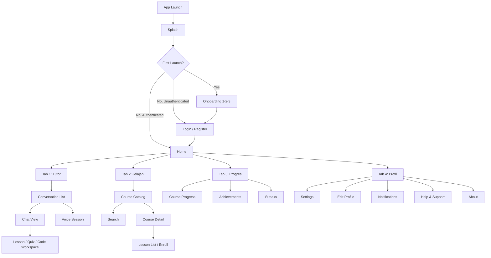

### Bottom Navigation Bar

| Tab | Label | Icon | Badge | Destination |
|---|---|---|---|---|
| 1 | Tutor | SmartTutor (custom) | Unread messages | AI Tutor screen |
| 2 | Jelajahi | Explore | New courses | Course catalog |
| 3 | Progres | TrendingUp | No | Progress dashboard |
| 4 | Profil | Person | No | Profile and settings |

Active tab: filled icon + primary-colored label. Inactive tabs: outlined icon + neutral label.

### Back Behavior

| Context | Back Button Action |
|---|---|
| Home (any tab) | Do nothing or show exit confirmation (Android) |
| Screen pushed from home | Pop to previous screen |
| Modal / bottom sheet | Dismiss modal |
| Full-screen dialog | Confirm discard or dismiss |
| Onboarding | Non-dismissable (first launch only) |
| Login / Register | Return to splash or exit |
| Deep-linked screen | Pop to root of current tab |

### Route Structure

| Pattern | Example | Description |
|---|---|---|
| `/` | `/` | App root |
| `/onboarding` | `/onboarding` | Onboarding flow |
| `/login` | `/login` | Authentication |
| `/home` | `/` | Home shell |
| `/home/tutor` | `/` | Tab 1 |
| `/home/explore` | `/` | Tab 2 |
| `/home/progress` | `/` | Tab 3 |
| `/home/profile` | `/` | Tab 4 |
| `/tutor/conversation` | `/tutor/conversation?courseId=123` | Chat view |
| `/tutor/voice` | `/tutor/voice` | Voice session |
| `/course/:id` | `/course/abc123` | Course detail |
| `/course/:id/lesson/:lid` | `/course/abc123/lesson/456` | Lesson viewer |
| `/course/:id/quiz/:qid` | `/course/abc123/quiz/789` | Quiz view |
| `/progress/course/:id` | `/progress/course/abc123` | Course progress |
| `/profile/settings` | `/profile/settings` | Settings |
| `/profile/edit` | `/profile/edit` | Edit profile |
| `/notifications` | `/notifications` | Notification center |

### Deep Linking

The routing system supports deep links via URL path matching. Deep links that require authentication redirect to login first, then navigate to the target after successful login.

| Deep Link Type | Behavior |
|---|---|
| Cold start | App opens directly to target screen |
| In-app | Navigation within the app stack |
| Push notification | Tap notification to navigate to relevant screen |

### Navigation Scalability

| Future Feature | Navigation Addition |
|---|---|
| Course marketplace | New tab or section under Explore |
| Achievements / badges | Sub-screen under Progress |
| Calendar / study planner | New tab or sub-screen under Profile |
| Community / forums | New tab or dedicated section |
| Offline downloads | Sub-screen under Profile |
| Voice practice | Sub-screen under AI Tutor |
| Leaderboard | Sub-screen under Progress |

---

## 4. User Journeys

### Journey 1: First Install

The user opens the app for the first time. Goal: reach a learning session within 3 minutes.

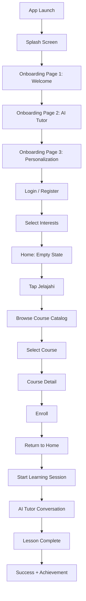

| Step | Target Time |
|---|---|
| Splash to onboarding | < 2 seconds |
| Onboarding (3 pages) | < 30 seconds (skippable) |
| Register / Login | < 60 seconds |
| Interest selection | < 15 seconds |
| First course enrollment | < 30 seconds |
| First learning session | < 30 seconds |
| **Total** | **< 3 minutes** |

### Journey 2: Returning User

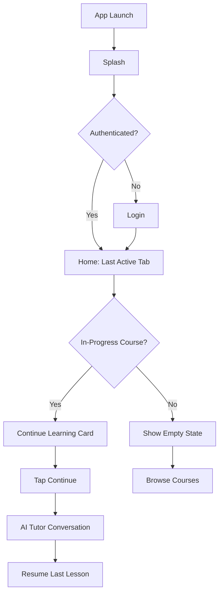

### Journey 3: Guest Flow

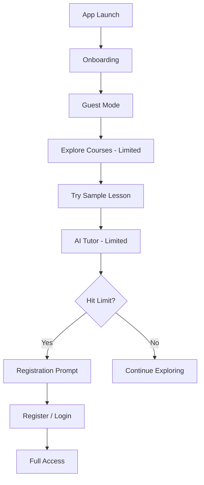

Guest limitations: browse 3 courses, 1 sample lesson per course, 10 AI tutor messages, no progress saving, no achievements.

### Journey 4: Learning Flow (Core Loop)

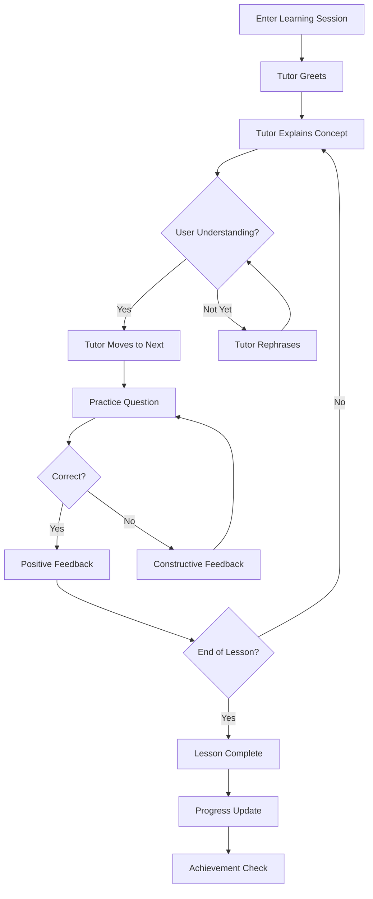

Interaction principles: one concept at a time, tutor checks understanding before proceeding, wrong answers get constructive feedback, celebrations are brief, the user always has a clear next action.

### Journey 5: Quiz Flow

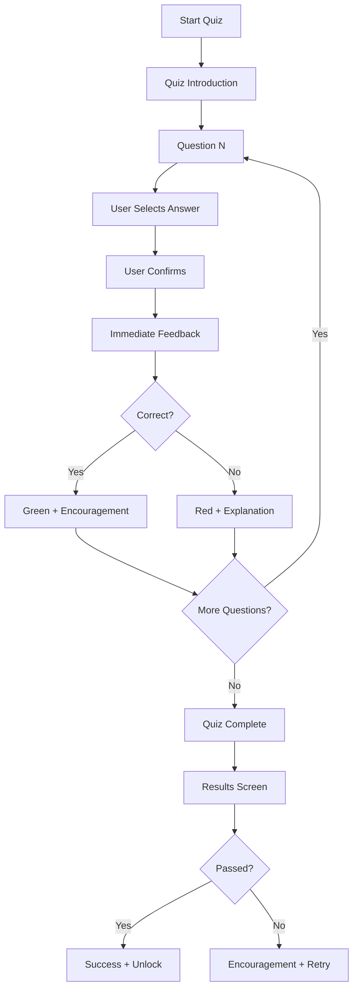

Quiz rules: one question at a time, select then confirm (prevents accidental taps), immediate feedback, results show per-question breakdown, retry after 24 hours or lesson review.

### Journey 6: Course Completion

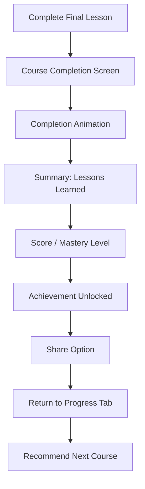

### Journey 7: Offline Usage

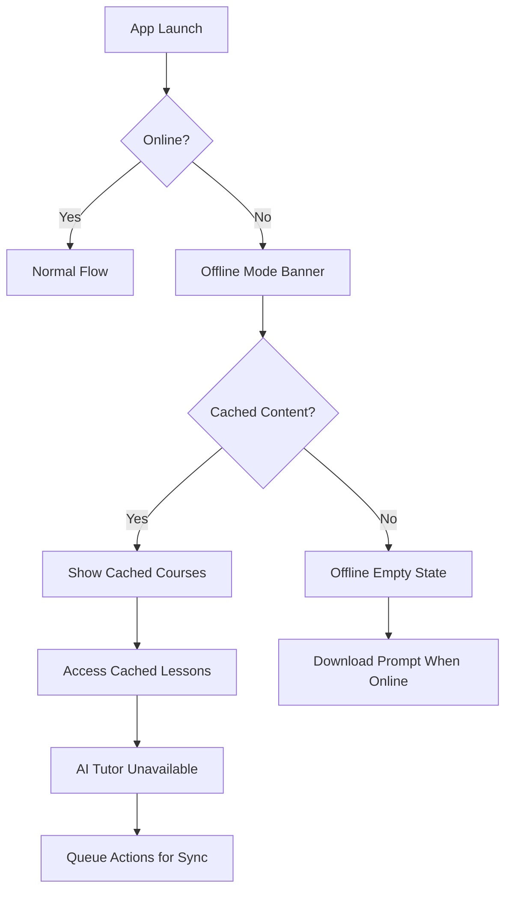

Offline capabilities: cached lessons viewable, quiz results saved locally and synced, AI tutor unavailable (polite message), progress saved locally, offline banner on every screen.

### Journey 8: Voice Interaction

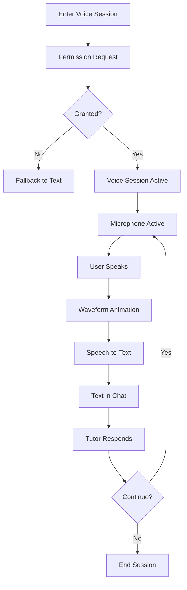

Rules: mic permission on first use, prominent waveform during recording, real-time transcription, tutor response as text with optional audio, text fallback always available, session ends after 5 minutes inactivity.

### Journey 9: Notification Interaction

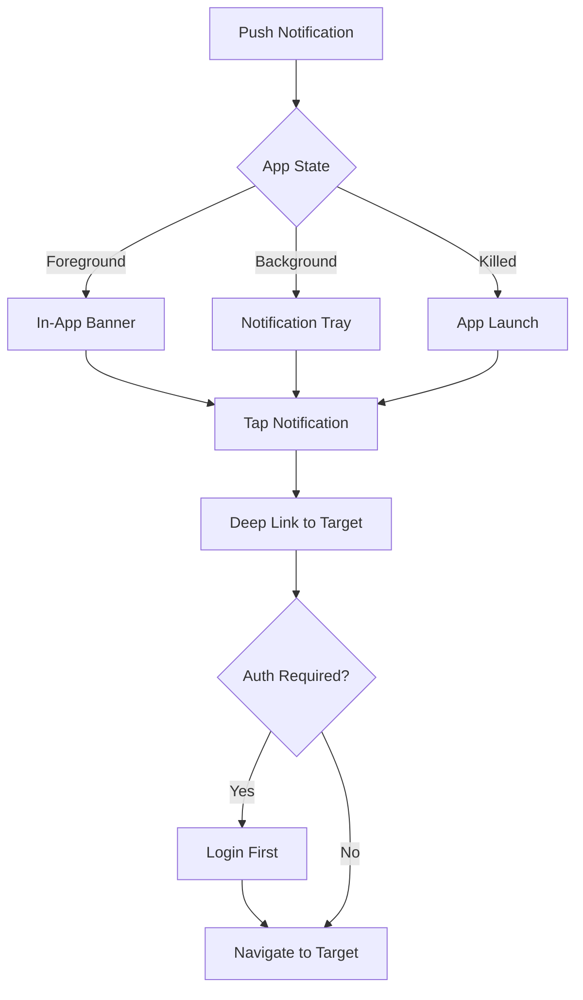

| Notification Type | Content | Deep Link |
|---|---|---|
| New lesson | "Pelajaran baru tersedia: [Name]" | Course detail |
| Streak reminder | "Jangan putus streakmu!" | Home (Tutor tab) |
| Achievement | "Pencapaian baru: [Name]" | Progress tab |
| Quiz available | "Quiz siap! Uji pemahamanmu." | Quiz view |
| Weekly summary | "Ringkasan mingguanmu siap!" | Progress tab |

### Journey 10: Settings and Profile

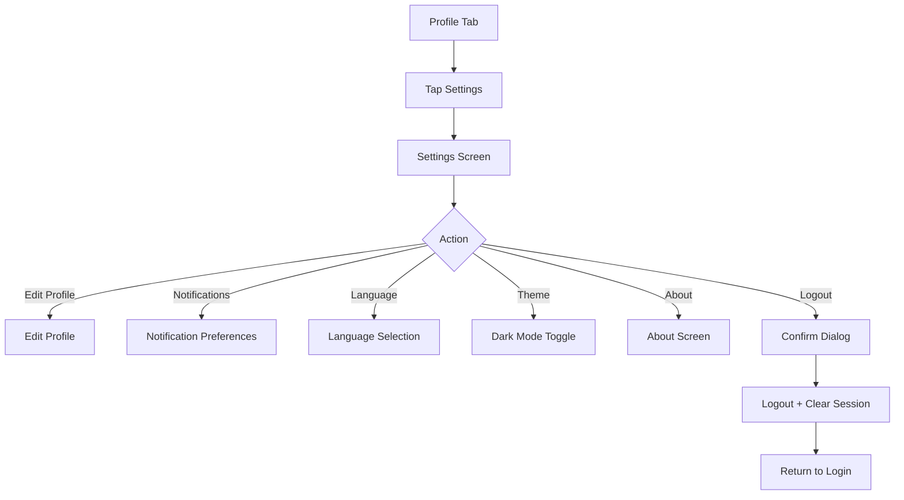

---

## 5. Screen Inventory

### Complete Screen List

| Screen | Purpose | Priority | Phase | Status | Dependencies |
|---|---|---|---|---|---|
| Splash | Brand display, app initialization | P0 | 6 | Planned | AppLogo, AppMascot, AssetPrecacher |
| Onboarding (3 pages) | Introduce app features | P0 | 6 | Planned | AppIllustrations, AppMascot |
| Login | Authenticate existing users | P0 | 6 | Planned | API: /auth/login |
| Register | Create new accounts | P0 | 6 | Planned | API: /auth/register |
| Home (Shell) | Bottom nav shell, tab switching | P0 | 7 | Planned | AppShell, AppBottomNav |
| AI Tutor | Conversation with AI tutor | P0 | 8 | Planned | API: /tutor/chat, WebSocket |
| Conversation Detail | Chat view with tutor | P0 | 8 | Planned | AppTutorBubble, AppUserBubble |
| Voice Session | Voice interaction with tutor | P1 | 8 | Planned | Audio recording, speech-to-text |
| Lesson View | Display lesson content | P0 | 9 | Planned | Markdown renderer, code highlighter |
| Quiz View | Take assessments | P0 | 10 | Planned | AppQuizOption, scoring logic |
| Quiz Results | Show quiz performance | P0 | 10 | Planned | Scoring data |
| Code Workspace | Code editor / viewer | P1 | 9 | Planned | Code editor widget |
| Course Catalog | Browse available courses | P0 | 7 | Planned | API: /courses |
| Course Detail | View course info, enroll | P0 | 7 | Planned | API: /courses/:id |
| Search | Search courses and content | P1 | 7 | Planned | API: /search |
| Progress Dashboard | View learning progress | P0 | 7 | Planned | Progress data |
| Course Progress | Detailed course progress | P1 | 7 | Planned | Course progress data |
| Streaks and Calendar | View study streaks | P2 | 7 | Planned | Streak data |
| Achievements | View earned badges | P2 | 7 | Planned | Achievement data |
| Profile | View and manage profile | P0 | 7 | Planned | User data |
| Edit Profile | Update name, avatar, interests | P1 | 7 | Planned | API: /profile |
| Settings | App preferences | P1 | 7 | Planned | Local preferences |
| Notifications | View notification history | P1 | 7 | Planned | Notification data |
| Help and Support | FAQ, contact support | P2 | 7 | Planned | FAQ data |
| About | App version, legal | P2 | 7 | Planned | Static content |
| Notification Center | Real-time notification overlay | P1 | 7 | Planned | Notification data |

### Screen Groups

| Group | Screens | Navigation Pattern |
|---|---|---|
| **Auth** | Splash, Onboarding, Login, Register | Stack (no bottom nav) |
| **Home Shell** | Home with tabs | Bottom nav (persistent) |
| **Learning** | AI Tutor, Conversation, Voice, Lesson, Quiz, Code Workspace | Push from Home |
| **Content** | Course Catalog, Course Detail, Search, Progress | Tab + push |
| **Profile** | Profile, Edit Profile, Settings, Notifications, Help, About | Push from Profile tab |
| **Overlay** | Notification Center, Modal, Bottom Sheet, Snackbar | Overlay on any screen |

---

## 6. Screen Specifications

This section defines the exact composition of every major screen using a structured layout specification format. Each screen is described through its purpose, layout zones, component hierarchy, information hierarchy, interaction model, states, animation, responsive behavior, and accessibility requirements.

### 6.1 Splash Screen

#### Purpose

Display brand identity while the application initializes. Load critical assets and determine the next navigation destination (onboarding, home, or login).

#### Primary Goal

No user action required. Automatic transition after initialization completes.

#### Layout

**Full-screen branded surface.**

| Zone | Position | Content | Dimensions |
|---|---|---|---|
| Background | Full screen | Brand orange gradient | 100% x 100% |
| Logo | Center (vertically and horizontally) | Logomark | 120 x 120 px |
| App Name | Below logo, centered | "MentorinAja" in Plus Jakarta Sans ExtraBold | 20px font |
| Loading Indicator | Below app name, centered | Circular spinner (white) | 24 x 24 px |

#### Component Hierarchy

```
Screen
├── Background (brand gradient)
├── Center Column
│   ├── Logo (AppLogo.primary)
│   ├── App Name (headlineMedium, white)
│   └── Loading Spinner (AppSpinner, white)
```

#### Information Hierarchy

- **Priority 1:** Logo — primary brand recognition
- **Priority 2:** App name — reinforces brand identity
- **Priority 3:** Loading indicator — communicates system activity

#### Interaction

- **Tap:** None
- **Long Press:** None
- **Swipe:** None
- **Keyboard:** None
- **Voice:** None
- **Accessibility:** Screen reader announces "MentorinAja, sedang memuat"

#### States

| State | Behavior |
|---|---|
| **Loading** | Spinner visible, logo and name displayed |
| **Error** | If initialization fails: spinner replaced with retry button "Muat ulang" below app name |
| **Empty** | N/A |
| **Offline** | Initialization continues with cached assets |
| **Success** | Fade out entire screen (300ms) and navigate to next destination |

#### Animation

| Trigger | Animation | Duration | Easing |
|---|---|---|---|
| Screen entry | Logo fades in + scales 0.9 to 1.0 | 600ms | emphasizedDecelerate |
| After logo | App name fades in | 400ms | standardDecelerate (delayed 200ms) |
| After name | Spinner appears | 200ms | standardDecelerate (delayed 400ms) |
| Initialization complete | Entire screen fades out | 300ms | standardAccelerate |
| Reduced motion | All transitions instant (200ms max cross-fade) | 200ms | — |

#### Responsive Behavior

| Breakpoint | Adaptation |
|---|---|
| Phone | Logo 120x120px, centered |
| Tablet | Logo 160x160px, centered |
| Desktop | Logo 160x160px, centered |

#### Accessibility

| Feature | Behavior |
|---|---|
| Screen Reader | "MentorinAja, sedang memuat" |
| Touch Targets | N/A (no interactive elements) |
| Focus Order | N/A |
| Dynamic Text | App name scales with system text factor |
| Contrast | White text on orange gradient — exceeds 4.5:1 |

---

### 6.2 Onboarding (3 Pages)

#### Purpose

Introduce the app value proposition and guide the user to register or login. Three swipeable pages with a consistent structure.

#### Primary Goal

User taps "Mulai" (Start) on the last page, or "Lewati" (Skip) on any page.

#### Layout

**Vertical stack with fixed bottom CTA and page indicator.**

| Zone | Position | Content | Dimensions |
|---|---|---|---|
| Skip Button | Top-right | "Lewati" text button | labelLarge, neutral600 |
| Illustration | Center-top | Scene illustration (varies per page) | 240 x 240 px |
| Title | Below illustration, centered | Page title | headlineMedium |
| Description | Below title, centered | 1-2 sentence explanation | bodyLarge, neutral600, max 480px width |
| CTA Button | Bottom, 32px horizontal padding | "Mulai" primary pill button | Full width |
| Page Indicator | Below CTA, centered | 3 dots, active = primary color | 8px diameter each |

#### Page Content

| Page | Title | Description | Illustration |
|---|---|---|---|
| 1: Welcome | "Selamat Datang di MentorinAja" | "Belajar jadi lebih mudah dengan bantuan tutor AI yang sabar dan pintar." | Tutor mascot waving |
| 2: AI Tutor | "Tutor AI yang Memahami Kamu" | "Tanyakan apa saja, kapan saja. Tutor akan menjelaskan dengan cara yang kamu pahami." | Tutor explaining on whiteboard |
| 3: Start Learning | "Mulai Belajar Sekarang" | "Pantau progresmu, raih pencapaian, dan jadi lebih percaya diri." | Student celebrating |

#### Component Hierarchy

```
Screen
├── Skip Button (AppButton.text, top-right)
├── Page View (swipeable)
│   ├── Page 1
│   │   ├── Illustration (AppImage.asset)
│   │   ├── Title (headlineMedium)
│   │   └── Description (bodyLarge)
│   ├── Page 2
│   │   ├── Illustration
│   │   ├── Title
│   │   └── Description
│   └── Page 3
│       ├── Illustration
│       ├── Title
│       └── Description
├── CTA Button (AppButton.primary, "Mulai")
└── Page Indicator (3 dots)
```

#### Information Hierarchy

- **Priority 1:** Illustration — visual storytelling, largest element
- **Priority 2:** Title — core value proposition
- **Priority 3:** Description — supporting detail
- **Priority 4:** CTA — action to proceed
- **Priority 5:** Page indicator — current position

#### Interaction

- **Tap CTA:** Navigate to next page or login
- **Tap Skip:** Navigate directly to login
- **Swipe Left/Right:** Navigate between pages
- **Keyboard:** Arrow keys navigate pages, Enter activates CTA
- **Accessibility:** Page indicator announces "Halaman X dari 3"; Skip announces "Lewati onboarding"

#### States

| State | Behavior |
|---|---|
| **Loading** | N/A (static content) |
| **Empty** | N/A |
| **Error** | N/A |
| **Offline** | Content available (pre-cached) |

#### Animation

| Trigger | Animation | Duration | Easing |
|---|---|---|---|
| Page transition | Horizontal slide | 300ms | emphasized |
| Page enter — illustration | scaleIn (0.95 to 1.0) + fadeIn | 400ms | emphasizedDecelerate (delayed 100ms) |
| Page enter — title | slideUp (+20px) + fadeIn | 300ms | standardDecelerate (delayed 200ms) |
| Page enter — description | slideUp + fadeIn | 300ms | standardDecelerate (delayed 300ms) |
| Page enter — CTA | slideUp + fadeIn | 300ms | standardDecelerate (delayed 400ms) |
| Reduced motion | All transitions instant | 0ms | — |

#### Responsive Behavior

| Breakpoint | Adaptation |
|---|---|
| Phone | Full layout, illustration 240x240px |
| Tablet | Illustration max 320x320px, text max width 480px centered |
| Desktop | Same as tablet, centered on screen |

#### Accessibility

| Feature | Behavior |
|---|---|
| Screen Reader | Semantic page group, each page announces content |
| Touch Targets | Skip button min 48x48px touch area; CTA min 48px height |
| Focus Order | Skip -> Illustration (decorative) -> Title -> Description -> CTA |
| Dynamic Text | All text scales; layout must not overflow at 2.0x |
| Contrast | All text meets 4.5:1 on white background |

---

### 6.3 Login

#### Purpose

Authenticate existing users with email and password.

#### Primary Goal

User taps "Masuk" (Login) after entering valid credentials.

#### Layout

**Vertical form layout with centered content.**

| Zone | Position | Content | Dimensions |
|---|---|---|---|
| Back Button | Top-left | Back arrow | iconLarge (24px) |
| Logo | Center-top | Logomark | 48 x 48 px |
| Title | Below logo, centered | "Selamat Datang Kembali" | headlineLarge |
| Subtitle | Below title, centered | "Masuk ke akunmu" | bodyLarge, neutral600 |
| Email Field | Below subtitle | AppTextField, email keyboard | Full width - 32px padding |
| Password Field | Below email | AppPasswordField with visibility toggle | Full width - 32px padding |
| Forgot Password | Right-aligned, below password | "Lupa Password?" text button | bodySmall, primary |
| Login Button | Below forgot | "Masuk" primary pill button | Full width - 32px padding |
| Divider | Below login | "Atau masuk dengan" with horizontal lines | — |
| Social Buttons | Below divider | Google and Facebook outlined buttons | 2 columns, equal width |
| Register Link | Bottom, centered | "Belum punya akun? Daftar" | bodyMedium |

#### Component Hierarchy

```
Screen
├── Back Button (icon button)
├── Scrollable Content
│   ├── Logo (AppLogo.mark, 48x48)
│   ├── Title (headlineLarge, "Selamat Datang Kembali")
│   ├── Subtitle (bodyLarge, "Masuk ke akunmu")
│   ├── Email Field (AppTextField, keyboard: email)
│   ├── Password Field (AppPasswordField)
│   ├── Forgot Password (AppButton.text, "Lupa Password?")
│   ├── Login Button (AppButton.primary, "Masuk")
│   ├── Social Divider ("Atau masuk dengan")
│   ├── Social Buttons Row
│   │   ├── Google Button (AppButton.outlined)
│   │   └── Facebook Button (AppButton.outlined)
│   └── Register Link (AppButton.text, "Belum punya akun? Daftar")
```

#### Information Hierarchy

- **Priority 1:** Title — confirms the user is logging in
- **Priority 2:** Email and Password fields — primary data entry
- **Priority 3:** Login button — primary action
- **Priority 4:** Forgot password — recovery path
- **Priority 5:** Social login — alternative authentication
- **Priority 6:** Register link — new user path

#### Interaction

- **Tap Login:** Validate and authenticate
- **Tap Forgot Password:** Navigate to password reset
- **Tap Social Button:** Initiate OAuth flow
- **Tap Register Link:** Navigate to register screen
- **Keyboard:** Tab moves between fields; Enter submits form
- **Accessibility:** Each field has semantic label; login button announces "Masuk ke akun"

#### States

| State | Behavior |
|---|---|
| **Loading** | Button shows spinner; fields become non-interactive |
| **Empty** | All fields empty; login button disabled or enabled (per design) |
| **Error — Field** | Red border + error text below specific field |
| **Error — Network** | Snackbar: "Koneksi terputus. Coba lagi." |
| **Error — Invalid Credentials** | Snackbar: "Email atau password salah." |
| **Success** | Navigate to Home |

#### Animation

| Trigger | Animation | Duration | Easing |
|---|---|---|---|
| Screen entry | Fields slideUp + fadeIn (staggered) | 100ms each | standardDecelerate |
| After fields | Button fades in | 200ms | standardDecelerate (delayed 300ms) |
| Login press | Button ripple | 150ms | standard |
| Error | Red border pulse | 300ms | standard |
| Reduced motion | All transitions instant | 0ms | — |

#### Responsive Behavior

| Breakpoint | Adaptation |
|---|---|
| Phone | Full width fields, 16px horizontal padding |
| Tablet | Fields max width 400px, centered |
| Desktop | Fields max width 400px, centered |

#### Accessibility

| Feature | Behavior |
|---|---|
| Screen Reader | Each field: "Email", "Password"; Login: "Masuk ke akun"; Forgot: "Lupa password, buka halaman reset" |
| Touch Targets | All buttons min 48x48px; fields min 48px height |
| Focus Order | Email -> Password -> Forgot -> Login -> Social -> Register |
| Dynamic Text | Fields and buttons scale; layout must not overflow at 2.0x |
| Contrast | All text meets 4.5:1; error text meets 4.5:1 on white |

---

### 6.4 Register

#### Purpose

Create a new user account.

#### Primary Goal

User taps "Daftar" (Register) after filling all required fields and accepting terms.

#### Layout

**Vertical form layout, same structure as Login with additional fields.**

| Zone | Position | Content | Dimensions |
|---|---|---|---|
| Back Button | Top-left | Back arrow | iconLarge |
| Logo | Center-top | Logomark | 48 x 48 px |
| Title | Below logo | "Buat Akun Baru" | headlineLarge |
| Subtitle | Below title | "Mulai belajar sekarang" | bodyLarge, neutral600 |
| Name Field | Below subtitle | AppTextField | Full width - 32px padding |
| Email Field | Below name | AppTextField, email keyboard | Full width - 32px padding |
| Password Field | Below email | AppPasswordField | Full width - 32px padding |
| Confirm Password | Below password | AppPasswordField | Full width - 32px padding |
| Terms Checkbox | Below confirm | Checkbox + "Saya menyetujui Syarat dan Ketentuan" | Full width - 32px padding |
| Register Button | Below checkbox | "Daftar" primary pill button | Full width - 32px padding |
| Login Link | Bottom, centered | "Sudah punya akun? Masuk" | bodyMedium |

#### Component Hierarchy

```
Screen
├── Back Button (icon button)
├── Scrollable Content
│   ├── Logo (AppLogo.mark, 48x48)
│   ├── Title (headlineLarge, "Buat Akun Baru")
│   ├── Subtitle (bodyLarge, "Mulai belajar sekarang")
│   ├── Name Field (AppTextField)
│   ├── Email Field (AppTextField, keyboard: email)
│   ├── Password Field (AppPasswordField)
│   ├── Confirm Password (AppPasswordField)
│   ├── Terms Checkbox (AppCheckbox + "Syarat dan Ketentuan" link)
│   ├── Register Button (AppButton.primary, "Daftar")
│   └── Login Link (AppButton.text, "Sudah punya akun? Masuk")
```

#### Information Hierarchy

- **Priority 1:** Title — confirms account creation context
- **Priority 2:** Form fields — required data entry
- **Priority 3:** Terms checkbox — legal requirement
- **Priority 4:** Register button — primary action
- **Priority 5:** Login link — existing user path

#### Interaction

- **Tap Register:** Validate all fields, check terms acceptance, create account
- **Tap Terms Link:** Open terms and conditions in a webview or modal
- **Tap Login Link:** Navigate to login screen
- **Keyboard:** Tab between fields; Enter submits
- **Accessibility:** Password fields announce toggle state; checkbox announces "centang untuk menyetujui"

#### States

| State | Behavior |
|---|---|
| **Loading** | Button shows spinner; fields non-interactive |
| **Empty** | All fields empty; register button disabled |
| **Error — Field** | Red border + error text below specific field |
| **Error — Password Mismatch** | "Password tidak cocok" below confirm field |
| **Error — Email Taken** | "Email sudah terdaftar" below email field |
| **Error — Network** | Snackbar with retry |
| **Success** | Navigate to interest selection or home |

#### Animation

| Trigger | Animation | Duration | Easing |
|---|---|---|---|
| Screen entry | Fields slideUp + fadeIn (staggered 80ms) | 80ms each | standardDecelerate |
| After fields | Checkbox fades in | 200ms | standardDecelerate (delayed 400ms) |
| After checkbox | Button fades in | 200ms | standardDecelerate (delayed 500ms) |
| Reduced motion | All transitions instant | 0ms | — |

#### Responsive Behavior

| Breakpoint | Adaptation |
|---|---|
| Phone | Full width fields, 16px horizontal padding |
| Tablet | Fields max width 400px, centered |
| Desktop | Fields max width 400px, centered |

#### Accessibility

| Feature | Behavior |
|---|---|
| Screen Reader | Each field labeled; checkbox: "Saya menyetujui Syarat dan Ketentuan, centang untuk menyetujui"; Terms link: "buka Syarat dan Ketentuan" |
| Touch Targets | Checkbox min 48x48px; buttons min 48px height |
| Focus Order | Name -> Email -> Password -> Confirm -> Terms -> Register -> Login |
| Dynamic Text | All text scales; layout must not overflow at 2.0x |
| Contrast | All text meets 4.5:1 |

---

### 6.5 Home (Shell with Tabs)

#### Purpose

The main application shell. Provides bottom navigation between four primary destinations. Each tab maintains its own navigation stack.

#### Primary Goal

Depends on active tab: continue learning (Tutor), browse courses (Jelajahi), view progress (Progres), or manage profile (Profil).

#### Layout

**Persistent top bar + scrollable content area + fixed bottom navigation.**

| Zone | Position | Content | Dimensions |
|---|---|---|---|
| Top Bar | Top (fixed) | App name (left), notification bell + search icon (right) | 56px height |
| Greeting | Below top bar | "Selamat pagi, [Name]!" | headlineMedium |
| Sub-greeting | Below greeting | "Yuk lanjut belajar hari ini." | bodyMedium, neutral600 |
| Content Area | Scrollable (flex) | Tab-specific content | Fills remaining space |
| Bottom Navigation | Bottom (fixed) | 4 tabs with icons and labels | 56px height |

#### Tab-Specific Content

| Tab | Content Area |
|---|---|
| **Tutor** | Continue learning cards (AppCourseCard with progress) + "Mulai Percakapan Baru" CTA |
| **Jelajahi** | Search bar + filter chips + featured course grid |
| **Progres** | Streak counter + weekly summary card + active courses + recent achievements |
| **Profil** | Avatar + name + settings tiles list |

#### Component Hierarchy

```
Screen
├── Top Bar
│   ├── App Name (headlineSmall, left)
│   ├── Notification Bell (icon button, right, with badge)
│   └── Search Icon (icon button, right)
├── Scrollable Content
│   ├── Greeting (headlineMedium)
│   ├── Sub-greeting (bodyMedium)
│   └── Tab Content (varies per tab)
│       ├── [Tutor] Continue Cards + CTA
│       ├── [Jelajahi] Search + Filters + Grid
│       ├── [Progres] Stats + Courses + Achievements
│       └── [Profil] Avatar + Menu Tiles
└── Bottom Navigation (AppBottomNav, 4 items)
```

#### Information Hierarchy

- **Priority 1:** Tab content — primary destination-specific information
- **Priority 2:** Greeting — personal connection
- **Priority 3:** Top bar actions — notifications and search
- **Priority 4:** Bottom navigation — mode switching

#### Interaction

- **Tap Tab:** Switch tab content (cross-fade)
- **Tap Tab (active):** Scroll content to top
- **Tap Notification Bell:** Navigate to notifications
- **Tap Search:** Navigate to search
- **Tap Continue Card:** Resume learning session
- **Tap CTA:** Start new conversation
- **Keyboard:** Tab switches between tabs
- **Accessibility:** Each tab has semantic label; notification bell announces unread count

#### States

| State | Behavior |
|---|---|
| **Loading** | Skeleton cards (3 placeholders with shimmer) |
| **Empty (Tutor tab)** | Tutor mascot encouraging + "Belum ada kursus" + "Jelajahi Kursus" CTA |
| **Empty (Progres tab)** | "Mulai Belajar!" + "Jelajahi Kursus" CTA |
| **Error** | Snackbar with retry if content fails to load |
| **Offline** | Banner: "Kamu offline"; cached content available |

#### Animation

| Trigger | Animation | Duration | Easing |
|---|---|---|---|
| Tab switch | Cross-fade content | 200ms | standard |
| Tab icon | Scale on active | 150ms | standard |
| Cards | slideUp + fadeIn on scroll into view | 300ms | standardDecelerate |
| Notification bell | Shake when new notifications | 400ms | bouncy |
| Reduced motion | All transitions instant | 0ms | — |

#### Responsive Behavior

| Breakpoint | Adaptation |
|---|---|
| Phone (< 600px) | Single column, full width cards |
| Tablet (600-904px) | Two-column grid for course cards |
| Desktop (> 904px) | Three-column grid; optional side navigation |

#### Accessibility

| Feature | Behavior |
|---|---|
| Screen Reader | Top bar: heading "MentorinAja"; Bell: "Notifikasi, [N] baru"; Search: "Cari kursus"; Each tab: semantic label |
| Touch Targets | Bottom nav items min 48x48px; top bar icons min 48x48px |
| Focus Order | Top bar -> Content -> Bottom nav (left to right) |
| Dynamic Text | Greeting and content scale; grid adapts column count |
| Contrast | All text meets 4.5:1 |

---

### 6.6 AI Tutor — Conversation List

#### Purpose

Show the user's conversation history and allow starting a new conversation with the AI tutor.

#### Primary Goal

User taps "Mulai Percakapan Baru" (Start New Conversation) or selects an existing conversation.

#### Layout

**Standard list screen with sticky bottom CTA.**

| Zone | Position | Content | Dimensions |
|---|---|---|---|
| Back Button | Top-left | Back arrow | iconLarge |
| Title | Center | "Percakapan Tutor" | headlineMedium |
| Conversation List | Scrollable | List of past conversations | Full width |
| New Conversation Button | Bottom (sticky) | "Mulai Percakapan Baru" primary button | Full width - 32px padding |

#### Conversation List Item

| Element | Position | Content |
|---|---|---|
| Avatar | Left | Tutor mascot (32x32px, thinking state) |
| Title | Right of avatar, top | Last message preview (titleMedium, max 1 line, ellipsis) |
| Timestamp | Right of avatar, bottom | Relative time (bodySmall, neutral500) |
| Unread Indicator | Far right | Orange dot (8px) if unread |

#### Component Hierarchy

```
Screen
├── Top Bar
│   ├── Back Button (icon button)
│   └── Title (headlineMedium, "Percakapan Tutor")
├── Conversation List (ListView)
│   ├── List Item 1
│   │   ├── Avatar (AppAvatar.asset, tutor-thinking, 32px)
│   │   ├── Title (titleMedium, last message preview)
│   │   ├── Timestamp (bodySmall, relative time)
│   │   └── Unread Indicator (8px orange dot, if applicable)
│   ├── List Item 2 ...
│   └── List Item N ...
└── Sticky Bottom
    └── New Conversation Button (AppButton.primary, full width)
```

#### Information Hierarchy

- **Priority 1:** Conversation list — primary content, scannable
- **Priority 2:** New conversation button — primary action
- **Priority 3:** Title — context confirmation

#### Interaction

- **Tap List Item:** Navigate to conversation detail
- **Tap New Conversation:** Start new conversation
- **Swipe Left on Item:** Reveal delete action (if supported)
- **Pull Down:** Refresh conversation list
- **Accessibility:** Each item: "Percakapan dengan Tutor, [preview], [time]"; Button: "Mulai percakapan baru dengan tutor"

#### States

| State | Behavior |
|---|---|
| **Loading** | 3 skeleton list items with shimmer |
| **Empty** | Tutor mascot waving + "Halo! Ada yang bisa aku bantu hari ini?" + "Mulai Percakapan" CTA |
| **Error** | Error illustration + "Gagal memuat percakapan" + retry button |
| **Offline** | Show cached conversations; new conversation button disabled |

#### Animation

| Trigger | Animation | Duration | Easing |
|---|---|---|---|
| List items | slideUp + fadeIn (staggered 50ms) | 50ms each | standardDecelerate |
| New conversation button | scaleIn on scroll to bottom | 200ms | standardDecelerate |
| Reduced motion | All transitions instant | 0ms | — |

#### Responsive Behavior

| Breakpoint | Adaptation |
|---|---|
| Phone | Full width list items |
| Tablet | List max width 600px, centered |
| Desktop | List max width 720px, centered |

#### Accessibility

| Feature | Behavior |
|---|---|
| Screen Reader | List items: buttons with full announcement; new conversation: semantic button label |
| Touch Targets | List items min 48px height; avatar min 48x48px touch area |
| Focus Order | List items top to bottom -> New conversation button |
| Dynamic Text | Text scales; timestamps may truncate |
| Contrast | All text meets 4.5:1 |

---

### 6.7 Conversation Detail (Chat View)

#### Purpose

The core learning interface. A chat-based conversation between the user and the AI tutor.

#### Primary Goal

User sends messages (text or voice) and receives tutor responses.

#### Layout

**Full-height chat view with fixed top bar and fixed bottom input.**

| Zone | Position | Content | Dimensions |
|---|---|---|---|
| Top Bar | Top (fixed) | Back button, tutor avatar + name, overflow menu | 56px height |
| Chat Area | Scrollable (flex) | Message bubbles (tutor + user) | Fills remaining space |
| Input Bar | Bottom (fixed) | Text field + mic button + send button | 56px height |

#### Message Bubble Types

| Type | Appearance | Alignment | Max Width |
|---|---|---|---|
| Tutor | White bg, neutral300 border, radius 16px | Left | 80% of screen |
| User | Primary container (#FFF3ED), no border, radius 16px | Right | 80% of screen |
| Tutor + Code | White bg with dark code block inset | Left | 80% of screen |
| System | Centered, bodySmall, neutral500 | Center | 100% |

#### Input Bar Elements

| Element | Position | Content | Visibility |
|---|---|---|---|
| Text Field | Left | AppTextField, placeholder "Ketik pesan..." | Always |
| Mic Button | Right of field | Icon button, mic icon | Always |
| Send Button | Right | Icon button, send icon (primary) | Only when text is entered |

#### Component Hierarchy

```
Screen
├── Top Bar
│   ├── Back Button (icon button)
│   ├── Tutor Avatar (AppAvatar.asset, 32px)
│   ├── Tutor Name (titleMedium)
│   └── Overflow Menu (icon button)
├── Chat Area (ListView, reversed)
│   ├── Typing Indicator (3 bouncing dots, when tutor is thinking)
│   ├── Tutor Bubble (AppTutorBubble)
│   ├── User Bubble (AppUserBubble)
│   ├── Tutor Bubble
│   │   └── Code Block (AppCodeBlock, if applicable)
│   └── System Message (centered, bodySmall)
└── Input Bar (fixed bottom)
    ├── Text Field (AppTextField)
    ├── Mic Button (icon button)
    └── Send Button (icon button, primary, conditional visibility)
```

#### Information Hierarchy

- **Priority 1:** Chat messages — primary content, full screen
- **Priority 2:** Input bar — primary action (sending messages)
- **Priority 3:** Top bar — context and navigation

#### Interaction

- **Tap Send:** Send message
- **Tap Mic:** Start voice input
- **Tap Overflow:** Show options (clear chat, report, etc.)
- **Swipe Down:** Pull to refresh (reload recent messages)
- **Long Press Message:** Copy text (if applicable)
- **Keyboard:** Enter sends; Shift+Enter adds newline
- **Accessibility:** Each message: "[Sender]: [text]"; Input: "Ketik pesan ke tutor"; Mic: "Rekam suara"; Send: "Kirim pesan"; Typing: "Tutor sedang mengetik"

#### States

| State | Behavior |
|---|---|
| **Loading** | Skeleton: 2 tutor bubbles + 1 user bubble placeholder |
| **Empty** | Tutor greeting message (always starts with tutor) |
| **Error — Send** | Red exclamation icon on failed message, tap to retry |
| **Error — Network** | Snackbar: "Koneksi terputus. Pesan akan dikirim saat online." |
| **Offline** | Messages queued; unsent messages show pending indicator |

#### Animation

| Trigger | Animation | Duration | Easing |
|---|---|---|---|
| New message | slideUp + fadeIn | 200ms | standardDecelerate |
| Typing indicator | 3 bouncing dots (loop) | 600ms loop | standard |
| Keyboard appear | Chat scrolls to bottom | 300ms | standard |
| Send button | scaleIn when text entered | 150ms | standard |
| Reduced motion | All transitions instant; typing indicator becomes static dots | 0ms | — |

#### Responsive Behavior

| Breakpoint | Adaptation |
|---|---|
| Phone | Input bar at bottom, chat fills remaining space |
| Tablet | Chat max width 720px, centered; input bar at bottom |
| Desktop | Chat max width 960px, centered |

#### Accessibility

| Feature | Behavior |
|---|---|
| Screen Reader | Messages in reading order; each announced with sender and text |
| Touch Targets | Input bar elements min 48x48px; messages min 48px height |
| Focus Order | Chat messages (scrollable) -> Input field -> Mic -> Send |
| Dynamic Text | Messages scale; bubble width adjusts |
| Contrast | Tutor bubble: neutral700 on white (9.7:1); User bubble: neutral900 on primaryContainer (exceeds 4.5:1) |

---

### 6.8 Voice Session

#### Purpose

Voice-based interaction with the AI tutor. The user speaks and the tutor responds with audio.

#### Primary Goal

User taps microphone to start/stop recording and engages in voice conversation.

#### Layout

**Centered vertical layout focused on the microphone button and visual feedback.**

| Zone | Position | Content | Dimensions |
|---|---|---|---|
| Back Button | Top-left | Back arrow | iconLarge |
| Title | Center | "Sesi Suara" | headlineMedium |
| Tutor Avatar | Center-top | Tutor mascot (thinking state) | 96 x 96 px |
| Status Text | Below avatar | "Tutor sedang mendengarkan..." | bodyLarge |
| Waveform | Center | Animated waveform bars (primary color) | 240 x 60 px |
| Mic Button | Center-bottom | Large circular button (primary fill) | 80 x 80 px |
| Hint Text | Below mic | "Ketuk untuk berhenti" | bodySmall, neutral500 |

#### Component Hierarchy

```
Screen
├── Top Bar
│   ├── Back Button (icon button)
│   └── Title (headlineMedium, "Sesi Suara")
├── Centered Content (Column)
│   ├── Tutor Avatar (AppAvatar.asset, tutor-thinking, 96px)
│   ├── Status Text (bodyLarge, live region)
│   ├── Waveform (AppWaveform, animated bars)
│   ├── Mic Button (AppIconButton, large, 80px, primary fill)
│   └── Hint Text (bodySmall, "Ketuk untuk berhenti")
```

#### Information Hierarchy

- **Priority 1:** Mic button — primary interaction point
- **Priority 2:** Waveform — visual recording feedback
- **Priority 3:** Status text — current state communication
- **Priority 4:** Tutor avatar — context and personality

#### Interaction

- **Tap Mic:** Start/stop recording
- **Tap Back:** End voice session, return to previous screen
- **Accessibility:** Mic: "Mulai merekam suara" / "Hentikan rekaman"; Waveform: decorative (hidden); Status: live region, announced on change

#### States

| State | Behavior |
|---|---|
| **Idle** | Mic button visible, status "Ketuk untuk mulai berbicara" |
| **Recording** | Mic pulses, waveform animated, status "Mendengarkan..." |
| **Processing** | Mic disabled, spinner, status "Memproses suara..." |
| **Responding** | Tutor avatar animates, status "Menjawab...", audio plays |
| **Permission Denied** | "Izin mikrofon diperlukan. Buka pengaturan untuk mengaktifkan." |
| **Network Error** | "Koneksi terputus. Coba gunakan teks sebagai gantinya." |
| **Recognition Failed** | "Maaf, saya tidak mendengar dengan jelas. Coba ulangi." |
| **Loading** | "Memproses suara..." with spinner |

#### Animation

| Trigger | Animation | Duration | Easing |
|---|---|---|---|
| Mic button recording | Pulse (scale 1.0 to 1.05) | 1500ms loop | easeInOut |
| Waveform | Bars animate proportionally to audio input | Continuous | — |
| Tutor avatar | Blink every 3-5 seconds | 150ms | standard |
| Status text | Cross-fade between states | 200ms | standard |
| Reduced motion | Mic pulse replaced with opacity change; waveform becomes static | 0ms | — |

#### Responsive Behavior

| Breakpoint | Adaptation |
|---|---|
| Phone | Full layout as described |
| Tablet | Tutor avatar scales to 128x128px; waveform wider |
| Desktop | Tutor avatar 128x128px; waveform wider; text input fallback more prominent |

#### Accessibility

| Feature | Behavior |
|---|---|
| Screen Reader | Mic button labeled with current state; status text as live region |
| Touch Targets | Mic button 80x80px (exceeds 48px minimum) |
| Focus Order | Back -> Mic button |
| Dynamic Text | Status text scales |
| Contrast | White mic on primary bg; status text meets 4.5:1 |

---

### 6.9 Lesson View

#### Purpose

Display lesson content in a structured, readable format. Supports text, images, code blocks, and interactive elements.

#### Primary Goal

User reads the lesson content and taps "Lanjutkan" (Continue) to proceed.

#### Layout

**Standard content screen with progress bar, scrollable content, and sticky bottom CTA.**

| Zone | Position | Content | Dimensions |
|---|---|---|---|
| Top Bar | Top (fixed) | Back button, progress bar, overflow menu | 56px height |
| Lesson Title | Below top bar | Course topic | headlineMedium |
| Lesson Subtitle | Below title | Section name | titleLarge, neutral600 |
| Content Area | Scrollable (flex) | Lesson text, images, code blocks, tutor comments | Fills remaining space |
| Continue Button | Bottom (sticky) | "Lanjutkan" primary button | Full width - 32px padding |

#### Content Types

| Type | Rendering |
|---|---|
| Body text | bodyLarge, neutral700 |
| Heading | headlineSmall, Plus Jakarta Sans |
| Code block | JetBrains Mono, dark background (#1E1E1E), radius 12px |
| Inline code | JetBrains Mono, primaryContainer background |
| Image | Full width, radius 12px, with caption below |
| Callout / tip | primaryContainer background, icon + text |
| Tutor comment | Tutor bubble inline with content |
| User response | User bubble inline with content |
| Quiz prompt | Inline quiz card within lesson |

#### Component Hierarchy

```
Screen
├── Top Bar
│   ├── Back Button (icon button)
│   ├── Progress Bar (AppProgressBar, determinate)
│   └── Overflow Menu (icon button)
├── Scrollable Content
│   ├── Lesson Title (headlineMedium)
│   ├── Lesson Subtitle (titleLarge, neutral600)
│   ├── Content Sections (variable)
│   │   ├── Body Text (bodyLarge)
│   │   ├── Code Block (AppCodeBlock)
│   │   ├── Image (AppImage.asset, with caption)
│   │   ├── Callout (AppCallout, primaryContainer)
│   │   ├── Tutor Comment (AppTutorBubble, inline)
│   │   └── User Response (AppUserBubble, inline)
│   └── ...
└── Sticky Bottom
    └── Continue Button (AppButton.primary, "Lanjutkan")
```

#### Information Hierarchy

- **Priority 1:** Lesson content — primary learning material
- **Priority 2:** Progress bar — indicates completion status
- **Priority 3:** Continue button — next action
- **Priority 4:** Title and subtitle — context

#### Interaction

- **Tap Continue:** Proceed to next section or complete lesson
- **Tap Code Block:** Copy code (long press) or expand (if collapsible)
- **Tap Image:** View full screen (if applicable)
- **Tap Tutor Comment:** Dismiss or interact (if interactive)
- **Scroll:** Read through content
- **Keyboard:** Space scrolls; Enter activates continue
- **Accessibility:** Progress bar: "Progres pelajaran: X%"; Content: semantic reading order, headings as landmarks; Code: "Contoh kode"; Continue: "Lanjutkan ke bagian berikutnya"

#### States

| State | Behavior |
|---|---|
| **Loading** | Skeleton: title placeholder + 3 text line placeholders + code block placeholder |
| **Empty** | N/A (lesson always has content) |
| **Error** | "Gagal memuat pelajaran" + retry button |
| **Offline** | Banner: "Kamu offline. Konten yang sudah dimuat tersedia." Cached content continues to work |

#### Animation

| Trigger | Animation | Duration | Easing |
|---|---|---|---|
| Content sections | slideUp + fadeIn on scroll into view | 300ms | standardDecelerate |
| Progress bar | Smooth fill animation | 300ms | standard |
| Continue button | Appears after reading minimum content (delayed fade-in) | 200ms | standardDecelerate |
| Reduced motion | All transitions instant | 0ms | — |

#### Responsive Behavior

| Breakpoint | Adaptation |
|---|---|
| Phone | Full width content, 16px horizontal padding |
| Tablet | Content max width 720px, centered; larger code blocks |
| Desktop | Content max width 960px, centered; side-by-side layout possible (lesson + tutor panel) |

#### Accessibility

| Feature | Behavior |
|---|---|
| Screen Reader | Progress announced; content in reading order; headings as landmarks |
| Touch Targets | Continue button min 48px height; interactive elements min 48x48px |
| Focus Order | Progress bar -> Content (scrollable) -> Continue button |
| Dynamic Text | Content scales; code blocks may scroll horizontally |
| Contrast | Body text neutral700 on white (9.7:1); code block: light text on dark bg (exceeds 4.5:1) |

---

### 6.10 Quiz View

#### Purpose

Present quiz questions one at a time with immediate feedback after each answer.

#### Primary Goal

User selects an answer, confirms it, receives feedback, and proceeds to the next question.

#### Layout

**Question-centric layout with top progress, options in the middle, and action button at bottom.**

| Zone | Position | Content | Dimensions |
|---|---|---|---|
| Top Bar | Top | Back button, quiz title, progress indicator | 56px height |
| Question Counter | Below top bar | "Pertanyaan X dari Y" | titleMedium, neutral600 |
| Question Text | Below counter | The question | headlineSmall |
| Options | Below question | 4 answer options (AppQuizOption) | Full width - 32px padding |
| Action Button | Bottom (sticky) | "Konfirmasi" or "Pertanyaan Berikut" | Full width - 32px padding |
| Feedback | Below options (after confirm) | Tutor explanation | Tutor bubble |

#### Quiz Flow States

| Phase | Action Button Label | Options State | Feedback |
|---|---|---|---|
| Selecting | "Konfirmasi" (disabled) | Selectable, one highlighted | Hidden |
| Confirming | "Konfirmasi" (enabled) | Selected, ready to confirm | Hidden |
| Feedback — Correct | "Pertanyaan Berikut" | Green border + checkmark | Tutor explanation with encouragement |
| Feedback — Incorrect | "Pertanyaan Berikut" | Red border + X mark + correct highlighted | Tutor explanation with correction |

#### Component Hierarchy

```
Screen
├── Top Bar
│   ├── Back Button (icon button)
│   ├── Quiz Title (titleMedium)
│   └── Progress Indicator (linear, determinate)
├── Scrollable Content
│   ├── Question Counter ("Pertanyaan X dari Y")
│   ├── Question Text (headlineSmall)
│   ├── Options Column
│   │   ├── Option A (AppQuizOption)
│   │   ├── Option B (AppQuizOption)
│   │   ├── Option C (AppQuizOption)
│   │   └── Option D (AppQuizOption)
│   └── Feedback Area (after confirm)
│       └── Tutor Explanation (AppTutorBubble)
└── Sticky Bottom
    └── Action Button (AppButton.primary)
```

#### Information Hierarchy

- **Priority 1:** Question text — what the user must answer
- **Priority 2:** Answer options — possible answers
- **Priority 3:** Action button — next step
- **Priority 4:** Feedback — learning reinforcement
- **Priority 5:** Progress — position in quiz

#### Interaction

- **Tap Option:** Select answer (highlight)
- **Tap Confirm:** Lock in answer, show feedback
- **Tap Next:** Proceed to next question or results
- **Tap Back:** Confirm exit (quiz progress may be lost)
- **Keyboard:** Arrow keys navigate options; Enter selects/confirms
- **Accessibility:** Options: radio group, each "Jawaban [letter]: [value]"; Confirm: "Konfirmasi jawaban [letter]"; Feedback: live region; Progress: "Soal [X] dari [Y]"

#### States

| State | Behavior |
|---|---|
| **Loading** | Skeleton: question placeholder + 4 option placeholders |
| **Empty** | N/A (quiz always has questions) |
| **Error — Load** | "Gagal memuat soal" + retry |
| **Error — Submit** | "Jawaban tidak tersimpan. Coba lagi." + retry |
| **Correct** | Green highlight + tutor encouragement + next button |
| **Incorrect** | Red highlight + tutor explanation + correct answer shown + next button |

#### Animation

| Trigger | Animation | Duration | Easing |
|---|---|---|---|
| Question enter | slideRight + fadeIn | 300ms | emphasized |
| Options enter | slideUp + fadeIn (staggered 80ms) | 80ms each | standardDecelerate |
| Feedback | slideUp + fadeIn | 200ms | standardDecelerate |
| Correct answer | Green pulse | 400ms | standard |
| Incorrect answer | Red shake | 400ms | standard |
| Reduced motion | All transitions instant | 0ms | — |

#### Responsive Behavior

| Breakpoint | Adaptation |
|---|---|
| Phone | Full width options, 16px padding |
| Tablet | Options max width 600px, centered |
| Desktop | Options max width 720px, centered |

#### Accessibility

| Feature | Behavior |
|---|---|
| Screen Reader | Question as heading; options as radio group; feedback as live region |
| Touch Targets | Options min 48px height; action button min 48px height |
| Focus Order | Question -> Options (top to bottom) -> Action button |
| Dynamic Text | Question and options scale; layout adjusts |
| Contrast | Correct: green on white (4.5:1); Incorrect: red on white (4.5:1) |

---

### 6.11 Quiz Results

#### Purpose

Show the user's quiz performance with score, breakdown, and next steps.

#### Primary Goal

User reviews results and chooses to retry, review answers, or return to course.

#### Layout

**Centered results layout with score ring, stats, and action buttons.**

| Zone | Position | Content | Dimensions |
|---|---|---|---|
| Back Button | Top-left | Back arrow | iconLarge |
| Title | Center | "Hasil Quiz" | headlineMedium |
| Mascot | Center | Tutor mascot (happy state) | 96 x 96 px |
| Score Message | Below mascot | "Hebat! Kamu mendapat X dari Y!" | headlineSmall |
| Score Ring | Below message | Circular progress with percentage | 120 x 120 px |
| Stats Card | Below ring | Benar / Salah / Skor summary | Full width - 32px padding |
| Review Button | Below stats | "Lihat Jawaban" outlined button | Full width - 32px padding |
| Retry Button | Below review | "Coba Lagi" primary button | Full width - 32px padding |
| Return Button | Below retry | "Kembali ke Kursus" text button | Full width - 32px padding |

#### Component Hierarchy

```
Screen
├── Top Bar
│   ├── Back Button (icon button)
│   └── Title (headlineMedium, "Hasil Quiz")
├── Centered Content
│   ├── Mascot (AppAvatar.asset, tutor-happy, 96px)
│   ├── Score Message (headlineSmall)
│   ├── Score Ring (AppCircularProgress, animated)
│   ├── Stats Card (AppCard.outlined)
│   │   ├── Benar: X (success color)
│   │   ├── Salah: X (error color)
│   │   └── Skor: X/100 (neutral)
│   ├── Review Button (AppButton.outlined, "Lihat Jawaban")
│   ├── Retry Button (AppButton.primary, "Coba Lagi")
│   └── Return Button (AppButton.text, "Kembali ke Kursus")
```

#### Information Hierarchy

- **Priority 1:** Score ring — immediate visual performance indicator
- **Priority 2:** Score message — personalized feedback
- **Priority 3:** Stats card — detailed breakdown
- **Priority 4:** Action buttons — next steps

#### Interaction

- **Tap Review:** Navigate to answer review
- **Tap Retry:** Restart quiz (after 24h or lesson review)
- **Tap Return:** Navigate back to course
- **Tap Back:** Navigate back to course
- **Accessibility:** Score ring: "Skor: X persen"; Stats: semantic list; Buttons: semantic labels

#### States

| State | Behavior |
|---|---|
| **Loading** | N/A (results are calculated instantly) |
| **Error** | N/A |

#### Animation

| Trigger | Animation | Duration | Easing |
|---|---|---|---|
| Score ring | Animate from 0 to final percentage | 800ms | emphasized |
| Score message | fadeIn (delayed 400ms) | 400ms | standardDecelerate |
| Stats card | slideUp + fadeIn (delayed 600ms) | 300ms | standardDecelerate |
| Buttons | slideUp + fadeIn (staggered 100ms, delayed 800ms) | 100ms each | standardDecelerate |
| Reduced motion | All transitions instant | 0ms | — |

#### Responsive Behavior

| Breakpoint | Adaptation |
|---|---|
| Phone | Full width layout |
| Tablet | Content max width 480px, centered |
| Desktop | Content max width 600px, centered |

#### Accessibility

| Feature | Behavior |
|---|---|
| Screen Reader | Score ring: "Skor: X persen"; Stats: list; Buttons: labeled |
| Touch Targets | All buttons min 48px height |
| Focus Order | Review -> Retry -> Return |
| Dynamic Text | All text scales |
| Contrast | All text meets 4.5:1 |

---

### 6.12 Course Catalog (Explore)

#### Purpose

Browse and discover available courses.

#### Primary Goal

User selects a course to view details and enroll.

#### Layout

**Search-driven list with filter chips and course cards.**

| Zone | Position | Content | Dimensions |
|---|---|---|---|
| Title | Top | "Jelajahi" | headlineLarge |
| Search Bar | Below title | AppSearchBar | Full width - 32px padding |
| Filter Chips | Below search | Horizontal scrollable chips | Full width |
| Course Grid | Scrollable | Course cards | Full width - 16px padding |

#### Filter Options

| Filter | Options |
|---|---|
| Category | Semua, Matematika, IPA, Bahasa, Teknologi |
| Sort | Populer, Terbaru, Rating Tertinggi |
| Level | Semua, Pemula, Menengah, Lanjutan |

#### Course Card Structure

| Element | Content |
|---|---|
| Thumbnail | Course image (16:9 ratio, radius 12px) |
| Title | Course name (headlineSmall) |
| Description | 1-2 line preview (bodyMedium, neutral600) |
| Rating | Star icon + rating (bodySmall) |
| Students | Student count (bodySmall, neutral500) |

#### Component Hierarchy

```
Screen
├── Title (headlineLarge, "Jelajahi")
├── Search Bar (AppSearchBar)
├── Filter Chips (horizontal scroll)
│   ├── FilterChip("Semua")
│   ├── FilterChip("Populer")
│   ├── FilterChip("Terbaru")
│   └── FilterChip("Rating Tertinggi")
└── Course Grid (GridView)
    ├── Course Card (AppCourseCard)
    ├── Course Card
    └── Course Card ...
```

#### Information Hierarchy

- **Priority 1:** Course cards — browsable content
- **Priority 2:** Search bar — primary discovery tool
- **Priority 3:** Filter chips — refinement
- **Priority 4:** Title — context

#### Interaction

- **Tap Course Card:** Navigate to course detail
- **Tap Search:** Focus and type to search
- **Tap Filter Chip:** Apply filter (single select per group)
- **Pull Down:** Refresh course list
- **Keyboard:** Tab through search, filters, and cards
- **Accessibility:** Search: "Cari kursus"; Filters: semantic group; Cards: "Kursus [name], rating [X], [N] siswa"

#### States

| State | Behavior |
|---|---|
| **Loading** | 6 skeleton course cards with shimmer |
| **Empty (no results)** | "Tidak ada kursus yang cocok" + "Hapus Filter" CTA |
| **Error** | "Gagal memuat kursus" + retry |
| **Offline** | Show cached courses; search disabled |

#### Animation

| Trigger | Animation | Duration | Easing |
|---|---|---|---|
| Search bar | slideDown | 200ms | standardDecelerate |
| Filter chips | slideRight (staggered 50ms) | 50ms each | standardDecelerate |
| Course cards | slideUp + fadeIn (staggered 100ms) | 100ms each | standardDecelerate |
| Reduced motion | All transitions instant | 0ms | — |

#### Responsive Behavior

| Breakpoint | Adaptation |
|---|---|
| Phone | Single column cards |
| Tablet | Two-column grid |
| Desktop | Three-column grid |

#### Accessibility

| Feature | Behavior |
|---|---|
| Screen Reader | Search: labeled; Filters: semantic group; Cards: button role with description |
| Touch Targets | Cards min 48px tap area; filter chips min 48x48px |
| Focus Order | Search -> Filters -> Cards (top to bottom, left to right) |
| Dynamic Text | Card text scales; grid may reduce columns |
| Contrast | All text meets 4.5:1 |

---

### 6.13 Course Detail

#### Purpose

Show course information, lesson list, and enrollment action.

#### Primary Goal

User enrolls in the course or continues learning.

#### Layout

**Hero image at top, scrollable content below, sticky CTA at bottom.**

| Zone | Position | Content | Dimensions |
|---|---|---|---|
| Back Button | Top-left (overlay on hero) | Back arrow (white) | iconLarge |
| Overflow Menu | Top-right (overlay) | More options (white) | iconLarge |
| Hero Image | Top | Course thumbnail | Full width, 200px height |
| Title | Below hero | Course name | headlineLarge |
| Description | Below title | Course description | bodyLarge |
| Stats Row | Below description | Rating, students, duration | titleMedium |
| Lesson List | Scrollable | Numbered lesson items | Full width |
| Enroll/Continue Button | Bottom (sticky) | "Enroll" or "Lanjutkan Belajar" | Full width - 32px padding |

#### Lesson List Item

| Element | Content |
|---|---|
| Number | Lesson number (labelLarge, neutral500) |
| Title | Lesson name (titleMedium) |
| Duration | Lesson duration (bodySmall, neutral500) |
| Status Icon | Checkmark (completed), lock (not accessible), or empty |

#### Component Hierarchy

```
Screen
├── Hero Image (AppImage.asset, full width, 200px)
├── Back Button (icon button, overlay, white)
├── Overflow Menu (icon button, overlay, white)
├── Scrollable Content
│   ├── Title (headlineLarge)
│   ├── Description (bodyLarge)
│   ├── Stats Row
│   │   ├── Rating (star icon + text)
│   │   ├── Students (icon + text)
│   │   └── Duration (icon + text)
│   └── Lesson List
│       ├── Lesson Item 1 (number, title, duration, status)
│       ├── Lesson Item 2 ...
│       └── Lesson Item N ...
└── Sticky Bottom
    └── Enroll/Continue Button (AppButton.primary)
```

#### Information Hierarchy

- **Priority 1:** Course title and description — what the course is about
- **Priority 2:** Enroll/Continue button — primary action
- **Priority 3:** Lesson list — content preview
- **Priority 4:** Stats — social proof and metadata
- **Priority 5:** Hero image — visual context

#### Interaction

- **Tap Enroll/Continue:** Enroll or start learning
- **Tap Lesson Item:** Navigate to lesson (if accessible)
- **Tap Back:** Return to catalog
- **Pull Down:** Refresh course data
- **Accessibility:** Hero: "Gambar kursus [name]"; Stats: "Statistik kursus"; Lessons: "Pelajaran [N]: [title], [status]"; Button: "Daftar kursus [name]" or "Lanjutkan belajar [name]"

#### States

| State | Behavior |
|---|---|
| **Loading** | Skeleton: hero placeholder + title + 5 lesson placeholders |
| **Empty** | N/A (course always has content) |
| **Error** | "Gagal memuat detail kursus" + retry |
| **Offline** | Show cached course data; enroll button may be disabled |

#### Animation

| Trigger | Animation | Duration | Easing |
|---|---|---|---|
| Hero | Parallax on scroll | Continuous | — |
| Lesson list | slideUp + fadeIn (staggered 50ms) | 50ms each | standardDecelerate |
| CTA button | slideUp on scroll | 200ms | standardDecelerate |
| Reduced motion | All transitions instant; parallax disabled | 0ms | — |

#### Responsive Behavior

| Breakpoint | Adaptation |
|---|---|
| Phone | Full width, stacked layout |
| Tablet | Side-by-side above fold: hero left, info right |
| Desktop | Side-by-side: hero left (40%), info right (60%) |

#### Accessibility

| Feature | Behavior |
|---|---|
| Screen Reader | Hero labeled; stats grouped; lessons listed; button labeled |
| Touch Targets | Lesson items min 48px height; button min 48px height |
| Focus Order | Hero (decorative) -> Title -> Description -> Stats -> Lessons -> Button |
| Dynamic Text | All text scales |
| Contrast | White overlay buttons on hero image (ensure 3:1 contrast) |

---

### 6.14 Progress Dashboard

#### Purpose

Show the user's overall learning progress, streaks, and achievements.

#### Primary Goal

User views progress and continues learning.

#### Layout

**Stats at top, scrollable content with course cards and achievements.**

| Zone | Position | Content | Dimensions |
|---|---|---|---|
| Title | Top | "Progres" | headlineLarge |
| Streak Counter | Below title | Streak with flame icon | headlineMedium + icon |
| Weekly Summary | Below streak | Stats card (lessons, time, score) | Full width - 32px padding |
| Active Courses | Scrollable | Course cards with progress bars | Full width - 16px padding |
| Achievements | Below courses | Horizontal badge scroll | Full width |

#### Component Hierarchy

```
Screen
├── Title (headlineLarge, "Progres")
├── Streak Counter (flame icon + "X hari berturut-turut")
├── Weekly Summary Card (AppCard.outlined)
│   ├── Pelajaran diselesaikan: X
│   ├── Waktu belajar: X jam
│   └── Rata-rata skor quiz: X%
├── Active Courses Section
│   ├── Section Title ("Kursus Aktif")
│   └── Course Cards (AppCourseCard with progress bar)
├── Achievements Section
│   ├── Section Title ("Pencapaian Terbaru")
│   └── Badge Row (horizontal scroll, AppBadge)
```

#### Information Hierarchy

- **Priority 1:** Streak counter — immediate visual engagement metric
- **Priority 2:** Weekly summary — performance overview
- **Priority 3:** Active courses — continuation paths
- **Priority 4:** Achievements — motivational rewards

#### Interaction

- **Tap Course Card:** Navigate to course or resume learning
- **Tap Achievement Badge:** View achievement details
- **Pull Down:** Refresh progress data
- **Accessibility:** Streak: "Streak: X hari berturut-turut"; Stats: semantic list; Progress bars: "Progres [course]: X%"; Badges: semantic list with labels

#### States

| State | Behavior |
|---|---|
| **Loading** | Skeleton: streak placeholder + stats card + 3 course placeholders |
| **Empty** | "Mulai Belajar!" + "Belum ada progres" + "Jelajahi Kursus" CTA |
| **Error** | "Gagal memuat progres" + retry |
| **Offline** | Show cached progress data |

#### Animation

| Trigger | Animation | Duration | Easing |
|---|---|---|---|
| Streak counter | Count-up animation | 600ms | standard |
| Stats card | slideUp + fadeIn | 300ms | standardDecelerate |
| Progress bars | Fill animation | 800ms | standard (staggered) |
| Achievement badges | scaleIn (staggered 100ms) | 100ms each | standardDecelerate |
| Reduced motion | All transitions instant | 0ms | — |

#### Responsive Behavior

| Breakpoint | Adaptation |
|---|---|
| Phone | Single column |
| Tablet | Two-column grid for courses |
| Desktop | Three-column grid; stats in sidebar |

#### Accessibility

| Feature | Behavior |
|---|---|
| Screen Reader | Streak announced; stats as list; progress bars labeled; badges as list |
| Touch Targets | Cards and badges min 48x48px |
| Focus Order | Streak -> Stats -> Courses -> Achievements |
| Dynamic Text | All text scales |
| Contrast | All text meets 4.5:1 |

---

### 6.15 Profile

#### Purpose

View and manage the user's profile, access settings, and support.

#### Primary Goal

User navigates to settings, edit profile, or other profile-related screens.

#### Layout

**Avatar section at top, settings tiles below.**

| Zone | Position | Content | Dimensions |
|---|---|---|---|
| Title | Top | "Profil" | headlineLarge |
| Avatar Section | Below title | Avatar, name, email | Centered |
| Menu List | Below avatar | Settings tiles | Full width |
| Logout Button | Bottom | "Keluar" outlined button (error color) | Full width - 32px padding |

#### Menu Items

| Item | Icon | Destination |
|---|---|---|
| Edit Profil | person_edit | Edit Profile screen |
| Pengaturan | settings | Settings screen |
| Notifikasi | notifications | Notifications screen |
| Bantuan & Dukungan | help | Help & Support screen |
| Tentang | info | About screen |

#### Component Hierarchy

```
Screen
├── Title (headlineLarge, "Profil")
├── Avatar Section (centered)
│   ├── Avatar (AppAvatar.asset, 96px)
│   ├── Name (headlineMedium)
│   └── Email (bodyMedium, neutral600)
├── Menu List
│   ├── AppSettingsTile("Edit Profil", person_edit)
│   ├── AppSettingsTile("Pengaturan", settings)
│   ├── AppSettingsTile("Notifikasi", notifications)
│   ├── AppSettingsTile("Bantuan & Dukungan", help)
│   └── AppSettingsTile("Tentang", info)
└── Logout Button (AppButton.outlined, error color, "Keluar")
```

#### Information Hierarchy

- **Priority 1:** Avatar and name — identity confirmation
- **Priority 2:** Menu items — navigation options
- **Priority 3:** Logout — session management

#### Interaction

- **Tap Menu Item:** Navigate to destination screen
- **Tap Logout:** Show confirmation dialog
- **Tap Avatar:** Navigate to edit profile (optional)
- **Accessibility:** Avatar: "Foto profil [name]"; Menu items: button role; Logout: "Keluar dari akun"

#### States

| State | Behavior |
|---|---|
| **Loading** | Skeleton: avatar circle + 5 line placeholders |
| **Error** | "Gagal memuat profil" + retry |
| **Offline** | Show cached profile data |

#### Animation

| Trigger | Animation | Duration | Easing |
|---|---|---|---|
| Avatar | scaleIn | 200ms | standardDecelerate |
| Menu items | slideRight + fadeIn (staggered 50ms) | 50ms each | standardDecelerate |
| Reduced motion | All transitions instant | 0ms | — |

#### Responsive Behavior

| Breakpoint | Adaptation |
|---|---|
| Phone | Full width layout |
| Tablet | Menu max width 480px, centered |
| Desktop | Menu max width 600px, centered |

#### Accessibility

| Feature | Behavior |
|---|---|
| Screen Reader | Avatar labeled; menu items as buttons; logout labeled |
| Touch Targets | Menu items min 48px height; logout min 48px height |
| Focus Order | Avatar -> Menu items (top to bottom) -> Logout |
| Dynamic Text | All text scales |
| Contrast | All text meets 4.5:1 |

---

### 6.16 Settings

#### Purpose

Manage application preferences.

#### Primary Goal

User toggles or adjusts settings.

#### Layout

**Grouped settings list.**

| Zone | Position | Content | Dimensions |
|---|---|---|---|
| Back Button | Top-left | Back arrow | iconLarge |
| Title | Center | "Pengaturan" | headlineMedium |
| Settings Sections | Scrollable | Grouped settings tiles | Full width |

#### Settings Structure

| Section | Items | Type |
|---|---|---|
| Umum | Bahasa, Tema, Notifikasi | Navigation |
| Belajar | Pengingat belajar, Waktu belajar | Toggle / Navigation |
| Akun | Ubah password, Hapus akun | Navigation |

#### Component Hierarchy

```
Screen
├── Top Bar
│   ├── Back Button (icon button)
│   └── Title (headlineMedium, "Pengaturan")
├── Settings List
│   ├── Section: "Umum"
│   │   ├── AppSettingsTile("Bahasa", trailing: "ID >")
│   │   ├── AppSettingsTile("Tema", trailing: ">")
│   │   └── AppSettingsTile("Notifikasi", trailing: ">")
│   ├── Section: "Belajar"
│   │   ├── AppSettingsTile("Pengingat belajar", trailing: Switch)
│   │   └── AppSettingsTile("Waktu belajar", trailing: ">")
│   └── Section: "Akun"
│       ├── AppSettingsTile("Ubah password", trailing: ">")
│       └── AppSettingsTile("Hapus akun", trailing: ">")
```

#### Interaction

- **Tap Navigation Item:** Navigate to sub-screen
- **Tap Toggle:** Change setting state
- **Accessibility:** Each setting: semantic label with current state; Toggle: "Pengingat belajar, [aktif/nonaktif]"

#### States

| State | Behavior |
|---|---|
| **Loading** | Skeleton: section placeholders + tile placeholders |
| **Error** | "Gagal memuat pengaturan" + retry |

#### Animation

| Trigger | Animation | Duration | Easing |
|---|---|---|---|
| Sections | slideUp + fadeIn (staggered 100ms) | 100ms each | standardDecelerate |
| Toggle | 150ms transition | 150ms | standard |
| Reduced motion | All transitions instant | 0ms | — |

#### Responsive Behavior

| Breakpoint | Adaptation |
|---|---|
| Phone | Full width |
| Tablet | Max width 600px, centered |
| Desktop | Max width 720px, centered |

#### Accessibility

| Feature | Behavior |
|---|---|
| Screen Reader | Settings labeled with current state |
| Touch Targets | Tiles min 48px height |
| Focus Order | Settings top to bottom |
| Dynamic Text | All text scales |
| Contrast | All text meets 4.5:1 |

---

### 6.17 Notification Center

#### Purpose

Show real-time and historical notifications.

#### Primary Goal

User taps a notification to navigate to the relevant screen.

#### Layout

**Standard list screen grouped by time.**

| Zone | Position | Content | Dimensions |
|---|---|---|---|
| Back Button | Top-left | Back arrow | iconLarge |
| Title | Center | "Notifikasi" | headlineMedium |
| Notification List | Scrollable | Grouped notifications | Full width |

#### Notification Groups

| Group | Label |
|---|---|
| Recent | "Baru" |
| Previous | "Sebelumnya" |

#### Notification Item Structure

| Element | Content |
|---|---|
| Icon | Context-specific (bell, trophy, book, etc.) |
| Title | Notification title (titleMedium) |
| Description | Notification body (bodySmall, neutral600) |
| Timestamp | Relative time (bodySmall, neutral500) |
| Unread Indicator | Orange dot (left of icon) if unread |

#### Component Hierarchy

```
Screen
├── Top Bar
│   ├── Back Button (icon button)
│   └── Title (headlineMedium, "Notifikasi")
├── Notification List
│   ├── Group: "Baru"
│   │   ├── Notification Item (unread)
│   │   └── Notification Item (unread)
│   └── Group: "Sebelumnya"
│       ├── Notification Item (read)
│       └── Notification Item (read)
```

#### Interaction

- **Tap Notification:** Navigate to deep link target
- **Swipe Left:** Mark as read or delete (if supported)
- **Pull Down:** Refresh notifications
- **Accessibility:** Each notification: button role with title, description, timestamp; Unread: semantic "unread" state

#### States

| State | Behavior |
|---|---|
| **Loading** | 3 skeleton notification items |
| **Empty** | "Belum ada notifikasi" + illustration |
| **Error** | "Gagal memuat notifikasi" + retry |
| **Offline** | Show cached notifications |

#### Animation

| Trigger | Animation | Duration | Easing |
|---|---|---|---|
| New notifications | slideLeft + fadeIn | 200ms | standardDecelerate |
| Read notification | Opacity fade to 0.6 | 150ms | standard |
| Reduced motion | All transitions instant | 0ms | — |

#### Responsive Behavior

| Breakpoint | Adaptation |
|---|---|
| Phone | Full width |
| Tablet | Max width 600px, centered |
| Desktop | Max width 720px, centered |

#### Accessibility

| Feature | Behavior |
|---|---|
| Screen Reader | Notifications as buttons with full description |
| Touch Targets | Items min 48px height |
| Focus Order | Notifications top to bottom |
| Dynamic Text | All text scales |
| Contrast | All text meets 4.5:1 |

---

## 7. Layout Rules

### Layout Zone System

Every screen in MentorinAja follows a consistent zone-based layout. Zones are ordered from top to bottom and must be respected in this sequence.

| Zone | Required | Height | Background | Z-Index |
|---|---|---|---|---|
| Status Bar | Yes | System (24-48px) | Matches page bg | 0 |
| Top Bar | Yes | 56-64px | Surface color | 10 |
| Hero / Header | No | Variable (120-300px) | Image or gradient | 5 |
| Content Area | Yes | Flex (fills remaining) | Transparent or neutral100 | 0 |
| Sticky Bottom | Context-dependent | 56-80px | Surface color | 20 |
| Bottom Navigation | Home screens only | 56-80px | Surface color | 30 |

### Top Bar Patterns

| Pattern | When to Use | Elements |
|---|---|---|
| Simple | Most screens | Back button (left), Title (center), Actions (right) |
| Elevated | Content with hero image | Transparent overlay, white icons |
| Collapsing | Long scrollable content | Collapses on scroll, title appears when collapsed |
| Tabbed | Multi-tab content | Title + tabs below |

### Content Area Rules

1. **Scrolling** — Content area must be scrollable when content exceeds viewport.
2. **Safe area** — Content must respect safe area insets (notch, rounded corners, gesture nav).
3. **Horizontal padding** — 16px on phone, 24px on tablet and desktop.
4. **Vertical rhythm** — 8pt grid spacing between content blocks (AppSpacing tokens).
5. **Max content width** — Content should not exceed 960px width, even on desktop.

### Sticky Bottom Rules

Sticky bottom elements are used for primary CTA buttons, chat input bars, and navigation elements.

Requirements:
- Visual separator (border or shadow) from scrollable content
- Respect safe area (bottom padding for gesture navigation)
- Add bottom padding to scrollable area equal to sticky height

### Spacing Rules

| Context | Horizontal Padding | Vertical Spacing |
|---|---|---|
| Page content | 16px (phone), 24px (tablet+) | N/A |
| Between sections | N/A | 24px (AppSpacing.lg) |
| Between cards | N/A | 12px (AppSpacing.sm) |
| Inside cards | 16px (AppSpacing.md) | 16px (AppSpacing.md) |
| Between form fields | N/A | 16px (AppSpacing.md) |
| Inside list items | 16px (AppSpacing.md) | 12px (AppSpacing.sm) |
| Top bar internal | 16px (phone), 24px (tablet+) | 12px vertical centering |

### Visual Hierarchy Rules

Every screen must establish a clear visual hierarchy:

1. **Page title** — largest text, top of screen, highest contrast
2. **Primary action** — most prominent button, primary color, pill shape
3. **Section titles** — smaller than page title, creates grouping
4. **Content text** — body size, neutral color, readable
5. **Supporting elements** — captions, badges, metadata, lowest contrast
6. **Interactive hints** — chevrons, arrows, subtle icons

### Scroll Behavior

| Behavior | Implementation |
|---|---|
| Scroll to top | Tapping active bottom nav tab scrolls to top |
| Scroll to section | Anchor links in section headers |
| Overscroll | System default (stretch on Android, bounce on iOS) |
| Scroll position preservation | Maintain position when returning to a screen |
| Scroll hide/show top bar | Optional on long content screens (lesson view) |

---

## 8. Responsive Rules

### Breakpoint System

| Breakpoint | Width Range | Device Class | Layout Strategy |
|---|---|---|---|
| Compact | 0 - 599px | Phone | Single column, full width |
| Medium | 600 - 904px | Small tablet / Large phone landscape | Two column possible, max width 904px |
| Expanded | 905 - 1239px | Tablet / Desktop | Two column, max width 1239px |
| Large | 1240px+ | Large desktop | Three column possible, max width 1440px |

### Layout Adaptation by Screen

| Screen | Compact | Medium | Expanded | Large |
|---|---|---|---|---|
| Splash | Centered, full width | Centered, full width | Centered, full width | Centered, full width |
| Onboarding | Full width, stacked | Centered, max 480px | Centered, max 480px | Centered, max 480px |
| Login / Register | Full width, stacked | Centered, max 400px | Centered, max 400px | Centered, max 400px |
| Home | Single column | 2-col course cards | 3-col course cards | 3-col course cards |
| AI Tutor | Full width chat | Max 720px, centered | Max 960px, centered | Max 960px, centered |
| Lesson View | Full width, 16px pad | Max 720px, centered | Max 960px, centered | Max 960px, centered |
| Quiz | Full width, stacked | Max 600px, centered | Max 720px, centered | Max 720px, centered |
| Course Catalog | Single column | 2-col grid | 3-col grid | 3-col grid, wider cards |
| Course Detail | Stacked | Side-by-side above fold | Side-by-side, wider | Side-by-side, wider |
| Progress | Single column | 2-col grid | 3-col grid | 3-col grid |
| Profile | Full width | Max 480px, centered | Max 600px, centered | Max 600px, centered |
| Settings | Full width | Max 600px, centered | Max 720px, centered | Max 720px, centered |

### Landscape Mode

When the device is rotated to landscape:
- Content reflows to use horizontal space
- Chat screens can show conversation list + chat side-by-side
- Lesson view can show content + tutor panel side-by-side
- Bottom nav collapses to a rail (icons only) or moves to the left side

### Foldable Device Support

- Layout adapts to current window size, not device form factor
- When unfolded, layout switches to appropriate breakpoint
- Content is not disrupted by fold/unfold transitions

### Window Resize (Desktop)

On desktop, the window can be resized. The layout adapts dynamically:
- Below 600px: compact layout (single column)
- 600-904px: medium layout (two columns possible)
- 905-1239px: expanded layout
- 1240px+: large layout (three columns possible)

---

## 9. Interaction Model

### Touch Interactions

| Gesture | Action | Context | Feedback |
|---|---|---|---|
| **Tap** | Primary action | Buttons, list items, cards | Ripple effect (150ms), state change |
| **Long press** | Secondary action | Messages (copy), images (save) | Scale down (100ms) + haptic + context menu |
| **Swipe left** | Reveal action | Notification items, list items | Swipe-to-dismiss or swipe actions |
| **Swipe right** | Navigate back | Any pushed screen | Slide from left (300ms) |
| **Pull down** | Refresh | Scrollable screens | Spinner appears (200ms) |
| **Scroll** | Navigate content | Any scrollable area | Momentum scroll, parallax on headers |
| **Pinch** | Zoom | Images, code blocks | Smooth zoom (if supported) |

### Voice Interactions

| Interaction | Behavior |
|---|---|
| Voice input | Tap mic button, speak, tap again to stop |
| Voice feedback | Tutor response with optional audio playback |
| Voice permission | Requested on first use, with clear explanation |
| Fallback | Text input always available as alternative |

### Keyboard Interactions (External Keyboard / Desktop)

| Key | Action |
|---|---|
| Tab | Move focus to next interactive element |
| Shift+Tab | Move focus to previous interactive element |
| Enter | Activate focused element (tap equivalent) |
| Escape | Close modal, dismiss overlay, go back |
| Space | Toggle checkboxes, activate buttons |
| Arrow keys | Navigate within lists, select quiz options |
| Ctrl+Z | Undo (if applicable) |

### Focus Order

The focus order follows the visual layout:
1. Top bar elements (left to right)
2. Content elements (top to bottom, left to right)
3. Sticky bottom elements (left to right)
4. Bottom navigation (left to right)

### Focus Indicators

| Element | Focus Style |
|---|---|
| Buttons | 2px primary-colored outline, 2px offset |
| Text fields | Primary-colored border highlight |
| List items | Subtle background change (neutral200) |
| Cards | Subtle border change (primary) |
| Icons | 2px primary-colored outline |
| Bottom nav | Active tab icon scales up |

### Haptic Feedback

| Interaction | Haptic |
|---|---|
| Button press | Light impact |
| Long press | Medium impact |
| Success | Success notification |
| Error | Error notification |
| Toggle switch | Selection click |

### Mouse and Trackpad (Desktop)

| Interaction | Action |
|---|---|
| Hover | Subtle elevation change on interactive elements |
| Click | Same as tap |
| Right-click | Context menu (if applicable) |
| Scroll wheel | Navigate content |
| Drag | Reorder items (if supported) |

### Accessibility Navigation

| Feature | Behavior |
|---|---|
| Screen reader (TalkBack / VoiceOver) | Reads semantic labels in focus order |
| Switch control | Navigates through interactive elements |
| Voice control | Activates elements by spoken label |
| External keyboard | Full navigation via Tab, Enter, Escape |

---

## 10. Animation Flow

### Screen Transitions

| Transition | Direction | Duration | Easing |
|---|---|---|---|
| Push (forward) | Slide from right | 300ms | emphasized |
| Pop (back) | Slide from left | 300ms | emphasized |
| Modal open | Slide from bottom | 400ms | emphasized |
| Modal close | Slide to bottom | 300ms | standardAccelerate |
| Tab switch | Cross-fade | 200ms | standard |
| Drawer open | Slide from left | 300ms | emphasized |

### Splash to Next Screen

| Phase | Animation | Duration |
|---|---|---|
| Logo appear | Scale + fade | 600ms |
| Name appear | Fade | 400ms |
| Spinner appear | Fade | 200ms |
| Screen exit | Fade out | 300ms |

### Onboarding Page Transitions

| Phase | Animation | Duration |
|---|---|---|
| Page swipe | Horizontal slide | 300ms |
| Illustration enter | Scale + fade | 400ms |
| Title enter | Slide up + fade | 300ms |
| Description enter | Slide up + fade | 300ms |
| CTA enter | Slide up + fade | 300ms |

### Home Tab Switching

| Phase | Animation | Duration |
|---|---|---|
| Content cross-fade | Opacity transition | 200ms |
| Tab icon scale | Scale on active | 150ms |
| Tab label color | Color transition | 150ms |

### Chat Message Animation

| Phase | Animation | Duration |
|---|---|---|
| New message | Slide up + fade | 200ms |
| Typing indicator | Bouncing dots loop | 600ms |
| Keyboard appear | Chat scrolls to bottom | 300ms |

### Quiz Transitions

| Phase | Animation | Duration |
|---|---|---|
| Question enter | Slide right + fade | 300ms |
| Options enter | Slide up + fade (staggered) | 80ms each |
| Feedback enter | Slide up + fade | 200ms |
| Correct answer | Green pulse | 400ms |
| Incorrect answer | Red shake | 400ms |

### Score Ring Animation

| Phase | Animation | Duration |
|---|---|---|
| Score fill | Circular progress 0 to final | 800ms |
| Message appear | Fade | 400ms |
| Stats appear | Slide up + fade | 300ms |
| Buttons appear | Slide up + fade (staggered) | 100ms each |

### Micro Interactions

| Interaction | Animation | Duration |
|---|---|---|
| Button press | Ripple effect | 150ms |
| Button hover (desktop) | Elevation change | 150ms |
| Toggle switch | Thumb slide | 150ms |
| Checkbox check | Checkmark draw | 200ms |
| Pull to refresh | Spinner appear | 200ms |
| Swipe to delete | Item slide out | 200ms |

### Reduced Motion

When `MediaQuery.disableAnimations` is true or the user has enabled "Reduce Motion":
- All transitions use zero duration or max 200ms cross-fade
- Page transitions become instant (200ms max)
- Loading spinners become static indicators
- Skeleton shimmer becomes static gray background
- Tutor animations are disabled
- Gesture feedback uses opacity change only (no scale)

---

## 11. Loading Strategy

### Skeleton Screens

Skeleton screens are the primary loading pattern. They use gray placeholder shapes with a shimmer animation to indicate content is loading.

| Screen | Skeleton Layout |
|---|---|
| Home | 3 course card placeholders (thumbnail + title + progress bar) |
| Course Catalog | 6 course card placeholders in grid |
| Conversation List | 3 list item placeholders (avatar + 2 lines) |
| Chat View | 2 tutor bubbles + 1 user bubble placeholders |
| Lesson View | Title placeholder + 3 text lines + code block placeholder |
| Quiz | Question placeholder + 4 option placeholders |
| Progress | Streak placeholder + stats card + 3 course placeholders |
| Profile | Avatar circle + 5 line placeholders |
| Notifications | 3 notification item placeholders |

### Progress Indicators

| Type | Usage |
|---|---|
| Linear (determinate) | Lesson progress bar, quiz progress |
| Linear (indeterminate) | Top of screen during full-page loads |
| Circular (indeterminate) | Button loading states, inline loading |
| Circular (determinate) | Quiz score ring |

### Placeholder Images

| Context | Placeholder |
|---|---|
| Course thumbnail | Gray rectangle with course icon |
| Avatar | Gray circle with person icon |
| Illustration | Gray rectangle with relevant icon |

### Lazy Loading

| Asset Type | Strategy |
|---|---|
| Course images | Load on scroll into view |
| Illustrations | Load on first use per screen |
| Animations (Lottie/Rive) | Load on screen enter |
| Audio | Load on first play |
| Code highlighting | Load on code block render |

### AI Loading (Tutor Thinking)

When the AI tutor is processing a response:
- Show typing indicator (3 bouncing dots)
- Show status text: "Tutor sedang berpikir..."
- After 5 seconds: "Sebentar, tutor sedang menyiapkan jawaban..."
- After 15 seconds: "Tutor sedang bekerja lebih keras. Tunggu sebentar ya..."

### Streaming Response Loading

For streaming AI responses:
- Text appears word by word with a blinking cursor
- No skeleton screen (content appears progressively)
- Cursor disappears when response is complete

### Voice Loading

| Phase | Indicator |
|---|---|
| Recording | Waveform animation + mic pulse |
| Processing | Spinner + "Memproses suara..." |
| Responding | Tutor avatar animation + audio playback |

---

## 12. Empty States

### Standard Empty State Layout

Every empty state follows this structure:

| Element | Content | Size |
|---|---|---|
| Illustration | Relevant mascot or scene | 160 x 160 px max |
| Title | 2-4 words describing what's missing | headlineSmall |
| Description | 1-2 sentences explaining why it matters and what to do | bodyMedium, neutral600 |
| Action Button | Primary CTA to resolve the empty state (if actionable) | AppButton.primary |

### Empty State Inventory

| Screen | Title | Description | Action | Illustration |
|---|---|---|---|---|
| Home (Tutor tab) | "Belum ada kursus" | "Jelajahi katalog untuk menemukan kursus yang kamu sukai." | "Jelajahi Kursus" | Tutor encouraging |
| Home (Progres tab) | "Mulai Belajar!" | "Belum ada progres. Mulai kursus pertamamu untuk melihat progres di sini." | "Jelajahi Kursus" | Empty progress |
| Conversation List | "Halo!" | "Mulai percakapan pertamamu dan mari belajar bersama." | "Mulai Percakapan" | Tutor waving |
| Course Catalog (no results) | "Tidak ada kursus" | "Coba kata kunci lain atau hapus filter." | "Hapus Filter" | Search illustration |
| Notifications | "Belum ada notifikasi" | "Notifikasi akan muncul di sini saat ada pembaruan." | None | Bell illustration |
| Achievements | "Belum ada pencapaian" | "Selesaikan pelajaran untuk meraih pencapaian pertamamu." | None | Trophy illustration |
| Search (no results) | "Tidak ditemukan" | "Coba kata kunci yang berbeda." | None | Search illustration |

### Empty State Rules

1. Never show a blank screen — always provide context and guidance
2. Illustration must be relevant to the missing content
3. Title must be short and descriptive (2-4 words)
4. Description must explain what's missing and what to do
5. Action button must lead to the most likely resolution
6. If no action is possible, omit the button (do not show a disabled button)

---

## 13. Error States

### Error State Layout

Every error state follows this structure:

| Element | Content | Size |
|---|---|---|
| Illustration | Relevant error scene | 120 x 120 px max |
| Title | What happened | headlineSmall |
| Description | Plain language explanation | bodyMedium, neutral600 |
| Retry Button | "Coba Lagi" (if recoverable) | AppButton.primary |
| Home Button | "Kembali ke Beranda" (if critical) | AppButton.outlined |

### Error State Inventory

| Error Type | Title | Description | Action |
|---|---|---|---|
| **Network error** | "Koneksi terputus" | "Sepertinya kamu offline. Cek koneksi internetmu ya." | "Coba Lagi" |
| **Server error** | "Server sedang istirahat" | "Ups, server sedang sibuk. Coba beberapa menit lagi." | "Coba Lagi" |
| **Not found** | "Tidak ditemukan" | "Konten yang kamu cari tidak tersedia atau sudah dipindahkan." | "Kembali ke Beranda" |
| **Unauthorized** | "Sesi berakhir" | "Silakan masuk kembali untuk melanjutkan." | "Masuk" |
| **Permission denied** | "Akses ditolak" | "Kamu tidak memiliki akses ke konten ini." | "Kembali ke Beranda" |
| **Timeout** | "Waktu habis" | "Permintaan memakan waktu terlalu lama. Coba lagi." | "Coba Lagi" |
| **Unknown** | "Ups, ada yang salah" | "Terjadi kesalahan yang tidak terduga. Coba sekali lagi?" | "Coba Lagi" |
| **Quiz submit fail** | "Gagal menyimpan" | "Jawaban tidak tersimpan. Coba lagi." | "Coba Lagi" |
| **Course load fail** | "Gagal memuat kursus" | "Tidak dapat memuat detail kursus." | "Coba Lagi" |

### Error State Rules

1. Never show raw error messages (no "Error 500", no stack traces)
2. Always explain what happened in plain language
3. Always offer a clear next action (retry, go home, or login)
4. Never blame the user ("Kamu salah" is forbidden)
5. Never show technical jargon unless in a debug mode
6. Error copy must be in Bahasa Indonesia
7. Error illustration must be calm and encouraging, not alarming

### Offline State

When the device is offline:
- Show a persistent banner at the top of every screen: "Kamu offline"
- Cached content remains accessible
- Network-dependent features show graceful degradation messages
- AI tutor shows: "Tutor sedang offline. Fitur ini memerlukan koneksi internet."
- When connectivity returns, automatically sync queued actions and dismiss the banner

---

## 14. Modal Strategy

### Modal Types

| Type | Usage | Appearance | Dismissal |
|---|---|---|---|
| **Bottom Sheet** | Contextual actions, options, confirmations | Slides up from bottom, partial height | Swipe down or tap outside |
| **Dialog** | Important confirmations, alerts | Centered card, fixed width | Tap button or tap outside |
| **Full-screen Dialog** | Complex forms, multi-step actions | Full screen, slides up | Close button, swipe down |
| **Snackbar** | Temporary feedback, undo actions | Bottom bar, auto-dismiss | Auto-dismiss (4s) or tap action |
| **Toast** | Non-actionable feedback | Bottom center, small | Auto-dismiss (2s) |
| **Overlay** | Loading states, critical operations | Semi-transparent backdrop + centered content | Programmatic |
| **Loading Overlay** | Blocking operations | Full screen, semi-transparent | Programmatic |

### Bottom Sheet Rules

- Used for: sharing, filtering, options menus, confirmations
- Must have a drag handle at the top
- Must be dismissible by swipe down or tap outside
- Must not exceed 90% of screen height
- Must respect safe area at the bottom

### Dialog Rules

- Used for: confirmations (logout, delete), alerts, important information
- Must have at least one action button
- Must be dismissible by tapping outside (unless critical)
- Must not stack multiple dialogs
- Title must be concise; description must be clear

### Snackbar Rules

- Used for: success messages, error messages with retry, undo actions
- Must auto-dismiss after 4 seconds
- Must not block important UI elements
- Must have a maximum of one action (undo, retry)
- Must appear at the bottom of the screen, above bottom nav

### Toast Rules

- Used for: non-actionable feedback (copied to clipboard, saved)
- Must auto-dismiss after 2 seconds
- Must not have action buttons
- Must be centered at the bottom

### Overlay Rules

- Used for: loading states during critical operations
- Must block interaction with background content
- Must show a spinner or progress indicator
- Must show a status message ("Menyimpan...", "Memuat...")

### Modal Hierarchy

When multiple modals are needed:
1. Only one modal should be visible at a time
2. If a new modal is triggered, dismiss the current one first
3. Bottom sheets can be replaced by dialogs (upgrade urgency)
4. Snackbars can appear while a modal is open (non-blocking)

---

## 15. Accessibility UX

### Screen Reader Order

The screen reader reads content in this order:
1. Top bar (title, actions)
2. Content area (top to bottom, left to right)
3. Sticky bottom (CTA buttons)
4. Bottom navigation (left to right)

### Semantic Labels

| Element | Label Pattern |
|---|---|
| Button | "[Action] [context]" — "Mulai belajar aljabar" |
| Icon button | "[Description]" — "Notifikasi, 3 baru" |
| List item | "[Title], [subtitle], [status]" — "Pelajaran 1, Variabel, selesai" |
| Input | "[Label]" — "Email", "Password" |
| Toggle | "[Setting], [state]" — "Pengingat belajar, aktif" |
| Progress bar | "[Label]: [percentage]" — "Progres pelajaran: 45%" |
| Image | "[Description]" — "Kursus Matematika" |

### Keyboard Navigation

| Key | Behavior |
|---|---|
| Tab | Next interactive element |
| Shift+Tab | Previous interactive element |
| Enter | Activate (tap equivalent) |
| Escape | Close/dismiss |
| Space | Toggle (checkboxes, switches) |
| Arrow keys | Navigate within groups (lists, options) |

### Focus Restoration

| Scenario | Behavior |
|---|---|
| Modal open | Focus moves to first interactive element in modal |
| Modal close | Focus returns to triggering element |
| Screen push | Focus moves to top of new screen |
| Screen pop | Focus returns to previous screen's last focused element |
| Dialog open | Focus trapped within dialog |
| Tab switch | Focus moves to new tab content |

### Dynamic Text Scaling

- All text respects system text scale factor
- Minimum text size: 11px (labelSmall)
- Layouts must not overflow at 2.0x text scale
- Use Flexible/Expanded widgets to accommodate text growth

### Touch Targets

| Element | Minimum Size |
|---|---|
| Buttons | 48 x 48 px |
| Icon buttons | 48 x 48 px |
| List items | Full width x 48 px height |
| Tab bar items | 48 x 48 px |
| Checkboxes | 48 x 48 px |
| Toggle switches | 48 x 48 px |

### Reduced Motion

When the user has enabled "Reduce Motion" in accessibility settings:
- All AnimatedContainer, AnimatedOpacity, SlideTransition, ScaleTransition use zero duration
- Page transitions become instant cross-fade (200ms max)
- Loading spinners become static indicators
- Skeleton shimmer becomes static gray background
- Tutor animations are disabled
- Gesture feedback uses opacity change only (no scale)

### Color Independence

- Information is never conveyed by color alone
- Always pair color with: icon, text label, or pattern
- Example: error state uses red color + error icon + error text
- Example: success uses green color + checkmark icon + success text

---

## 16. Future Screens

### Reserved Sections

The following screens are planned for future phases. Each section provides a starting point for implementation.

#### AI Tutor Enhancements

- Voice call mode (real-time voice conversation)
- Image sharing (user sends photo of homework)
- Code execution (run code within tutor)
- Multi-language tutor (English practice mode)

#### Course Marketplace

- Featured courses carousel
- Category browsing
- Course reviews and ratings
- Instructor profiles
- Course comparison

#### Achievements System

- Achievement gallery
- Badge categories (learning streak, quiz mastery, completion)
- Achievement sharing
- Leaderboard (opt-in)

#### Notifications System

- Push notification preferences
- Notification scheduling
- In-app notification center
- Notification history

#### Calendar and Study Planner

- Study schedule
- Reminder scheduling
- Goal setting
- Time tracking

#### Offline Downloads

- Course download management
- Download progress tracking
- Storage management
- Auto-download on WiFi

#### Voice Practice

- Pronunciation practice
- Conversation practice
- Listening comprehension
- Voice recording and playback

#### Community Features

- Discussion forums
- Study groups
- Peer tutoring
- Content sharing

#### Leaderboard

- Weekly rankings
- Category rankings
- Friend rankings
- Achievement rankings

---

## 17. Implementation Notes

### Guiding Principles for Engineers

1. **Every screen must follow this document.** If this document does not cover a specific behavior, consult with the design team before improvising.

2. **Components come from DesignSystem.md.** Never build buttons, inputs, cards, or other components from scratch. Use the existing design system.

3. **Brand comes from BrandIdentity.md.** Never hardcode colors, fonts, spacing, or other visual properties. Use the established tokens.

4. **This document defines only layout and UX.** It specifies what the user sees and how they interact. It does not specify implementation details (class names, API calls, state management).

### Implementation Checklist

For every screen, the engineer must:

- [ ] Follow the Layout specification (zones, hierarchy, dimensions)
- [ ] Implement all States (loading, empty, error, offline)
- [ ] Implement all Interactions (tap, long press, swipe, keyboard)
- [ ] Add Accessibility labels (screen reader, focus order)
- [ ] Support Responsive behavior (phone, tablet, desktop)
- [ ] Implement Animations (entry, exit, micro-interactions)
- [ ] Support Dark mode (use theme tokens)
- [ ] Support Reduced motion (respect accessibility setting)
- [ ] Test at 2.0x text scale
- [ ] Test with TalkBack / VoiceOver

### Testing Requirements

| Test | Frequency | Tool |
|---|---|---|
| Screen reader walkthrough | Every screen | TalkBack (Android), VoiceOver (iOS) |
| Text scaling at 2.0x | Every screen | Device settings |
| Keyboard navigation | Every interactive screen | External keyboard |
| Dark mode | Every screen | App theme toggle |
| Reduced motion | Every screen | Device accessibility settings |
| Touch target measurement | Every interactive element | Manual measurement |
| Color contrast | Every screen | Chrome DevTools, Colour Contrast Analyser |

### Document Maintenance

This document must be updated when:
- A new screen is added
- An existing screen layout changes
- Navigation behavior changes
- New interaction patterns are introduced
- Accessibility requirements change
- Responsive breakpoints are adjusted
