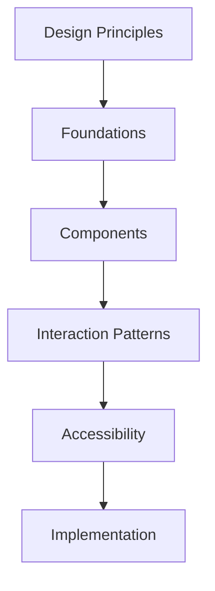

# Nerove Tutor Design System

**Status:** Draft v1.0  
**Maintained by:** Design contributors, frontend engineers, and product reviewers  
**Audience:** Designers, Flutter developers, QA, and maintainers

---

## Overview

Nerove Tutor is a calm, premium, and supportive product experience designed for learning rather than distraction. The design system defines the visual language, interaction model, and reusable patterns needed to deliver a consistent experience across Android, iOS, and Windows.

This document provides the shared foundation for product surfaces such as onboarding, tutoring, lessons, quizzes, settings, and conversation flows.

---

## Purpose

This document exists to ensure that the product presents a coherent and high-quality experience as it evolves. It defines the design vocabulary used by the product and establishes the reusable patterns that frontend teams should implement consistently.

---

## Scope

This document covers:

- design principles and visual direction
- color, typography, spacing, and motion foundations
- component patterns and usage rules
- accessibility expectations
- interaction and feedback behavior
- platform consistency across Flutter targets

This document does not replace product requirements or implementation architecture; it provides the design foundation that those systems build upon.

---

## Design Principles

Nerove Tutor’s visual and interaction system is guided by the following principles:

1. Calm over loud: the interface should support focus and reduce cognitive load.
2. Encouraging over punitive: feedback should feel supportive and constructive.
3. Clear over clever: the experience should be easy to understand at a glance.
4. Human over mechanical: interface behavior should feel considerate and natural.
5. Consistent over fragmented: repeated patterns should be predictable across surfaces.
6. Accessible by default: accessibility is a product requirement, not an optional refinement.

---

## Visual Direction

The product should feel modern, orderly, and reassuring, similar to premium education products that prioritize clarity and calm. The interface should avoid visual noise and keep attention on the lesson experience.

### Desired qualities

- soft but confident surfaces
- restrained color usage
- strong hierarchy and readable content
- smooth motion that feels purposeful
- low friction in task completion
- visual calm during long learning sessions

---

## Design Foundations

### Color system

The color system should support learning, clarity, and emotional confidence. Primary colors should be used for emphasis, while neutral tones should carry the majority of the interface.

#### Core palette

| Role       | Usage                                     | Example token   |
| ---------- | ----------------------------------------- | --------------- |
| Primary    | calls to action, highlights, focus states | `primary`       |
| Secondary  | supporting emphasis, progress states      | `secondary`     |
| Surface    | cards, containers, sheets                 | `surface`       |
| Background | app background, page base                 | `background`    |
| Text       | primary content                           | `textPrimary`   |
| Muted text | secondary labels, hints                   | `textSecondary` |
| Success    | correct answers, completion states        | `success`       |
| Warning    | caution, review prompts                   | `warning`       |
| Error      | failure states, destructive actions       | `error`         |

#### Color usage rules

- use color to reinforce meaning, not to decorate alone
- ensure sufficient contrast for all text and interactive elements
- avoid relying on color alone for important state changes
- keep primary actions visually distinct without becoming aggressive

### Typography

Typography should be legible, calm, and structured for educational reading. The system should prioritize readability for long-form explanations and short interactions alike.

#### Type scale

| Style   | Purpose                           |
| ------- | --------------------------------- |
| Display | hero headings, lesson titles      |
| Heading | section titles, card headers      |
| Body    | explanatory content, descriptions |
| Label   | controls, metadata, input labels  |
| Caption | supporting text, helper text      |

#### Typography rules

- use a clear type hierarchy with consistent weighting
- prefer simple, readable font families
- maintain generous line height for longer reading content
- keep headings concise and action-oriented

### Spacing system

A consistent spacing system improves rhythm and makes the UI feel deliberate.

#### Spacing scale

| Token     | Value |
| --------- | ----- |
| `space-1` | 4px   |
| `space-2` | 8px   |
| `space-3` | 12px  |
| `space-4` | 16px  |
| `space-5` | 24px  |
| `space-6` | 32px  |
| `space-7` | 40px  |
| `space-8` | 48px  |

#### Spacing rules

- use spacing consistently across similar components
- prefer token-based spacing over arbitrary values
- keep grouping and alignment deliberate and predictable

### Motion and transitions

Motion should feel smooth, subtle, and purposeful. It should support focus and clarity without becoming distracting.

#### Motion principles

- use motion to reinforce state changes and navigation
- keep transitions short and calm
- avoid excessive animation during active learning sessions
- respect reduced-motion preferences

---

## Component System

The design system should define reusable components for the core surfaces of the product.

### Core component categories

- layout components
- navigation components
- input components
- content components
- feedback components
- educational components

### Core components

#### App shell

Used for the top-level frame of the application. It should support navigation, header behavior, and contextual actions.

#### Lesson card

Used to present lesson content in a way that is scannable and encouraging.

#### Tutor message bubble

Used to present AI tutor responses in a conversational layout with support for text, audio, and optional code references.

#### Practice input

Used for short-answer, fill-in-the-blank, and structured exercise responses.

#### Quiz option

Used for answer selection in a quiz experience.

#### Progress indicator

Used to show lesson state, completion status, and mastery signals.

#### Code workspace panel

Used to present code examples and explanations within the learning experience.

#### Settings row

Used for toggles and preference controls in settings surfaces.

---

## Component Usage Rules

Each component should follow a clear usage pattern.

### General rules

- components should be used consistently across the product
- if a pattern appears repeatedly, it should become a shared component
- avoid one-off UI variations unless there is a strong product reason
- the same interaction pattern should feel the same across contexts

### Content component rules

- long-form educational content should be readable and uncluttered
- code examples should be visually distinguishable from body text
- helpers and hints should not overpower the main content

### Feedback component rules

- success, warning, and error states should be visually distinct
- feedback should be concise and actionable
- destructive or irreversible actions should be clearly signaled

---

## Interaction Patterns

The product’s interaction model should feel supportive and low-friction.

### Core interaction patterns

#### Guided progression

The interface should make the learner’s next action visible and clear.

#### Gentle feedback

The system should provide feedback that feels encouraging and informative rather than punitive.

#### Progressive disclosure

The interface should reveal complexity gradually, avoiding overload at the start of a lesson.

#### Low-friction input

Voice and text input should both feel natural and accessible alternatives.

#### Context-aware assistance

The UI should surface relevant help based on the learner’s progress and current lesson context.

---

## Accessibility Standards

Accessibility is a core product requirement. The design system should support inclusive behavior by default.

### Accessibility requirements

- text contrast must meet accessible thresholds
- interactive elements must have clear focus states
- all controls should have labels and accessible names
- important content must not rely on color alone
- motion should respect reduced-motion preferences
- screen-reader flow should be logical and predictable
- voice-only interactions should remain paired with visible text output

### Accessibility behavior rules

- every interactive control must expose a clear semantic role
- form inputs must provide descriptive labels and error messaging
- errors should be announced clearly to assistive technology
- large touch targets should be preferred for mobile interaction

---

## Responsive Behavior

The design system must scale gracefully across phones, tablets, and desktop windows.

### Responsive principles

- layouts should adapt to available space without breaking hierarchy
- mobile-first layout practices should guide early composition
- dense content should reflow rather than overflow without structure
- shared components should support both compact and spacious layouts

### Layout expectations

- narrow screens should preserve clarity and reduce visual clutter
- wider screens should use spacing and structure to support richer content
- the code workspace and lesson panels should remain usable across device sizes

---

## Content and Messaging Tone

The product voice should be calm, direct, and encouraging. UI copy should feel helpful, never judgmental.

### Tone principles

- use plain language
- be encouraging without being overly cheerful
- keep feedback concise and specific
- avoid blame, shame, or condescending phrasing
- refer to the learner as capable and supported

### Examples

- “Let’s try that one step at a time.”
- “You’re making progress.”
- “A quick review may help before moving on.”

---

## Implementation Conventions

The design system should be implemented in Flutter in a way that is reusable and maintainable.

### Implementation rules

- use design tokens rather than hard-coded values where possible
- keep visual styling centralized
- avoid embedding styling decisions in feature screens unless they are local and intentional
- ensure components are reusable and composable
- align implementation with the product’s visual and interaction principles

### Suggested token structure

```text
ThemeData
  colorScheme
  textTheme
  elevation
  spacing tokens
  radius tokens
```

---

## Examples

### Example: lesson card

A lesson card should show:

- lesson title
- short description or objective
- completion state
- a clear call to action

### Example: tutor response

A tutor response should show:

- the message content
- optional code snippet or reference
- a readable layout with generous spacing
- support for text and audio affordances

---

## Diagrams

### Design system relationships



---

## References

This document should be read alongside the following authoritative sources:

- [../Architecture.md](../architecture/Architecture.md)
- [../frontend/FlutterArchitecture.md](../frontend/FlutterArchitecture.md)
- [../PRD.md](../PRD.md)
- [../ERD.md](../ERD.md)
- [../SCHEMA.md](../SCHEMA.md)

These documents define the product intent, technical architecture, and persistence model that the design system is intended to support.
