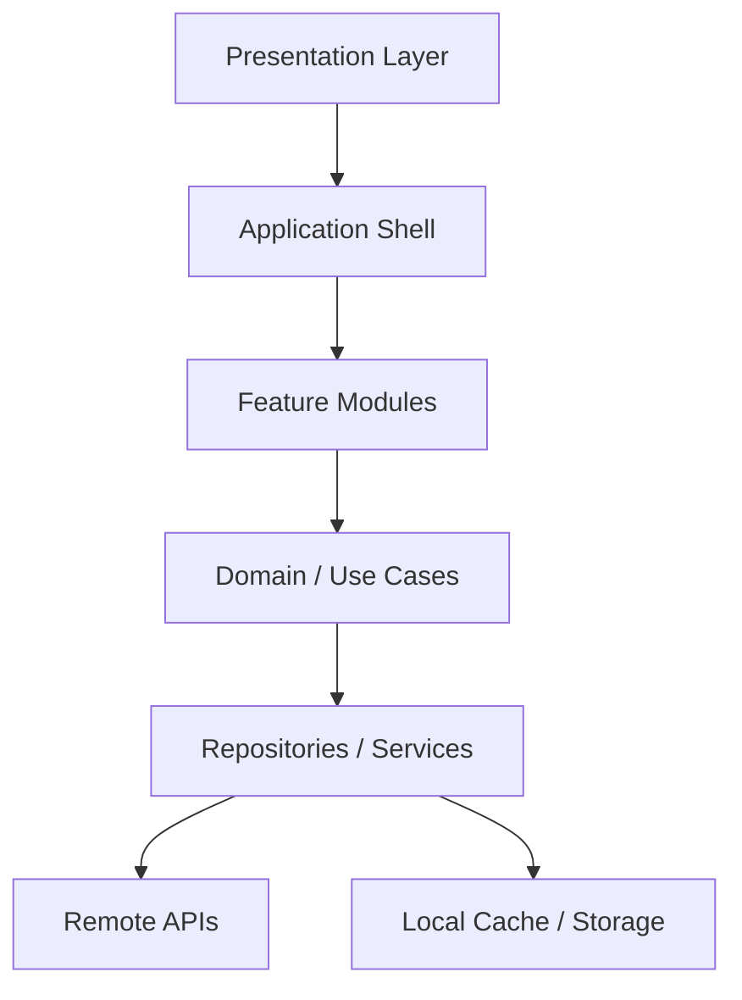
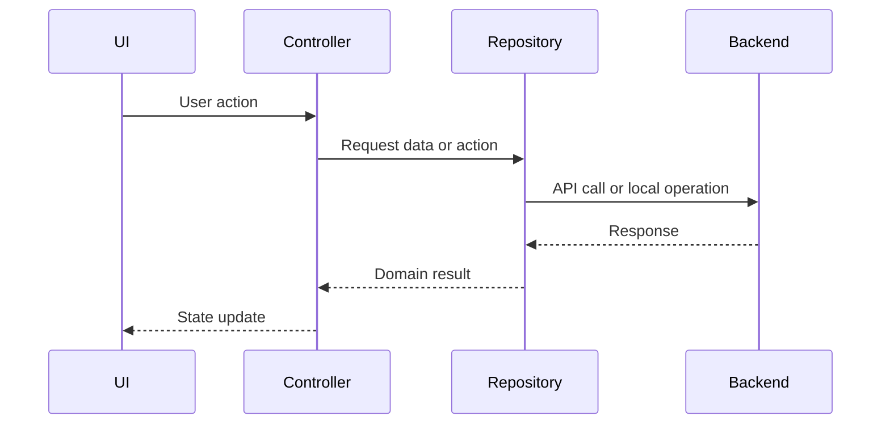
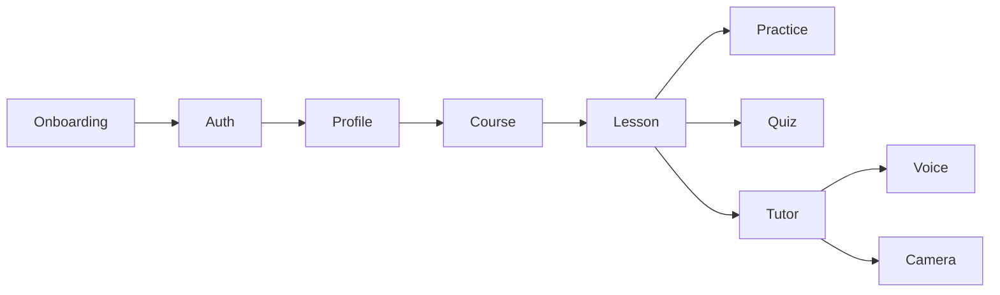
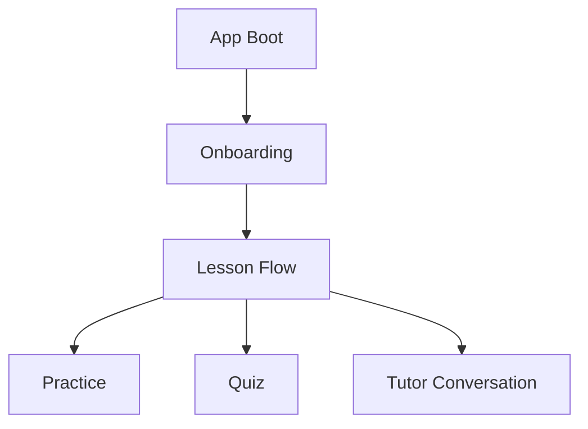

# Flutter Architecture for Nerove Tutor

**Status:** Draft v1.0  
**Maintained by:** Mobile engineers and frontend contributors  
**Audience:** Flutter developers, platform engineers, designers, and reviewers

---

## Overview

Nerove Tutor uses Flutter as the single client framework for Android, iOS, and Windows. The frontend architecture is designed to support a voice-first tutoring experience with a strong separation between UI, application state, domain logic, and external integrations.

This document defines the architectural shape of the Flutter application so that the product can evolve without turning the client into a tightly coupled monolith.

---

## Purpose

This document exists to provide a concrete frontend engineering reference for the Flutter application. It describes how the application should be organized, how state should flow, how modules should be separated, and how the implementation should remain maintainable as the product grows.

---

## Scope

This document covers:

- application architecture and module structure
- state management strategy
- navigation and routing patterns
- data access and repository boundaries
- UI composition and shared components
- platform-specific considerations
- testing and maintainability conventions

This document does not replace the product or backend architecture documents. Those remain the authoritative sources for product intent and system boundaries.

---

## Design Decisions

The frontend architecture is based on the following decisions:

- Flutter is the only client framework for Android, iOS, and Windows.
- The application should follow a feature-oriented structure rather than a purely screen-based structure.
- UI presentation should be separated from domain logic and infrastructure concerns.
- State should be explicit, testable, and easy to reason about.
- The app must support low-latency voice and optional camera interaction without compromising maintainability.
- The UI should be modular and reusable across devices while remaining adaptable to platform differences.

---

## Application Architecture

### High-level application structure



### Architectural layers

| Layer          | Responsibility                                                     |
| -------------- | ------------------------------------------------------------------ |
| Presentation   | Widgets, screens, navigation, visual composition                   |
| Application    | App bootstrap, dependency injection, lifecycle orchestration       |
| Domain         | Use cases, rules, state transitions, business behavior             |
| Data           | Repositories, API clients, local persistence, cache handling       |
| Infrastructure | Platform integrations, media, audio, notifications, authentication |

---

## Module Structure

The application should be organized by feature rather than by technical concern alone. Each feature should own its screens, state, and supporting logic, while shared concerns remain in a common layer.

### Recommended top-level structure

```text
lib/
  app/
    app.dart
    routes.dart
    bootstrap.dart
  core/
    design_system/
    theme/
    utils/
    extensions/
    constants/
    services/
  features/
    auth/
    onboarding/
    course/
    lesson/
    practice/
    quiz/
    tutor/
    voice/
    camera/
    profile/
    settings/
    progress/
    conversation/
  shared/
    widgets/
    models/
    repositories/
    providers/
    services/
```

### Module conventions

Each feature module should contain:

- `presentation/` for screens and widgets
- `domain/` for use cases and rules
- `data/` for repository implementations and remote/local sources
- `application/` for controllers, state holders, or providers

This keeps the module structure consistent and makes it easier to onboard new contributors.

---

## State Management Strategy

The client should use a state management approach that is explicit, composable, and testable. The design assumes a layered state model rather than ad-hoc widget-local state.

### State categories

| State type    | Example                                        | Ownership                        |
| ------------- | ---------------------------------------------- | -------------------------------- |
| UI state      | loading, selected tab, expanded panels         | widget or controller             |
| Feature state | current lesson, quiz state, conversation state | feature-level state holder       |
| Session state | active tutoring session, voice status          | domain or application layer      |
| Global state  | auth session, profile, settings                | app-level provider or controller |

### Recommended model

- Use a reactive state container for feature-specific flows.
- Keep state transitions explicit and centralized in the feature layer.
- Avoid spreading state updates across unrelated widgets.
- Prefer typed state models over loosely structured maps.

### State flow pattern



---

## Navigation and Routing

Navigation should be predictable and route-driven. The router should support deep links where applicable and preserve flow context for lessons and tutoring sessions.

### Routing principles

- routes should be defined centrally
- route names should be stable and human-readable
- navigation should be testable
- stateful flows should remain explicit rather than hidden inside widget trees

### Suggested routing model

```text
/landing
/onboarding
/auth
/course
/course/:chapterId
/lesson/:lessonId
/lesson/:lessonId/practice
/lesson/:lessonId/quiz
/conversation
/settings
/profile
```

### Navigation conventions

- screen transitions should be consistent across platforms
- modal and sheet flows should be handled through explicit navigation patterns
- back-stack behavior should respect lesson continuity and user expectations

---

## Presentation Layer

The presentation layer is responsible for rendering the user experience and composing reusable widgets.

### Presentation guidelines

- widgets should be focused and composable
- large screens should be composed from smaller, purpose-built widgets
- layout concerns should be separated from business behavior
- styling should flow from a shared design system rather than ad-hoc values

### Shared UI building blocks

- app shell and scaffold
- lesson content renderer
- practice input widgets
- quiz answer widgets
- conversation message list
- voice control bar
- progress indicators
- code workspace surface

### Component principles

- components should be stateless when possible
- presentation logic should remain simple and declarative
- visual state should be driven by inputs and state objects rather than imperative branching

---

## Data Access Layer

The frontend should interact with backend services through a repository abstraction. This ensures the UI does not need to know whether data comes from a remote API, a local cache, or a future offline source.

### Repository responsibilities

- expose domain-level operations
- hide transport details from the UI layer
- manage caching and local fallback when appropriate
- normalize remote responses into stable domain models

### Data access boundaries

| Concern        | Example                             |
| -------------- | ----------------------------------- |
| Authentication | sign in, refresh, sign out          |
| Course content | lessons, chapters, progress         |
| Learning state | quiz results, session updates       |
| Conversation   | chat turns, summaries, memory state |
| Settings       | preferences, privacy toggles        |

### Repository conventions

- repositories should return typed domain objects
- failures should be explicit and surfaced through the application layer
- remote response parsing should be centralized
- caching should be versioned and predictable

---

## Local Persistence and Offline Support

The app must support offline viewing of downloaded static lesson content while preserving online functionality where required.

### Offline strategy

- static lesson content should be cached locally
- cached content should be version-aware
- user-generated or session-specific state should be persisted locally when appropriate
- the UI should clearly communicate when content is available offline or online only

### Local storage principles

- local persistence should be abstracted behind repository or storage services
- storage should be consistent across platforms
- sensitive state should remain protected and not be stored more broadly than necessary

---

## Voice and Camera Integration

Voice and camera features are important product capabilities and should be integrated through dedicated modules rather than scattered across the UI layer.

### Voice integration structure

- speech input should be owned by a dedicated feature module
- voice state should be managed independently of general lesson state
- audio streaming and state transitions should be encapsulated behind services or controllers

### Camera integration structure

- camera access should be isolated in a separate module
- any attention or drowsiness analysis should be abstracted behind a service interface
- privacy-preserving behavior should remain explicit and testable

### Integration principles

- the rest of the app should depend on a stable interface, not on platform-specific implementation details
- failures in voice or camera services should degrade gracefully
- the UI should present a clear and non-confusing fallback path

---

## Platform-Specific Considerations

Although the app is built with Flutter, platform-specific differences must remain isolated and intentional.

### Platform concerns

- Android and iOS differ in permission handling and audio lifecycle behavior
- Windows may require different input and lifecycle assumptions
- small-screen and large-screen layouts should be handled through responsive composition rather than hard-coded branching

### Platform abstraction approach

- platform-specific logic should be encapsulated behind a service interface
- platform adapters should be implemented at the boundary rather than throughout the app
- shared UI should remain the default path while device-specific behavior remains additive

---

## Testing Strategy for Flutter

The frontend should be tested at multiple levels to ensure correctness across device types and user flows.

### Testing layers

| Level                    | Purpose                                                 |
| ------------------------ | ------------------------------------------------------- |
| Unit tests               | verify models, use cases, and domain logic              |
| Widget tests             | verify widget behavior and UI composition               |
| Integration tests        | verify multi-step flows and state transitions           |
| Device-level smoke tests | verify platform-specific behavior and runtime stability |

### Testing conventions

- tests should exercise real behavior rather than implementation details
- state transitions should be tested explicitly
- asynchronous flows such as voice and network interactions should be covered with deterministic tests where possible
- UI tests should remain focused on user-visible outcomes

---

## Conventions

The Flutter frontend should follow these conventions:

- use a feature-oriented structure
- keep state flow explicit and typed
- separate UI, domain, and data responsibilities
- keep shared widgets in a common layer
- avoid cross-feature coupling through shared mutable state
- keep platform-specific code behind abstractions
- document architectural changes when the structure or responsibility boundaries change

---

## Best Practices

- Prefer small, focused widgets over large screen-level widgets.
- Avoid embedding API logic directly inside widgets.
- Keep business rules out of the UI layer.
- Make asynchronous operations visible and testable.
- Use dependency injection to make the app easier to substitute and test.
- Preserve privacy-sensitive behavior in the architecture rather than relying on ad hoc implementation choices.

---

## Diagrams

### Feature dependency model



### Screen-to-feature mapping



---

## References

This document should be read alongside the following authoritative sources:

- [../Architecture.md](../architecture/Architecture.md)
- [../PRD.md](../PRD.md)
- [../ERD.md](../ERD.md)
- [../SCHEMA.md](../SCHEMA.md)

These documents define the broader system architecture, product intent, and persistence contract that the frontend architecture is designed to support.
